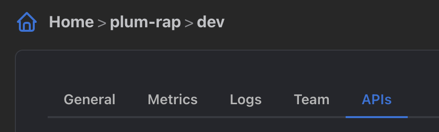
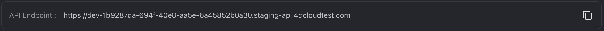
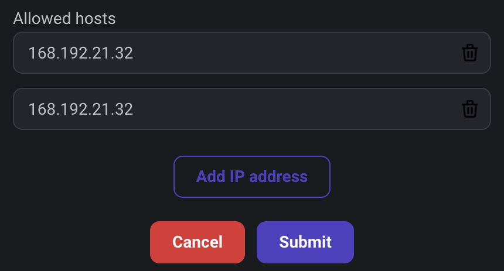
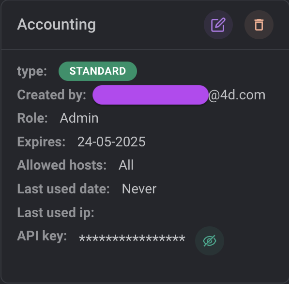

## Overview

You can allow external clients to access your Qodly application and request your data. Such requests require an **endpoint URL** and a **read-only API key** for authentication.

- **Endpoint URL**: All API requests must connect to the endpoint URL, provided by the Qodly Cloud Management Console (QCMC) for your application.

- **API key**: A unique string that is passed on every request to the Qodly Cloud application. The key must be passed in the header of every HTTP REST request. An API key is bound to a [**role**](../studio/roles/rolesPrivilegesOverview.md), so that client requests can only execute actions corresponding to the role associated to the API key.  

## Get your authentication keys and endpoint

To authenticate connections to your Qodly application resource, you'll need to generate API keys and get its endpoint.

1. Select the environment for which you want to create a key and click on the **API keys** tab.

The API management table provides the API Endpoint for the environment and lists the keys generated for the application (empty by default).

2. To copy the API Endpoint in order to use it in your code for REST calls, click on the **copy** button.

3. To create a new key, click **New API key**. The following dialog box is displayed:

|Property|Description|
|---|----|
|**Description**|Used to identify the key. You can enter any string with allowed characters.|
|**API Type**|<li>**Web**: Standard API type, suitable for most users. Access rights are controlled by the associated **Role**.</li><li>**Web Admin**: Specific API type, only required for Custom component designers. It gives extra rights to access application data and overrides any **Role**.</li> |
|**Role**|Role assigned to the key access. The menu contains [roles defined in the application](../studio/roles/rolesPrivilegesOverview.md) (only Admin by default)|
|**Expiration date**|Date on which the API will no longer be valid. An API key can be valid for up to one year.|
|**Allowed hosts**|By default, an API key an be used from any host, i.e. any client machine. If you want to restrict its usage to one or more specific host(s), just click on the **Add IP address** button and enter the allowed host(s)|

4. Configure your key and click **Submit** to generate the API key.

The API key is then generated:

The **Show api key** button  displays the API key in clear and reveals a **Copy** button, allowing you to copy the key.
The **Delete** button deletes the API key (a confirmation dialog is displayed).

5. Copy and paste your keys and endpoint URL in a convenient location, such as Notepad.

## Using the API keys and endpoint

- The endpoint URL must be used as target for initial connection requests to the server.
- The API key must be sent in the header of all HTTP REST requests sent to the server for the session. For more information, please refer to the REST API Reference.
