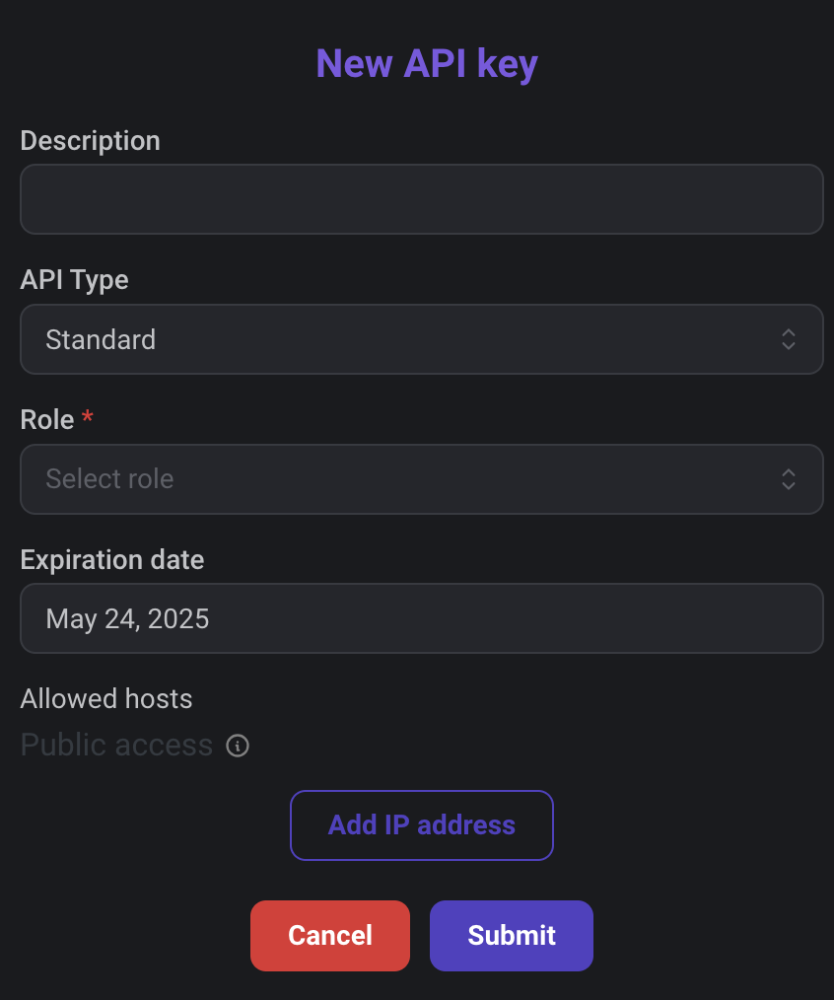

## Overview

You can allow external clients to access your Qodly application and request your data. Such requests require an **endpoint URL** and a **read-only API key** for authentication.

- **Endpoint URL**: All API requests must connect to the endpoint URL, provided by the Qodly Cloud Management Console (QCMC) for your application.

- **API key**: A unique string that is passed on every request to the Qodly Cloud application. The key must be passed in the header of every HTTP REST request. An API key is bound to a [**role**](../studio/roles/rolesPrivilegesOverview.md), so that client requests can only execute actions corresponding to the role associated to the API key.  

## Get your authentication keys and endpoint

To authenticate connections to your Qodly application resource, you'll need to generate API keys and get its endpoint.

1. Select the environment for which you want to create a key and click on the **APIs** tab.

The API management table provides the API Endpoint for the environment and lists the keys generated for the application (empty by default).

2. To copy the API Endpoint in order to use it in your code for REST calls, click on the **copy** button.

3. To create a new key, click **Add API**. In the dialog box, enter the name of the key (e.g. "Accounting"), select a Profile and click **Submit**.

:::note

The API name is used to identify the key, you can enter any string with allowed characters.

:::

The API key is then generated:

The following properties are available:

- **API Name**: Used to identify the key in the list
- **Profile**: Role assigned to the key
- **Expiration Date**: Date after which the key will automatically expire. You can set any key duration time.
- **Allowed host**: By default, a key can be used by any host. You can limit allowed hosts in order to control how the key is used.
- **API Key**: String of the API key (obfuscated by default). Click on the **Show api key** button  in order to be able to **copy** it.
- **Show api key** button: displays the API key in clear and show the **Paste** button.   
- **Delete** button: deletes the API keys (a confirmation dialog is displayed).

Copy and paste your keys and endpoint URL in a convenient location, such as Notepad.

## Using the API keys and endpoint

- The endpoint URL must be used as target for initial connection requests to the server.
- The API key must be sent in the header of all HTTP REST requests sent to the server for the session.

