The Qodly Cloud Management Console (QCMC) is the portal from which you can manage all your Qodly applications. 

## Apps list

Once you are logged to your Qodly account, the QCMC displays all your Qodly applications in a single page:

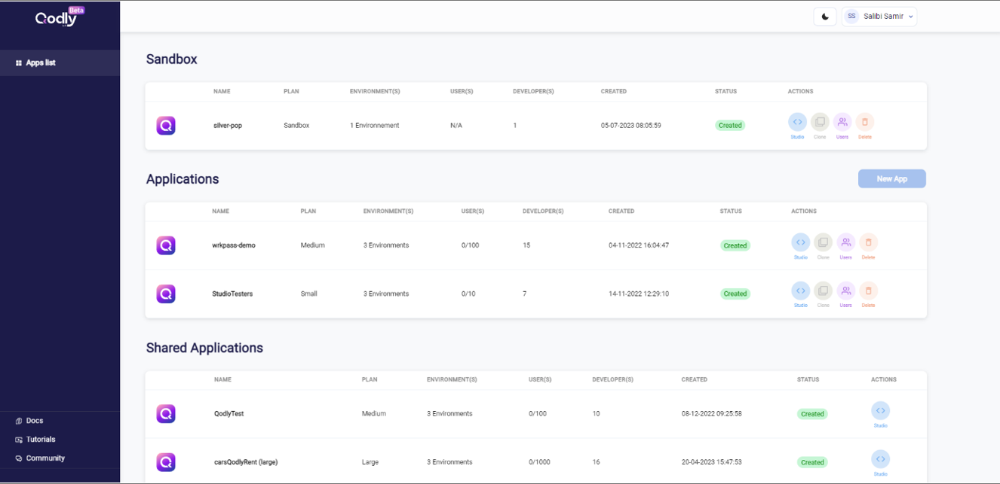

There are three kinds of Qodly applications:

- **Sandbox**: This is your trial application, where you can let your imagination run wild and experiment with all Qodly's features. This application is only available in the [development environment](../concepts/platform.md#environments-and-services). 
- **Applications**: This area lists all the applications that you have created (except the Sandbox)
- **Shared Applications**: This area lists all the applications created by other developers that they have shared with you (through invitations).
 

### Clone your applications

Instead of starting from scratch, you can clone any of your applications and start a new project based on the same code. 

To clone an application, click on the **Clone** button in the Apps list:

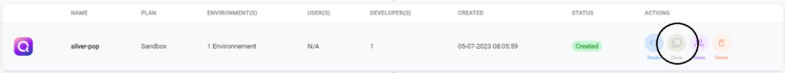

The cloning feature duplicates all your code except your data and resources. 

## Application Management

When you click on an application in the Apps list, you open its dedicated panel. You can view the status of every [environment](../concepts/platform.md#environments-and-services):

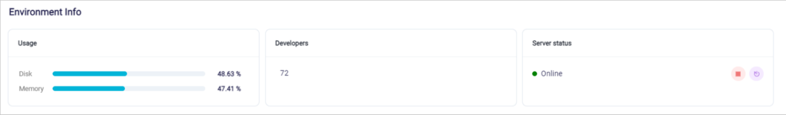

Click on the left side tabs to control your apps individually for every environment. 

### Stop or restart Qodly Server

This action can be useful to reset the Server memory. 

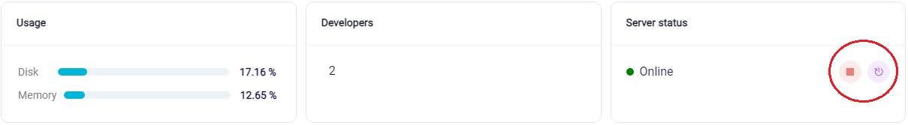

### Go to Qodly Studio

You can directly open your application instance in Qodly Studio (**Development** and **Staging** [environments](../concepts/platform.md#environments-and-services) only):

- Click on the **Studio** button in the Overview page

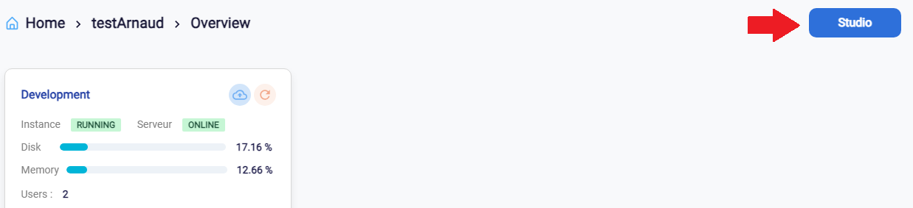

- Or,  click on the "Studio URL" in the **General** tab for the open environment:

### Monitor your resources

Click on the **Metrics** tab of an environment to monitor the resources for this environment: 

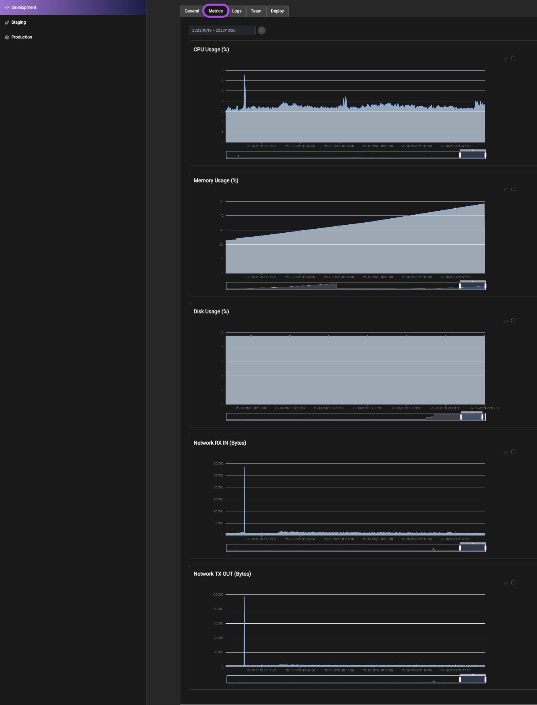

### Update your Qodly Server 

You can update your Qodly Server with latest updates provided by Qodly Platform:

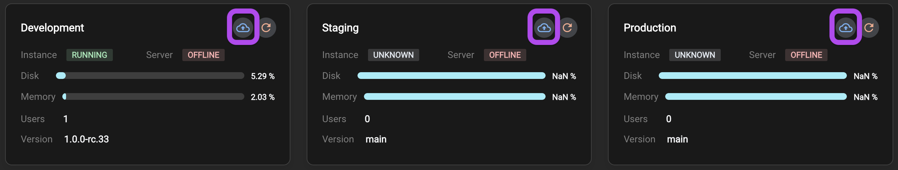

### Invite other developers or users

Click on the **Team** tab to display the list of developers and users who are registered to the application. 

Click on the **Add user** button to invite users:

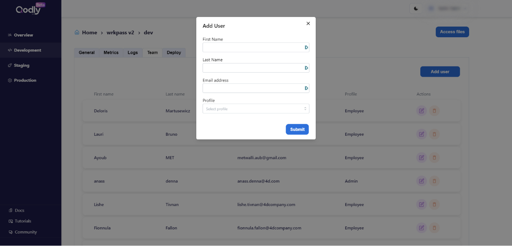

For every user, you need to provide their "First Name", "Last Name", "Email address", and "Profile". The Profile is a Role you [defined in the application with Qodly Studio](../studio/roles/rolesPrivilegesOverview.md). 

### Schedule and restore your backups

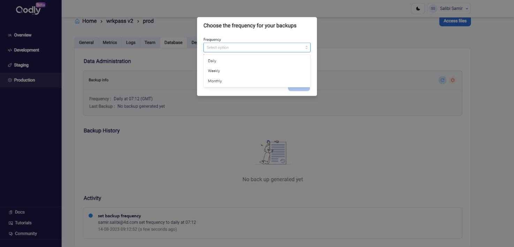

### Preview your app

In the Application Access area, click on the **Preview URL** to open the [home page](../studio/settings.md#start-page) of your application.

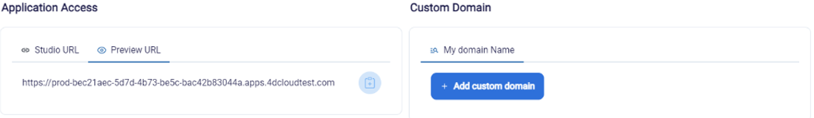

### Add custom domain

Per app, you can add your domain to be validated by your DNS. All the information will be provided by QCMC.

### Access to your files through sftp

For every environment, you can access to your files on the server using the **Secure File Transfert Protocol** (sftp). You just need to click on the **Access files** button:

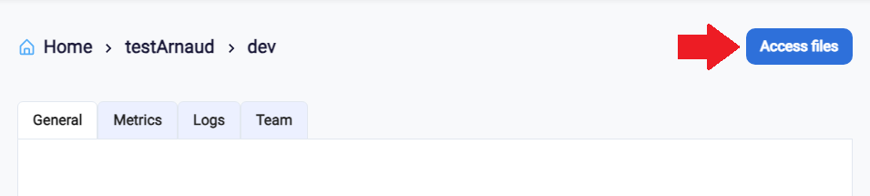

With your favorite ftp client (Filezilla for instance), you can access and manage your files. 

## Release Management and Deployment

Before deploying, from Development or Staging environment you need to create a **release** from the source environment. 

Select the **Deploy** tab and click on the **New Release** button:

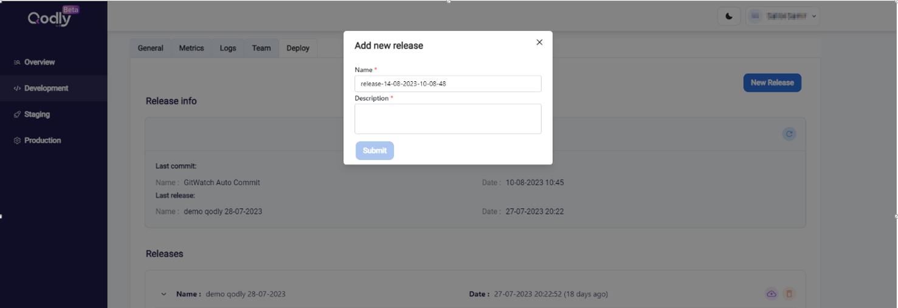

Give a name and a description for the release, then you can deploy the release you created from destination environment:

