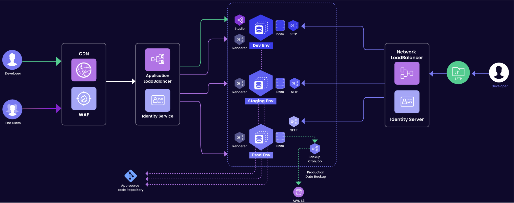

## Qodly Dashboard

The Qodly Dashboard is the portal from which you can manage all your Qodly applications. 

After [logging in to your Qodly account](../concepts/quickstart.md), the Dashboard presents an organized display of your Qodly applications on a single page.

Your Qodly applications fall into three categories:

- **Sandbox**: This serves as a trial application where you can freely explore Qodly's features and experiment. Please note that the Sandbox is accessible only in a [single environment](../cloud/getStarted#environments-and-services). 
- **Applications**: This section lists all applications you've created, excluding the Sandbox.
- **Shared Applications**: Here, you'll find applications developed by other collaborators and shared with you through invitations.

## Environments and services

For each application (except the SandBox), the [Qodly Server](../concepts/platform.md#qodly-server) can be deployed across several instances, referred to as **environments**. You can create as many environments as necessary, depending on your needs. 

Environments usually match the main steps or states of an application and you can enable services related to each state. For example, you can create three environments: 

- **Development**: for developers to create, design, and enhance their Qodly applications.
- **Staging**: developers, product managers, or quality teams can thoroughly test application features in a configuration that closely simulates the production environment.
- **Production**: where users can access and utilize your finalized application.

Each environment could offer the following set of services:

||Development|Staging|Production|
|---|---|---|---|
|Access to Qodly Studio|X|||
|Invite developers|X|||
|Invite users||X|X|
|Data Backup and Restore|||X|
|Updates|X|X|X|

## Cloning Applications

Rather than starting from scratch, you have the option to clone any existing application and kickstart a new project based on the same codebase.

To initiate application cloning, locate the desired application in the Apps list and click the **Clone** button:

The cloning process duplicates all your code, except data and resources.

## Sleep Mode for Sandbox Applications

Sandbox environments benefit from an automatic Sleep Mode feature, intended to enhance resource efficiency. 

The Sleep Mode feature is based upon the following principles:

- **Automatic Sleep Activation**: If your sandbox's Studio is not accessed for a continuous period of 7 days, it will automatically enter Sleep Mode. This is part of our strategy to optimize resource usage.

- **Easy Reactivation**: You can easily wake your sandbox from Sleep Mode during your next login, resuming your work seamlessly.

Entering and waking up from sleep mode is automatically handled by the Qodly Cloud. You are notified by messages on screen when accessing the QCMC.

:::important Important Notice - Deletion Policy

If the sandbox is not reactivated within 3 months, it will be subject to permanent deletion.
You will receive an email notification before any action is taken, ensuring you're informed at every step.
We believe this feature will not only improve our system's efficiency but also encourage more active engagement with your sandbox projects.

:::

## Access

Within your application's framework, access is categorized into two levels: **Developer Access** and **End User Access**.

### Developer Access

Developers possess entry to the Qodly Studio environment within the development phase, where they engage in coding activities. The procedure for gaining Qodly Studio access mandates a sequence of steps encompassing transit through a Content Delivery Network (CDN) and a Web Application Firewall (WAF). These measures reinforce security measures, providing a shield against potential threats. 
 
Across each [environment](#environments-and-services), dedicated databases store essential data. Moreover, in the production environment, data undergoes periodic migration to a backup storage repository via a scheduled Cron job. This backup data is subsequently preserved in an S3 bucket, bolstering redundancy and enhancing data protection. Throughout the entirety of the developmental life cycle, meticulous oversight is maintained, and all relevant processes and components are meticulously tracked within the App Source code repository. This concerted approach ensures a secure and seamless workflow from inception to deployment. 

#### SFTP Access

Developers are empowered to utilize SFTP for file uploads and downloads across all environments. To realize SFTP access, developers traverse a Network Load Balancer along with an Identity Service, which collectively handles authentication and authorization requirements. 

### End User Access

End users are granted authorization to interact with renderers across all environments. Comparable to developer access, requests from end users are channeled through a CDN and WAF, bolstering security measures before being directed to the appropriate environment via load balancing. 

