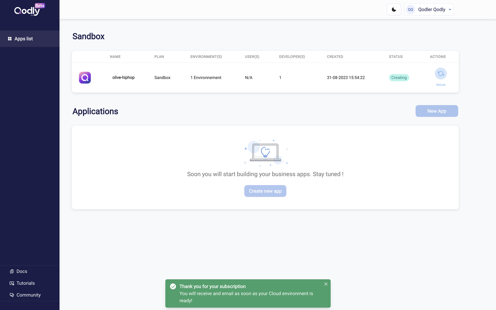
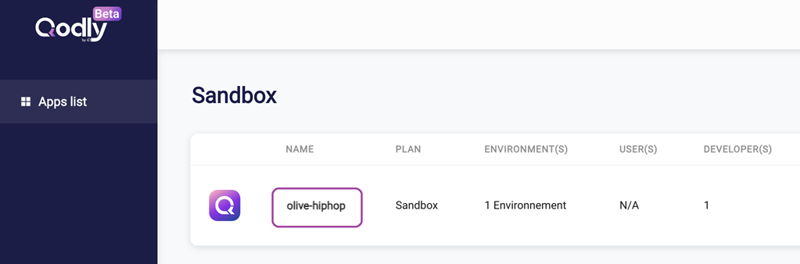

The first step in getting started with the Qodly experience is to create an account on the Qodly cloud platform, then head to the Sandbox environment where anything goes!

## Step 1: Create your account

1. Connect to [**cloud.qodly.com/signup**](https://cloud.qodly.com/signup) and create your account in a few clicks. 

2. Copy the verification code you received by email and click **Confirm account**.

3. Provide some additional information to complete your profile:

4. Click **Submit**: you enter immediately the Qodly Cloud Management Console. 

## Step 2: Create your sandbox and let Qodly prepare your environment

1. Select a Template to create your sandbox application.

You have two options:

- **create a sandbox from scratch**: your sandbox will be created empty, without any code or data. But no worries, the **Welcome tour** will guide you step by step through Qodly Studio. Select the **Blank app** template,
- **create a sandbox from a sample**: your sandbox will contain the code and data of the sample application. It is very helpful to get started with examples of screens, code and data modeling.

2. The sandbox environment is automatically prepared... You just have to wait a few seconds.

## Step 3: Go to Qodly Studio and follow the Welcome Tour

The environment is now ready, it's time to open the Qodly Studio and start creating your new web site.

1. Click on the **Studio** button on the right side of your application line:

2. Click **Next** to start the Welcome Tour and enjoy your journey in Qodly Studio!

:::note

You can skip and reactivate the Welcome Tour at any time in the [Qodly Studio Settings](../studio/settings.md#activate-welcome-tour). 

:::

:::tip

To find out more, follow the [**Create your first app**](xxxx) video tutorial, which guide you step by step in the creation of your first application with Qodly Studio.

You can also browse our [**Youtube Channel**](https://www.youtube.com/channel/UCLNHKvjJQZ_5D1ziskba6jg). 

:::