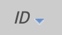
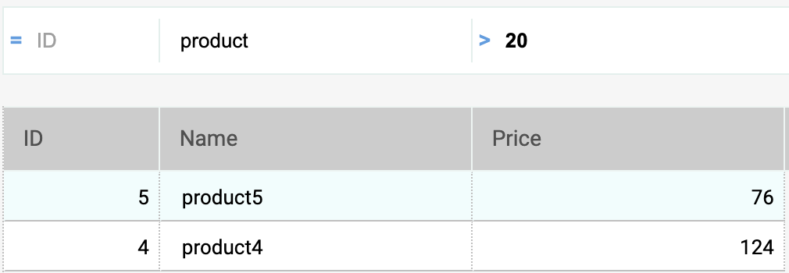
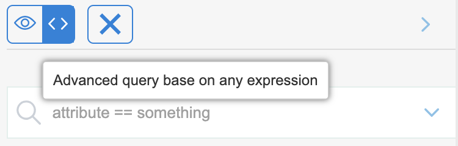
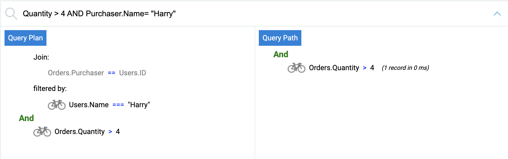
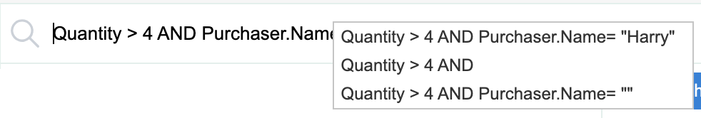

import Column from '@site/src/components/Column'

## Opening the Data Explorer

To open the Data Explorer web page for a Qodly application:

<Column.List align="center" justifyContent="between">
<Column.Item width="55%">

<ol>
<li>Open your application with Qodly Studio.</li><br/><br/><br/><br/><br/><br/>
<li>Click on the <code>Data</code>  button in the Studio home page </li>
</ol>
</Column.Item>
<Column.Item width="45%">
 <br/>
 
</Column.Item>
</Column.List>
<br/>
Or:

<Column.List align="center" justifyContent="between">
<Column.Item width="55%">

<ol start="2">
<li>Click on the <code>Data</code>  button in the header bar:</li>
</ol>
</Column.Item>
<Column.Item width="45%">

</Column.Item>
</Column.List>

The Data Explorer window opens in a new tab, displaying data available in your application.

:::info

The Data Explorer supports the following web browsers:

- Chrome
- Safari
- Edge
- FireFox

The minimum resolution to use the Data Explorer is 1280x720. Recommended resolution is 1920x1080.

:::

## Data Explorer Overview

The Data Explorer provides a web interface to view, query, and edit data in your project datastore. Using this tool, you can easily browse among all your entities and search, order, or filter attribute values. It helps you quickly identifying issues at any step of the development process, as well as controlling and editing data.

The page contains several areas:


1. **DataClasses** : Lists all the dataclasses. You can select which dataclasses to display and filter the list of dataclass names using the search bar.
2. **Attributes** : Lists all the attributes of the selected dataclass. Attributes are ordered according to their creation order, and primary key and indexed attributes have a specific icon. You can filter the list of attribute names using the search bar and you can reduce the number of columns in the data grid by unchecking attributes.
3. **Dark mode** : You can switch to the **dark mode** display theme.
4. **Search bar** : Two query modes are available: Query on attributes (selected by default), and the Advanced query based on any expression. You select the query mode by clicking on the corresponding button  (the X button allows you to reset the query area and thus stop filtering).
5. **Data grid** : List of entities of the selected dataclass
6. **Details** : The attribute values of the currently selected entity as well as **related data**, if any. You can browse between the entities of the dataclass by clicking the **First** / **Previous** / **Next** / **Last** links at the bottom of the area.

:::info
The name of the selected dataclass is added as a tab above the data grid. Using these tabs, you can switch between dataclasses that have been already selected. You can remove a referenced dataclass by clicking the "remove" icon (X) after the dataclass name.

All attribute types are displayed, including pictures, objects (expressed in json) as well as calculated and alias attributes.
:::

:::tip

**Ctrl+Click** (Windows) or **Command+Click** (macOS) on a related attribute name in the right side area displays the values of the attribute in an independant floating area.

:::

## Browsing Data

In addition to a comprehensive and customizable view of your data, the Data Explorer allows you to query and order your data.

### Ordering entities

You can reorder the displayed entity list according to attribute values. All types of attributes can be used for a sort, except picture and object.

- Click on a column header to order entities according to the corresponding attribute values. By default, the sort is ascending. Click twice for a descending sort. A column used to sort entities is displayed with a small icon and its name is in _italics_. 

:::info

You can sort attributes on several levels. For example, you can sort employees by city and then by salary. To do that, hold down the **Shift** key and click sequentially on each column header to include in the sort order.

:::

### Query entities

#### Query on attributes

In this mode, you can filter entities by entering values to find (or to exclude) in the areas above the attribute list. You can filter on one or several attributes. The entity list is automatically updated when you type in.

Different operators and query options are available, depending on the data type of the attribute.
<br/>

<Column.List align="center" justifyContent="between">
<Column.Item width="60%">

<ol>
<strong>Text:</strong> Text filters are not diacritic (a = A). The filter is of the "starts with" type. For example, entering "Jim" will show "Jim" and "Jimmy" values. 
</ol>
</Column.Item>
<Column.Item width="30%">
<br/>
</Column.Item>
</Column.List>

<Column.List align="center" justifyContent="between">
<Column.Item width="60%">

<br/>
<ol>
<strong>Dates:</strong> With date attributes, you can enter the date to use through a datepicker widget (click on the date area to display the calendar)
</ol>
</Column.Item>
<Column.Item width="30%">
<br/>
</Column.Item>
</Column.List>

<Column.List align="center" justifyContent="between">
<Column.Item width="60%">

<ol>
<strong>Booleans:</strong> When you click on a boolean attribute area, you can filter on true/false values but also on null/not null values

</ol>
</Column.Item>
<Column.Item width="30%">
<br/>
</Column.Item>
</Column.List>

<Column.List align="center" justifyContent="between">
<Column.Item width="65%">

<ol>
<strong>Numeric operators:</strong> With numeric, date, and time attributes, the "=" operator is selected by default. However, you can select another operator from the operator list (click on the "=" icon to display the list)
</ol>
</Column.Item>
<Column.Item width="30%">

</Column.Item>
</Column.List>

If you enter several attributes, a AND is automatically applied. For example, the following filter displays entities with _firstname_ attribute starting with "flo" AND _salary_ attribute value > 50000:

 -->

:::note

You cannot filter on picture or object attributes.

:::

### Advanced queries with expression

When you select this option, a query area is displayed above the entity list, allowing you to enter any expression to use to filter the contents:



You can enter advanced queries that are not available as attribute queries. For example, if you want to find entities with _firstname_ attribute containing "Jim" but not "Jimmy", you can write:

```
firstname=="Jim"
```

You can use any query expression as [documented with the `query()` function](../orda/queries.md), with the following limitations or differences:

- For security, you cannot execute formulas using `eval()`.
- Placeholders cannot be used; you have to write a _queryString_ with values.
- String values containing space characters must be embedded in double quotes ("").

For example, with the Employee dataclass, you can write:

```
firstname = "Marie Sophie" AND manager.lastname = "@th"
```

You can click on the `v` icon to display both [`queryPlan` and `queryPath`](../orda/queries.md#about-queryplan-and-querypath). In the area, you can hover over the subquery blocks to have detailed information per subquery:



Right-click in the query area to display the previous valid queries:



## Editing Data

The Data Explorer allows you to modify attribute values, add or delete entities. These feature is intended to administrators, for example to test implementations or fix issues with invalid data.

### Allow editing

For security reasons, to be able to edit data through the Data Explorer, you first need to enable the editing mode using the **Allow editing** selector. When enabled, edit action buttons are displayed to the right side:


This selector is enabled **per dataclass** and **per browser session**.

:::info

The selector is intended to prevent accidental modifications since no confirmation dialog boxes are displayed when editing data through the Data Explorer.

:::

### Entering values

When the **Allow editing** selector is enabled for a dataclass, you can enter values for a new or selected entity through dedicated input widgets in the **Details** area for the selected dataclass.

The following scalar attribute values can be edited:

- text
- boolean
- numeric
- date
- time
- image (you can upload or drag and drop an image)
- object (JSON string)

:::info

Blob attributes cannot be modified.

New or modified values are stored in the local cache, you need to [save them explicitely](#saving-modifications) to store them in the data.

:::

### Creating entities

You can create a new, empty entity in the selected table by clicking on the creation button . You can then [enter values](#entering-values) for this entity.

The new entity is is kept in the local cache, you need to [save it explicitely](#saving-modifications) to store it in the data.

:::info

Attribute values that need to be calculated by Qodly (autogenerated IDs, computed attributes) will be returned only after you saved the entity.

:::

### Reloading values

The **reload** button  reloads the entity attribute values from the data file. This button is useful for example when you want to make sure the displayed values are the most recent saved values.

### Saving modifications

Except for [deletion](#deleting-entities) (see below), entity modifications are done locally and need to be saved so that they are stored in the data file.

To save modifications or to save an entity you created in the Data Explorer, click on the **Save** button .

:::info

Modifications on an existing entity are automatically saved when you select another entity of the same dataclass.

:::

In case of conflict (e.g. another user has modified the same attribute value on the same entity), an error message is displayed at the bottom of the Data Explorer. You can click on the [**Reload** button](#reloading-values) to get the new value from the data and then, apply and save your modifications.

### Deleting entities

You can delete entities by clicking on the **delete** button .

To delete a set of entities, select two or more entities in the list area using **Shift+click** (continuous selection) or **Ctrl/Command+click** (discontinuous selection) and click on the **delete** button.

:::note

If some entities could not be deleted because of a conflict (e.g. entities locked on the server), they are highlighted in the list.

:::

:::caution

No confirmation dialog is displayed when you delete entities. Selected entities are immediately deleted from the data.

:::
