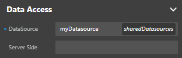

## Overview

Datasources contain data. You can bind them to your Webform components to determine where the data is displayed in your application.

### Shared datasources 

Inside a project, you can create *shared datasources*. A shared datasource can be used in several webforms inside the same project.

Shared datasources are grouped under namespaces. To create a shared datasource, follow the steps to [create a datasource](#creating-a-datasource) and enter a namespace before choosing **Confirm**. 

When you select a component linked to a datasource, the Properties panel allows you to identify if that datasource is shared:
* If the datasource is shared, its namespace appears next to its name.
* If the datasource is not shared, *webform* is displayed next to its name to indicate that it can only be used in the current webform.

Namespaces of shared datasources are also displayed in the Contextual panel when you configure events that trigger functions.

### Shared functions 

By extension, when entity and entity selections are used as shared datasources, their functions are shared too and can be used in several webforms in the same project. 

When you configure a function event, the Contextual panel indicates if the function is shared:
* If it is shared, its namespace is displayed next to its name. 
* If it isn't shared, *webform* is displayed instead. 

### Exposed and non-exposed assets

4D Web Studio runs through the [4D WebAdmin web server](https://developer.4d.com/docs/en/Admin/webAdmin.html). When you use 4D Web Studio as a developer, even when you preview a webform in the studio, you’re using the 4D WebAdmin web server. This allows you to see dataclasses, functions and attributes that are not exposed as REST resources for example (they are greyed out).

However, [webform rendering](../rendering.md) happens outside 4D Web Studio, and is served by the [standard 4D web server](https://developer.4d.com/docs/en/WebServer/webServer.html). In this situation, your web application cannot access assets that are not exposed as REST resources.

See [Exposed vs non-exposed functions](https://developer.4d.com/docs/en/ORDA/ordaClasses.html#exposed-vs-non-exposed-functions) and [Exposing tables](https://developer.4d.com/docs/en/REST/configuration.html#exposing-tables) for more information on how to expose assets.

### Remote or local

Datasources can be remote or local:

- **Remote**: Remote datasources are based upon entities and entity selections. They are handled on the server. They offer functions defined on the [ORDA classes](https://developer.4d.com/docs/en/ORDA/ordaClasses.html#class-description) that they instantiate (Entity class, Entity Selection class). 
- **Local**: Local datasources are based upon scalar data types handled with the browser's memory. They can be assigned to variables. No request is sent to the server when the application accesses local datasources.

Basically, remote and local datasources work the same way.

## Creating a datasource 

### Data Sources section

Inside the Webform Editor, the **Data Sources** section groups the available datasources:

In this section, you'll find:

- A **Search** area, allowing to filter the datasource list 

- The **Catalog**, which holds:
    * data from your database. From this list, you can designate entities or entity selections from your [datastore](https://developer.4d.com/docs/en/ORDA/dsmapping.html), and they will be handled by the server as datasources.
    * the functions defined in each class

- **Webform datasources**: Datasources that can only be used within the webform.  

- **Namespaces**: Datasources that can be used in several webforms your project (**shared datasources**), grouped by namespaces. You can create a namespace by clicking on the **+** icon or when defining a shared datasource. 

#### From the Catalog

1. In the Data Sources section, choose **Catalog** > **Data Classes**
2. Click the **+** icon next to a dataclass
3. Enter the name of the datasource. 
4. Select Entity or Entity Selection.
5. Define its settings: initial value, page size, and depth (optional)
6. To create a shared datasource, enter a Namespace. To create a webform (non-shared) datasource, let the area empty. 
7. Click **Confirm**. 

The newly created Entity or Entity selection datasource now appears in the **This Webform** or **Namespaces** section, depending on your settings.

#### From a Namespace

1. Click the **+** icon near a defined namespace.
2. Enter the name of the datasource.
3. Select the datasource Type.  
If you select Entity selection or Entity, you create a remote datasource. You need then to select its Dataclass and configure its settings (initial value, page size or depth).

4. Click **Confirm**. 

### Renaming a datasource

You can rename a datasource from the contextual panel. In this case, the Studio allows you to rename the datasource references:

- in the components bound to this datasource 
- and in the origin of other datasources having the renamed datasource as origin

:::caution

When renaming a shared datasource, only opened web forms can have their references renamed.

:::

## Binding a datasource to a component

There are several ways to bind a datasource to a component:

* Drag it from the **Data Sources** section and drop it on a component
* Select a component and enter the name of the datasource in the **Properties** panel > **Data Access** > **DataSource** 

:::tip

If you drag and drop a datasource attribute to a component, the *$This.attributeName* binding is automatically done:

For images, the binding is automatically displayed in the Data Access panel:

:::

### Iterative components

You can use components to iterate on data. These components allow you to select an item among the data as an independent datasource.

The following components are iterative: [**matrix**](components.md#matrix) and [**select box**](components.md#select-box).

Iterative components can be bound to two data sources:

- **DataSource**: a data source to iterate on. Its attributes are bound to the component to display the iterative data (usually, an entity selection or a collection).
- **Selected Element**: a data source to get the item selected inside the iterative component. Usually, an entity or a collection element.

To assign the data sources, use the Data Access panel:

## Attaching events to datasources 

You can attach events to datasources to trigger certain actions when these datasources are updated in the web browser. See [datasource events](design-webforms/events/events.md#datasource-events) for more information.

## Storing data in a datasource

You can store data in local and remote datasources. For example, you can configure an event that calls a function, and store the result of that function in a datasource. See the [example from the user events section](design-webforms/events/events.md#example-search-feature-using-the-onchange-event).

## Keeping track of your datasources

The **Inspect** option  allows you to check where your datasources are used in your webforms. Toggle the option by clicking the icon, then mouse over a datasource to highlight its location in your webform.

