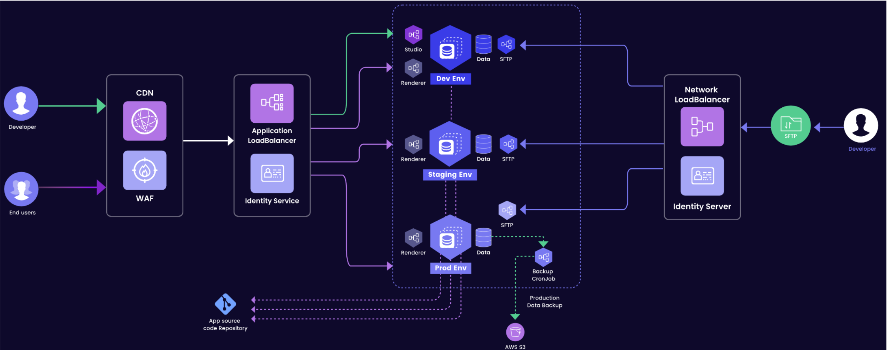

## General

<details>
<summary style= {{ fontWeight: "bold" , marginBottom: "20px" }}> What is included in the Qodly Platform?</summary>

The Qodly platform is a fully integrated environment where you can develop, test, deploy, and monitor business applications with advanced web interfaces. Qodly is the perfect platform to design and publish powerful back office applications, or sophisticated dashboards, in a record time.

The Qodly plaform is made of a **Studio**, a **Server**, and a **Cloud platform**, all working together flawlessly to provide you with an end-to-end software platform that can build web business apps in no time.
</details>


<details>
<summary style= {{ fontWeight: "bold" , marginBottom: "20px" }}> How is Qodly structured in the cloud?</summary>

Qodly is powered by [**Amazon Web Services**](https://aws.amazon.com/cognito/).  

Every Qodly Server is a container deployed on a Virtual Machine (VM) powered by [AWS Elastic Kubernetes Service](https://aws.amazon.com/eks/) (EKS).  

User access is managed by Qodly Identity Service (QIS) based on [AWS Cognito](https://aws.amazon.com/cognito/). It is a central service to control all users access to Qodly modules. Every developer or application user needs to be declared in QIS with an appropriate [role](../4DQodlyPro/roles/rolesPrivilegesOverview.md#understanding-roles). Roles allow you to assign different permissions at [datastore level](../orda/data-model.md#datastore) for [user sessions](../language/SessionClass.md).

Automatic scheduled backups are provided for staging and production environment. Backups are stored on [AWS S3](https://aws.amazon.com/s3/) services.  


</details>


<details>
<summary style= {{ fontWeight: "bold" , marginBottom: "20px" }}> Where are stored my data?</summary>

Your data are stored on AWS (Amazon Cloud).

</details>


<details>
<summary style= {{ fontWeight: "bold" , marginBottom: "20px" }}> How are handled user accesses?</summary>



#### Developer Access


Developers possess entry to Qodly Studio environment within the development phase, where they engage in coding activities. The procedure for gaining Qodly Studio access mandates a sequence of steps encompassing transit through a Content Delivery Network (CDN) and a Web Application Firewall (WAF). These measures reinforce security measures, providing a shield against potential threats. 
 
Across each [environment](../../QodlyinCloud/console/environmentsOverview.md#overview), dedicated databases store essential data. Moreover, in the production environment, data undergoes periodic migration to a backup storage repository via a scheduled Cron job. This backup data is subsequently preserved in an S3 bucket, bolstering redundancy and enhancing data protection. Throughout the entirety of the developmental life cycle, meticulous oversight is maintained, and all relevant processes and components are meticulously tracked within the App Source code repository. This concerted approach ensures a secure and seamless workflow from inception to deployment. 


#### SFTP Access

Developers are empowered to utilize SFTP for file uploads and downloads across all environments. To realize SFTP access, developers traverse a Network Load Balancer along with an Identity Service, which collectively handles authentication and authorization requirements. 

#### End User Access

End users are granted authorization to interact with renderers across all environments. Comparable to developer access, requests from end users are channeled through a CDN and WAF, bolstering security measures before being directed to the appropriate environment via load balancing. 
</details>


## Studio

<details>
<summary style= {{ fontWeight: "bold", marginBottom: "20px" }}> Do I need specific expertise in HTML, CSS, or JavaScript to use Qodly Studio?</summary>

No, Qodly Studio offers an experience of intuitive and visual web development that does not require any expertise of web technologies.
</details>

<details>
<summary style= {{ fontWeight: "bold" , marginBottom: "20px" }}> Is Qodly Studio supported on all Web browsers?</summary>

See the requirements list [here](../4DQodlyPro/overview.md#requirements).

</details>


<details>
<summary style= {{ fontWeight: "bold", marginBottom: "20px" }}> Why is the Base State Visible Before the Correct State?</summary>

The Base state becomes momentarily visible because the actual correct state is applied only after the [page has initially rendered](../4DQodlyPro/rendering.md#pagerenderer-lifecycle). This occurs due to the timing of when qodly sources and conditions are processed. Initially, the page loads and displays the Base state by default. As qodly sources are fetched and conditions evaluated, the appropriate state for the user is determined and applied, causing the transition from the Base state to the correct state.

To resolve this, the `onInit` event should be used to ensure that all necessary qodly sources and conditions are set up before the page is rendered. This approach prevents the Base state from being displayed and ensures the page renders directly into the correct state based on the user's role and conditions.

</details>


## Qodly Server

<details>
<summary style= {{ fontWeight: "bold" , marginBottom: "20px" }}> What is Qodly Server?</summary>

Qodly Server is actually a full stack of integrated servers and development layers and supports all necessary requirements to develop, test, and deploy business web applications.

Qodly Server includes:

- an **HTTP server**, handling all incoming requests. It provides a high level of security by supporting [user sessions](../language/guides/sessions.md) and their associated privileges, connected to your own user directory in the cloud through **Amazon Cognito**.
- a **REST server** with a comprehensive API. The REST server handles requests that access the resources of the Qodly application, for example to get data from the datastore or to execute functions. The REST server exposes an automatically generated REST API to access and manipulate data. For example, if you have an exposed dataclass named "Product", it can automatically return its entities using the `/Product` request. The REST server also has a memory link between the web and the datastore layer to achieve very short processing times.
- a **Web application server**, handling your application Pages and features.
- **Qodly Database**, a built-in relational database. The Qodly Database has extended capabilities to store and process data. Model and data access is done through **ORDA** (*Object Relational Data Access*), an enhanced technology allowing to handle both the model and the data of a database as **objects**. With ORDA, the database is accessed through an abstraction layer, the **datastore** (which is an object itself). The ORM is natively included in the ORDA concept.
- the **QodlyScript** language, that can be used in all layers of the project: to configure the model, the application layer, the qodlysources, the pages, the events. No other language is required to develop a Qodly application. QodlyScript is an object-oriented language containing built-in classes that you can extend, and also user classes. ORDA provides data model classes that are very efficient to handle data.  

All these elements are included in one single executable running under Linux OS, providing the best performances by eliminating unnecessary intermediary connectors.

</details>


<details>
<summary style= {{ fontWeight: "bold" , marginBottom: "20px" }}> Can I install a local instance of Qodly Server?</summary>

No, Qodly Server is only proposed a a cloud service.
</details>


<details>
<summary style= {{ fontWeight: "bold" , marginBottom: "20px" }}> What are the capabilities of the Qodly database per application?</summary>

|Capabilities|Maximum|
|---|---|
|Number of dataclasses|32,767|
|Number of attributes per dataclass|32,767|
|Number of entities per dataclass|1 billion|
|Number of index keys per dataclass|128 billion|
|Size of text attributes|2 GB|
|Size of BLOB attributes|2 GB|
|Size of object attributes|2 GB|
|Number of properties per object attribute|up to 128 billion*|
|Number of transaction levels|Unlimited|

\* depending on the number of index keys

</details>


<details>
<summary style= {{ fontWeight: "bold" , marginBottom: "20px" }}> What is the lazy loading?</summary>

Since entities are managed as references, data is loaded only when necessary, i.e. when accessing it in the code or through interface widgets. This optimization principle is called lazy loading.

</details>


## QodlyScript

<details>
<summary style= {{ fontWeight: "bold" , marginBottom: "20px" }}> What's the difference between cs and ds?</summary>

  `cs` is the Class Store object, containing all classes of the current project:
    - user classes (e.g. `cs.MyUserClass`)
    - datastore classes (e.g. `cs.People`, `cs.PeopleEntity`, etc.).

  It is used for:
    - **declaration** of both user class and datastore class object variables
    - **instantiation** of user class objects.

  `ds` is a shortcut to the main DataStore object, providing access to the [ORDA model and data object](../orda/data-model.md) instances. It is a kind of singleton, used for **instantiation** of datastore objects.
  Datastore objects are instantiated and managed by ORDA and cannot be handled through the `cs` Class Store.

  ```qs
  //declare an object variable of class cs.myClass
  var myInstance : cs.myClass
  //declare two datastore object variables of class cs.PeopleEntity
  var myEntity,myNewEntity : cs.PeopleEntity

  //create a new instance of myClass class and put it in the variable
  myInstance = cs.myClass.new()
  //create a new instance of People dataclass (i.e. a blank entity) and put it in the variable
  myNewEntity = ds.People.new()
  //put an instance of People dataclass (i.e. an entity) in the variable
  myEntity = ds.People.get(167)
  ```
</details>


## Custom Components

<details>
<summary style= {{ fontWeight: "bold" , marginBottom: "20px" }}> Why did my custom component fail to upload? </summary>
  
If you encounter an error while importing a custom component, follow these steps to troubleshoot the issue:

1. **Clearing Browser Cache**

    Sometimes, even after a successful import, the component may not appear in the list. In such cases:

    - **Clear Your Browser Cache:** Clear your browser cache and refresh the page.

    - **Re-Test the Import:** Try importing the component again.

2. **Check Zip File Structure**

    Ensure that your zip file has the correct structure:

    - **Top-Level `manifest.json` File:** The zip file should include a `manifest.json` at the top level.

    - **Valid `manifest.json` Content:** The `manifest.json` file should contain valid content with correct paths.

    - **No Source Folder:** Ensure the zip file is not a downloaded repository source (e.g., containing a folder named `zip` at the top level). It should be a properly built component from the Releases section.

</details>


<details>
<summary style= {{ fontWeight: "bold" , marginBottom: "20px" }}> What does the failed upload error message mean? </summary>
  
If the upload fails, you might see the following error message:


```
The upload of the custom component failed. 
Make sure you are importing a properly built custom component for Qodly. 
```


This message indicates that the system was unable to process the zip file you provided. Ensure the zip file is structured correctly and contains all necessary files as per the guidelines.

</details>


<details>
<summary style= {{ fontWeight: "bold" , marginBottom: "20px" }}> Common mistakes to avoid while developing custom components </summary>
  
Avoid these common mistakes to ensure a smooth import process:

- **Manual Addition of `manifest.json`:** Adding a `manifest.json` manually without valid content can cause errors.

- **Incorrect Paths in `manifest.json`:** Ensure all paths specified in the `manifest.json` are correct and point to valid files within the zip.

</details>


