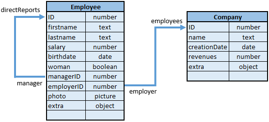

Dataclass attributes are available as properties of their respective classes. For example:

```4d
 nameAttribute=ds.Company.name //reference to class attribute
 revenuesAttribute=ds.Company["revenues"] //alternate way
```

This code assigns to `nameAttribute` and `revenuesAttribute` references to the `name` and `revenues` attributes of the Company class. This syntax does NOT return values held inside of the attribute, but instead returns references to the attributes themselves. To handle values, you need to go through [**Entities**](EntityClass.md).

`DataClassAttribute` objects have properties that you can read to get information about your dataclass attributes.

> Dataclass attribute objects can be modified, but the underlying model will not be altered.

### Functions and properties

||
|---|
|[**.autoFilled** : Boolean](#autofilled)&nbsp;&nbsp;&nbsp;&nbsp;contains True if the attribute value is automatically filled by Qodly|
|[**.exposed** : Boolean](#exposed)&nbsp;&nbsp;&nbsp;&nbsp;true if the attribute is exposed in REST |
|[**.fieldNumber** : Integer](#fieldnumber)&nbsp;&nbsp;&nbsp;&nbsp;contains the internal Qodly database field number of the attribute |
|[**.fieldType** : Integer](#fieldtype)&nbsp;&nbsp;&nbsp;&nbsp;contains the Qodly database field type of the attribute |
|[**.indexed** : Boolean](#indexed)&nbsp;&nbsp;&nbsp;&nbsp;contains **True** if there is a B-tree or a Cluster B-tree index on the attribute |
|[**.inverseName** : Text](#inversename)&nbsp;&nbsp;&nbsp;&nbsp;returns the name of the attribute which is at the other side of the relation |
|[**.keywordIndexed** : Boolean](#keywordindexed)&nbsp;&nbsp;&nbsp;&nbsp;contains **True** if there is a keyword index on the attribute|
|[**.kind** : Text](#kind)&nbsp;&nbsp;&nbsp;&nbsp;returns the category of the attribute|
|[**.mandatory** : Boolean](#mandatory)&nbsp;&nbsp;&nbsp;&nbsp;contains True if Null value input is rejected for the attribute|
|[**.name** : Text](#name)&nbsp;&nbsp;&nbsp;&nbsp;returns the name of the `dataClassAttribute` object as string|
|[**.readOnly** : Boolean](#readonly)&nbsp;&nbsp;&nbsp;&nbsp;true if the attribute is read-only|
|[**.relatedDataClass** : Text](#relateddataclass)&nbsp;&nbsp;&nbsp;&nbsp;returns the name of the dataclass related to the attribute|
|[**.type** : Text](#type)&nbsp;&nbsp;&nbsp;&nbsp;contains the conceptual value type of the attribute|
|[**.unique** : Boolean](#unique)&nbsp;&nbsp;&nbsp;&nbsp;contains True if the attribute value must be unique |


## .autoFilled


**.autoFilled** : Boolean


#### Description

The `.autoFilled` property contains True if the attribute value is automatically filled by Qodly. This property corresponds to the **autosequence** model attribute property. 

This property is not returned if `.kind` = "relatedEntity" or "relatedEntities".

>For generic programming, you can use `Bool(dataClassAttribute.autoFilled)` to get a valid value (false) even if `.autoFilled` is not returned.


## .exposed


**.exposed** : Boolean


#### Description

The `.exposed` property is true if the attribute is exposed in REST.


## .fieldNumber


**.fieldNumber** : Integer


#### Description

The `.fieldNumber` property contains the internal Qodly database field number of the attribute.

This property is not returned if `.kind` = "relatedEntity" or "relatedEntities".

>For generic programming, you can use `Num(dataClassAttribute.fieldNumber)` to get a valid value (0) even if `.fieldNumber` is not returned.


## .fieldType  


**.fieldType** : Integer


#### Description

The `.fieldType` property contains the Qodly database field type of the attribute. It depends on the attribute kind (see [`.kind`](#kind)).

**Possible values:**

|dataClassAttribute.kind|	fieldType|
|---|---|
|storage|	Corresponding Qodly database field type, see [`Value type`]|
|relatedEntity|	38 (`Is object`)	|
|relatedEntities|	42 (`Is collection`)	|
|calculated|<li>scalar: corresponding Qodly field type, see [`Value type`]</li><li>entity: 38 (`Is object`)</li><li>entity selection: 42 (`Is collection)`</li>|


#### See also

[`.type`](#type)


## .indexed  


**.indexed** : Boolean


#### Description

The `.indexed` property contains **True** if there is a B-tree or a Cluster B-tree index on the attribute.  

This property is not returned if `.kind` = "relatedEntity" or "relatedEntities".

> For generic programming, you can use `Bool(dataClassAttribute.indexed)` to get a valid value (false) even if `.indexed` is not returned.


## .inverseName  


**.inverseName** : Text


#### Description

The `.inverseName` property returns the name of the attribute which is at the other side of the relation.  

This property is not returned if `.kind` = "storage". It must be of the "relatedEntity" or "relatedEntities" kind.

>For generic programming, you can use `String(dataClassAttribute.inverseName)` to get a valid value ("") even if `.inverseName` is not returned.  


## .keywordIndexed  


**.keywordIndexed** : Boolean


#### Description

The `.keywordIndexed` property contains **True** if there is a keyword index on the attribute.  

This property is not returned if [`.kind`](#kind) = "relatedEntity" or "relatedEntities".

> For generic programming, you can use `Bool(dataClassAttribute.keywordIndexed)` to get a valid value (false) even if `.keywordIndexed` is not returned.


## .kind  


**.kind** : Text


#### Description

The `.kind` property returns the category of the attribute. Returned value can be one of the following:

*	"storage": storage (or scalar) attribute, i.e. attribute storing a value, not a reference to another attribute
*	"calculated": computed attribute, i.e. defined through a [`get` function](../concepts/orda/orda-classes#function-get-attributename).
*	"relatedEntity": N -> 1 relation attribute (reference to an entity)
*	"relatedEntities": 1 -> N relation attribute (reference to an entity selection)


#### Example

Given the following dataclass and relation:


```4d
 var attKind : Text
 attKind=ds.Employee.lastname.kind //"storage"
 attKind=ds.Employee.manager.kind //"relatedEntity"
 attKind=ds.Employee.directReports.kind //"relatedEntities"
```


## .mandatory  


**.mandatory** : Boolean


#### Description

The `.mandatory` property contains True if Null value input is rejected for the attribute.

This property is not returned if [`.kind`](#kind) = "relatedEntity" or "relatedEntities".

>For generic programming, you can use `Bool(dataClassAttribute.mandatory)` to get a valid value (false) even if `.mandatory` is not returned.


## .name  


**.name** : Text


#### Description

The `.name` property returns the name of the `dataClassAttribute` object as string.

#### Example

```4d
 var attName : Text
 attName=ds.Employee.lastname.name //attName="lastname"
```


## .readOnly  


**.readOnly** : Boolean


#### Description

The `.readOnly` property is true if the attribute is read-only.

For example, computed attributes without [`set` function](../basics/orda/orda-classes#function-set-attributename) are read-only. 


## .relatedDataClass  


**.relatedDataClass** : Text


#### Description

>This property is only available with attributes of the "relatedEntity" or "relatedEntities" [`.kind`](#kind) property.

The `.relatedDataClass` property returns the name of the dataclass related to the attribute.

#### Example

Given the following tables and relations:





```4d
 var relClass1, relClassN : Text
 relClass1=ds.Employee.employer.relatedDataClass //relClass1="Company"
 relClassN=ds.Employee.directReports.relatedDataClass //relClassN="Employee"
```


## .type  


**.type** : Text


#### Description

The `.type` property contains the conceptual value type of the attribute, useful for generic programming.

The conceptual value type depends on the attribute [`.kind`](#kind).

**Possible values:**

|dataClassAttribute.kind|	type|	Comment|
|---|---|---|
|storage|"blob", "bool", "date", "image", "number", "object", or "string"| "number" is returned for any numeric types including duration. "string" is returned for uuid, string and text attribute types. "blob" attributes are [blob objects](../basics/lang-blob.md), they are handled using the [Blob class](BlobClass.md).|
|relatedEntity|related dataClass name|Ex: "Companies"|
|relatedEntities|related dataClass name + "Selection" suffix|	Ex: "EmployeeSelection"|
|calculated|<li>storage: type ("blob", "number", etc.)</li><li>entity: dataClass name</li><li>entity selection: dataClass name + "Selection"</li>||


#### See also


[`.fieldType`](#fieldtype)


## .unique  


**.unique** : Boolean


#### Description

The `.unique` property contains True if the attribute value must be unique. This property corresponds to the "Unique" 4D field property.

This property is not returned if [`.kind`](#kind) = "relatedEntity" or "relatedEntities".

>For generic programming, you can use `Bool(dataClassAttribute.unique)` to get a valid value (false) even if `.unique` is not returned.


