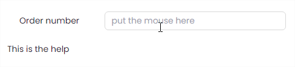
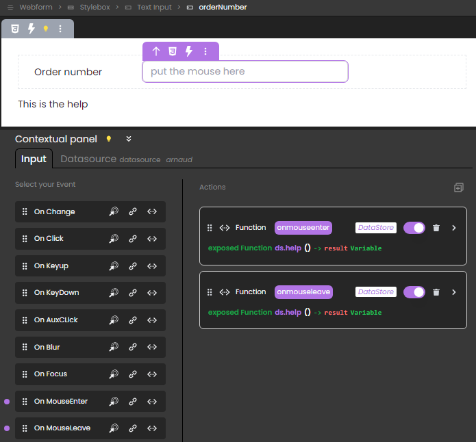

Qodly proposes several commands and functions allowing to handle your webform components. 


### Commands

||
|---|
|[<!-- INCLUDE #_command_.webEvent.Syntax -->](#webevent)&nbsp;&nbsp;&nbsp;&nbsp;<!-- INCLUDE #_command_.webEvent.Summary -->|
|[<!-- INCLUDE #_command_.webForm.Syntax -->](#webform)&nbsp;&nbsp;&nbsp;&nbsp;<!-- INCLUDE #_command_.webForm.Summary -->|


### Functions and properties (WebForm)

||
|---|
|[<!-- INCLUDE #WebFormClass.componentName.Syntax -->](#componentname)&nbsp;&nbsp;&nbsp;&nbsp;<!-- INCLUDE #WebFormClass.componentName.Summary -->|
|[<!-- INCLUDE #WebFormClass.setError().Syntax -->](#seterror)&nbsp;&nbsp;&nbsp;&nbsp;<!-- INCLUDE #WebFormClass.setError().Summary -->|
|[<!-- INCLUDE #WebFormClass.setMessage().Syntax -->](#setmessage)&nbsp;&nbsp;&nbsp;&nbsp;<!-- INCLUDE #WebFormClass.setMessage().Summary -->|
|[<!-- INCLUDE #WebFormClass.setWarning().Syntax -->](#setwarning)&nbsp;&nbsp;&nbsp;&nbsp;<!-- INCLUDE #WebFormClass.setWarning().Summary -->|


### Functions and properties (WebFormItem)

||
|---|
|[<!-- INCLUDE #WebFormItemClass.addCSSClass().Syntax -->](#addclass)&nbsp;&nbsp;&nbsp;&nbsp;<!-- INCLUDE #WebFormItemClass.addCSSClass().Summary -->|
|[<!-- INCLUDE #WebFormItemClass.hide().Syntax -->](#hide)&nbsp;&nbsp;&nbsp;&nbsp;<!-- INCLUDE #WebFormItemClass.hide().Summary -->|
|[<!-- INCLUDE #WebFormItemClass.removeCSSClass().Syntax -->](#removeclass)&nbsp;&nbsp;&nbsp;&nbsp;<!-- INCLUDE #WebFormItemClass.removeCSSClass().Summary -->|
|[<!-- INCLUDE #WebFormItemClass.show().Syntax -->](#show)&nbsp;&nbsp;&nbsp;&nbsp;<!-- INCLUDE #WebFormItemClass.show().Summary -->|


## webEvent

<!-- REF #_command_.webEvent.Syntax -->**webEvent** : object<!-- END REF -->

<!-- REF #_command_.webEvent.Params -->
|Parameter|Type||Description|
|---------|--- |:---:|------|
|Result|object|<-| object
<!-- END REF -->

#### Description

**webEvent** <!-- REF #_command_.webEvent.Summary -->returns an object with information on a triggered event linked to a webform component<!-- END REF -->.

The function must be called in the context of a web form handled by the Qodly web server

**Result**

The returned object contains the following properties:

| Property | Type | Description |
|----|----|----|
| caller | string | Server-side reference of the component triggering the event |
| eventType | string | Event type: onclick, onchange, onmouseover...(see below) |
| data	| object| For Tabs component: contains an index property (Number) with the index of the clicked Tab (indexing starts at 0) |

*eventType* can contain the following events: 

* blur
* focus
* auxclick
* click
* dblclick
* mouseenter
* mouseleave
* mouseover
* keydown
* keyup
* change
* On Load

The "On Load" event is triggered when the `WebForm` component loads.

#### Example

The objective is to display help when the user hovers over the component:



This is done by attaching an `onmouseover` event to an **Input string** component that displays the information:



In the above image: 

* The string Input component has `orderNumber` as server reference
* The component has an `onmouseover` event attached to it
* The exposed function `help` attached to the `onmouseover` event contains the following code: 

```qs
var event : object
var myForm : 4D.WebForm

myForm=webForm
event=webEvent
componentRef=event.caller

if (event.eventType=="onmouseover")  // event is onmouseover 
	myForm["helpOn_"+componentRef].show()  // show the help on "orderNumber" by showing  
	// the text component with reference "helpOn_orderNumber" 
else 
	myForm["helpOn_"+componentRef].hide()  // hide the help on orderNumber
end 
```


## webForm

<!-- REF #_command_.webForm.Syntax -->**webForm** : 4D.WebForm<!-- END REF -->

<!-- REF #_command_.webForm.Params -->
|Parameter|Type||Description|
|---------|--- |:---:|------|
|Result|4D.WebForm|<-|New `WebForm` object
<!-- END REF -->

#### Description

The `webForm` command <!-- REF #_command_.webForm.Summary --> returns a `4D.WebForm` object that references a webform<!-- END REF -->.

Each property of the returned object is an object of the [4D.WebFormItem](#webformitem-class) class.

The command returns `null` if it is called in a request that does not originate from Qodly Studio.


## WebForm Class

The `4D.WebForm` class object provides an interface that allows you to handle your webform components. `4D.WebForm` objects are instantiated with the [webForm](#webform) command.


### *.componentName*

<!-- REF #WebFormClass.componentName.Syntax -->***.componentName*** : [4D.WebFormItem](#webformitem-class)<!-- END REF -->

#### Description

The components of webforms are <!-- REF #WebFormClass.componentName.Summary -->objects that are available directly as properties<!-- END REF --> of these webforms.

The returned objects are of the [`4D.WebFormItem`](#webformitem-class) class. These objects have functions that you can use to manage your components dynamically.


#### Example

```qs
var myForm: 4D.WebForm
var component: 4D.WebFormItem

myForm=webForm //returns the web form as an object, each property is a component
component=myForm.myImage //returns the myImage component of the web form

```

### .setError()

<!-- REF #WebFormClass.setError().Syntax -->
**.setError**( *msg* : string)<!-- END REF -->

<!-- REF #WebFormClass.setError().Params -->
|Parameter|Type||Description|
|---------|--- |:---:|------|
|msg|string|->|Error message to display in the web form|
<!-- END REF -->

#### Description

The `.setError()` function  <!-- REF #WebFormClass.setError().Summary -->sends *msg* as an error message to the web form<!-- END REF -->.

The function returns a response with a `200 OK` status and a `__WEBFORM` object in the body with a `__NOTIFICATION.message` property set to *msg* and a `__NOTIFICATION.type` set to "error".


 
#### Example

```qs 
exposed Function myError()

webForm.setError("My error message")

```

If the [**Provide feedback**](../studio/design-webforms/events.md#provide-feedback) feature is enabled for the event, the *message* is automatically displayed as a red *toast* at the bottom of the web form and disappears automatically after 5 seconds:


#### See also

[`throw`](debug.md#throw)


### .setMessage()

<!-- REF #WebFormClass.setMessage().Syntax -->
**.setMessage**( *msg* : string)<!-- END REF -->

<!-- REF #WebFormClass.setMessage().Params -->
|Parameter|Type||Description|
|---------|--- |:---:|------|
|msg|string|->|Information message to display in the web form|
<!-- END REF -->

#### Description

The `.setMessage()` function  <!-- REF #WebFormClass.setMessage().Summary -->sends *msg* as an information message to the web form<!-- END REF -->.

The function returns a response with a `200 OK` status and a `__WEBFORM` object in the body with a `__NOTIFICATION.message` property set to *msg* and a `__NOTIFICATION.type` set to "message".


 
#### Example

```qs 
exposed Function myMessage()

webForm.setMessage("My information message")

```

If the [**Provide feedback**](../studio/design-webforms/events.md#provide-feedback) feature is enabled for the event, the *message* is automatically displayed as a green *toast* at the bottom of the web form and disappears automatically after 5 seconds:


### .setWarning()

<!-- REF #WebFormClass.setWarning().Syntax -->
**.setWarning**( *msg* : string)<!-- END REF -->

<!-- REF #WebFormClass.setWarning().Params -->
|Parameter|Type||Description|
|---------|--- |:---:|------|
|msg|string|->|Warning message to display in the web form|
<!-- END REF -->

#### Description

The `.setWarning()` function  <!-- REF #WebFormClass.setWarning().Summary -->sends *msg* as a warning message to the web form<!-- END REF -->.

The function returns a response with a `200 OK` status and a `__WEBFORM` object in the body with a `__NOTIFICATION.message` property set to *msg* and a `__NOTIFICATION.type` set to "warning".


 
#### Example

```qs 
exposed Function myWarning()

webForm.setWarning("My warning message")

```

If the [**Provide feedback**](../studio/design-webforms/events.md#provide-feedback) feature is enabled for the event, the *message* is automatically displayed as a green *toast* at the bottom of the web form and disappears automatically after 5 seconds:


## WebFormItem Class

The `4D.WebFormItem` class allows you to handle the behavior of your webform components.

`4D.WebFormItem` objects are properties of the [`4D.WebForm`](#webform-class) object returned by the [`webForm`](#webform) command. 

When you call the [`webForm`](#webform) command, the returned `4D.WebForm` object holds as many `4D.WebFormItems` as there are components with `[server-side references](XXX)` in your webform.

For example, `WebFormObject.myImage` refers to the image component with `myImage` as server reference.


### .hide()

<!-- REF #WebFormItemClass.hide().Syntax -->
**.hide**()<!-- END REF -->

<!-- REF #WebFormItemClass.hide().Params -->
|Parameter|Type||Description|
|---------|--- |:---:|------|
||||Does not require any parameters|
<!-- END REF -->


#### Description

The `.hide()` function <!-- REF #WebFormItemClass.hide().Summary -->hides the component<!-- END REF -->.

#### Example

To call a function that hides an image when the user clicks a button: 

1. Select the image component on the canvas, and enter a server-side reference in the Properties Panel > Server Side, for example "myImage".
2. Create an exposed function named `isHidden` that contains the following code:

```qs 
exposed Function isHidden()

var myComponent: 4D.WebFormItem

myComponent=webForm.myImage
myComponent.hide() // Hide the component that has "myImage" as server reference 
```

3. Select the Button component and add an `onclick` event to it.
4. Attach the `isHidden` function to the event.


### .show()

<!-- REF #WebFormItemClass.show().Syntax -->
**.show**()<!-- END REF -->


<!-- REF #WebFormItemClass.show().Params -->
|Parameter|Type||Description|
|---------|--- |:---:|------|
||||Does not require any parameters|
<!-- END REF -->


#### Description

The `.show()` function <!-- REF #WebFormItemClass.show().Summary -->makes the component visible<!-- END REF -->. If the component was already visible, the function does nothing.


### .addCSSClass()

<!-- REF #WebFormItemClass.addCSSClass().Syntax -->
**.addCSSClass**(*className* : string)<!-- END REF -->

<!-- REF #WebFormItemClass.addCSSClass().Params -->
|Parameter|Type||Description|
|---------|--- |:---:|------|
|className|string|->|Name of the CSS class to add to the component|
<!-- END REF -->

#### Description

The **.addCSSClass** function <!-- REF #WebFormItemClass.addCSSClass().Summary -->adds the class specified in *className* to the component<!-- END REF -->.


### .removeCSSClass()


<!-- REF #WebFormItemClass.removeCSSClass().Syntax -->
**.removeCSSClass**(*className*: string)<!-- END REF -->

<!-- REF #WebFormItemClass.removeCSSClass().Params -->
|Parameter|Type||Description|
|---------|--- |:---:|------|
|className|string|->|Name of the CSS class to remove from the component|
<!-- END REF -->

#### Description

The `.removeCSSClass()` function <!-- REF #WebFormItemClass.removeCSSClass().Summary -->removes the class specified in *className* from the component<!-- END REF -->.

