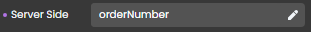
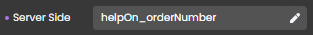

The `4D.WebForm` class object provides an interface that allows you to handle your webform components. `4D.WebForm` objects are instantiated with the [`webForm`](#webform) command.


### Commands

||
|---|
|[<!-- INCLUDE #_command_.webEvent.Syntax -->](#webevent)&nbsp;&nbsp;&nbsp;&nbsp;<!-- INCLUDE #_command_.webEvent.Summary -->|
|[<!-- INCLUDE #_command_.webForm.Syntax -->](#webform)&nbsp;&nbsp;&nbsp;&nbsp;<!-- INCLUDE #_command_.webForm.Summary -->|


### Functions and properties

||
|---|
|[<!-- INCLUDE #WebFormClass.componentName.Syntax -->](#componentname)&nbsp;&nbsp;&nbsp;&nbsp;<!-- INCLUDE #WebFormClass.componentName.Summary -->|
|[<!-- INCLUDE #WebFormClass.setError().Syntax -->](#seterror)&nbsp;&nbsp;&nbsp;&nbsp;<!-- INCLUDE #WebFormClass.setError().Summary -->|
|[<!-- INCLUDE #WebFormClass.setMessage().Syntax -->](#setmessage)&nbsp;&nbsp;&nbsp;&nbsp;<!-- INCLUDE #WebFormClass.setMessage().Summary -->|
|[<!-- INCLUDE #WebFormClass.setWarning().Syntax -->](#setwarning)&nbsp;&nbsp;&nbsp;&nbsp;<!-- INCLUDE #WebFormClass.setWarning().Summary -->|


## webEvent

<!-- REF #_command_.webEvent.Syntax -->**webEvent** : object<!-- END REF -->

<!-- REF #_command_.webEvent.Params -->
|Parameter|Type||Description|
|---------|--- |:---:|------|
|Result|object|<-| object
<!-- END REF -->

#### Description

`webEvent` <!-- REF #_command_.webEvent.Summary -->returns an object with information on a triggered event linked to a webform component<!-- END REF -->.

The command must be called in the context of a web form handled by the Qodly web server.

**Result**

The returned object contains the following properties:

| Property |  |Type| Description |
|----|---|----|----|
| caller |  |string| [Server-side reference](../studio/design-webforms/create-webform.md#data-access-category) of the component triggering the event |
| eventType |  |string| Type of event:<li>onblur</li><li>onfocus</li><li>onclick</li><li>onauxclick</li><li>onmouseenter</li><li>onmouseleave</li><li>onkeyup</li><li>onkeydown</li><li>onchange</li><li>unload</li><li>onload - triggered when the `WebForm` component loads</li>|
| data	| |object|Additional information depending on the involved component|
| 	|index |number|<li>Tabs component: index of the tab (indexing starts at 0)</li><li>Data Table component: column number</li>|
| 	|row |number|Data Table component: row number |
| 	|name |string|Data Table component: datasource name of the column (e.g. "firstname", "address.city")|


#### Example

The objective is to display/hide a help text when the user hovers over the component:


This is done by attaching `onmouseenter` and `onmouseleave` events to a **Text input** component that displays the information stored in a **Text** component (displaying "This is the help"). 


In this scenario: 

* The Text input component has `orderNumber` as Server side reference.
	
* The Text component has `orderNumber` as Server side reference.
	
* The exposed function `help()` is attached to both the `onmouseenter` and `onmouseleave` events and contains the following code: 

```qs
exposed function help()

var event : object
var myForm : 4D.WebForm
var componentRef : string

myForm = webForm
event = webEvent
componentRef = event.caller

switch 
: (event.eventType == "onmouseenter")  // event is onmouseenter 
	myForm["helpOn_"+componentRef].show()  // show the help on "orderNumber" by showing  
	// the text component with reference "helpOn_orderNumber" 
: (event.eventType == "onmouseleave")  // event is onmouseleave 
 	myForm["helpOn_"+componentRef].hide()  // hide the help on orderNumber
end 

```

To open the WebForm with the help on `orderNumber` hidden, you can associate this function to the `onload` event of the WebForm:

```qs
exposed function hideOnLoad()
	webForm.helpOn_orderNumber.hide()
```

## webForm

<!-- REF #_command_.webForm.Syntax -->**webForm** : 4D.WebForm<!-- END REF -->

<!-- REF #_command_.webForm.Params -->
|Parameter|Type||Description|
|---------|--- |:---:|------|
|Result|4D.WebForm|<-|New `WebForm` proxy object
<!-- END REF -->

#### Description

The `webForm` command <!-- REF #_command_.webForm.Summary --> returns a `4D.WebForm` proxy object, providing a means to work with and effectively emulates the web form's properties and functions<!-- END REF -->.


:::info

Keep in mind that a `4D.WebForm` object  is a **proxy object**, and not a direct reference to the web form object itself. As a consequence for example, the `4D.WebForm` object does not expose all web form properties in the Debugger. 

:::

Each property of the returned object is an object of the [4D.WebFormItem](WebFormItemClass.md) class.

The command returns `null` if it is called in a request that does not originate from Qodly Studio.


### *.componentName*

<!-- REF #WebFormClass.componentName.Syntax -->***.componentName*** : [4D.WebFormItem](#webformitem-class)<!-- END REF -->

#### Description

The components of webforms are <!-- REF #WebFormClass.componentName.Summary -->objects that are available directly as properties<!-- END REF --> of these webforms.

The returned objects are of the [`4D.WebFormItem`](#webformitem-class) class. These objects have functions that you can use to manage your components dynamically.


#### Example

```qs
var myForm: 4D.WebForm
var component: 4D.WebFormItem

myForm = webForm //returns the web form as an object, each property is a component
component = myForm.myImage //returns the myImage component of the web form

```

:::info

While `myForm` may not display typical object properties when examined in the debugger, it behaves as if it were the actual `webForm` object. You can interact with the underlying `webForm` object's properties and functions through `myForm`. For example, you can dynamically manipulate web form components or transmit messages to web pages using specialized functions like `myForm.setMessage()`.

:::

### .setError()

<!-- REF #WebFormClass.setError().Syntax -->
**.setError**( *msg* : string)<!-- END REF -->

<!-- REF #WebFormClass.setError().Params -->
|Parameter|Type||Description|
|---------|--- |:---:|------|
|msg|string|->|Error message to display in the web form|
<!-- END REF -->

#### Description

The `.setError()` function  <!-- REF #WebFormClass.setError().Summary -->sends *msg* as an error message to the web form<!-- END REF -->.

The function returns a response with a `200 OK` status and a `__WEBFORM` object in the body with a `__NOTIFICATION.message` property set to *msg* and a `__NOTIFICATION.type` set to "error".


 
#### Example

```qs 
exposed function myError()

webForm.setError("My error message")

```

If the [**Provide feedback**](../studio/design-webforms/events.md#provide-feedback) feature is enabled for the event, the *message* is automatically displayed as a red *toast* at the bottom of the web form and disappears automatically after 5 seconds:


#### See also

[`throw`](debug.md#throw)


### .setMessage()

<!-- REF #WebFormClass.setMessage().Syntax -->
**.setMessage**( *msg* : string)<!-- END REF -->

<!-- REF #WebFormClass.setMessage().Params -->
|Parameter|Type||Description|
|---------|--- |:---:|------|
|msg|string|->|Information message to display in the web form|
<!-- END REF -->

#### Description

The `.setMessage()` function  <!-- REF #WebFormClass.setMessage().Summary -->sends *msg* as an information message to the web form<!-- END REF -->.

The function returns a response with a `200 OK` status and a `__WEBFORM` object in the body with a `__NOTIFICATION.message` property set to *msg* and a `__NOTIFICATION.type` set to "message".


 
#### Example

```qs 
exposed function myMessage()

webForm.setMessage("My information message")

```

If the [**Provide feedback**](../studio/design-webforms/events.md#provide-feedback) feature is enabled for the event, the *message* is automatically displayed as a green *toast* at the bottom of the web form and disappears automatically after 5 seconds:


### .setWarning()

<!-- REF #WebFormClass.setWarning().Syntax -->
**.setWarning**( *msg* : string)<!-- END REF -->

<!-- REF #WebFormClass.setWarning().Params -->
|Parameter|Type||Description|
|---------|--- |:---:|------|
|msg|string|->|Warning message to display in the web form|
<!-- END REF -->

#### Description

The `.setWarning()` function  <!-- REF #WebFormClass.setWarning().Summary -->sends *msg* as a warning message to the web form<!-- END REF -->.

The function returns a response with a `200 OK` status and a `__WEBFORM` object in the body with a `__NOTIFICATION.message` property set to *msg* and a `__NOTIFICATION.type` set to "warning".


 
#### Example

```qs 
exposed function myWarning()

webForm.setWarning("My warning message")

```

If the [**Provide feedback**](../studio/design-webforms/events.md#provide-feedback) feature is enabled for the event, the *message* is automatically displayed as a yellow *toast* at the bottom of the web form and disappears automatically after 5 seconds:


