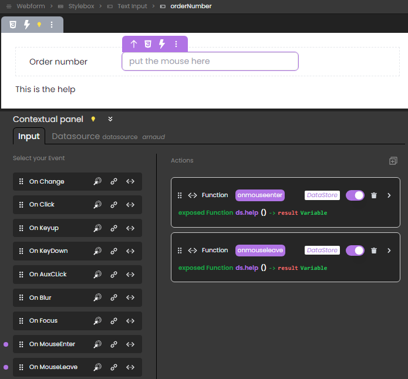

<!-- REF #_command_.webEvent.Syntax -->**webEvent** : object<!-- END REF -->

<!-- REF #_command_.webEvent.Params -->
|Parameter|Type||Description|
|---------|--- |:---:|------|
|Result|object|<-| object
<!-- END REF -->

#### Description

`webEvent` <!-- REF #_command_.webEvent.Summary -->returns an object with information on a triggered event linked to a webform component<!-- END REF -->.

The command must be called in the context of a web form handled by the Qodly web server.

**Result**

The returned object contains the following properties:

| Property |  |Type| Description |
|----|---|----|----|
| caller |  |string| [Server-side reference](../studio/design-webforms/create-webform.md#data-access-category) of the component triggering the event |
| eventType |  |string| Type of event:<li>onblur</li><li>onfocus</li><li>onclick</li><li>onauxclick</li><li>onmouseenter</li><li>onmouseleave</li><li>onkeyup</li><li>onkeydown</li><li>onchange</li><li>unload</li><li>onload - triggered when the `WebForm` component loads</li>|
| data	| |object|Additional information depending on the involved component|
| 	|index |number|<li>Tabs component: index of the tab (indexing starts at 0)</li><li>Data Table component: column number</li>|
| 	|row |number|Data Table component: row number |
| 	|name |string|Data Table component: datasource name of the column (e.g. "firstname", "address.city")|


#### Example

The objective is to display/hide a help text when the user hovers over the component:


This is done by attaching `onmouseenter` and `onmouseleave` events to a **Text input** component that displays the information stored in a **Text** component (displaying "This is the help"). 



In this scenario: 

* The Text input component has `orderNumber` as Server side reference.
	
* The Text component has `orderNumber` as Server side reference.
	
* The exposed function `help()` is attached to both the `onmouseenter` and `onmouseleave` events and contains the following code: 

```qs
exposed function help()

var event : object
var myForm : 4D.WebForm
var componentRef : string

myForm = webForm
event = webEvent
componentRef = event.caller

switch 
: (event.eventType == "onmouseenter")  // event is onmouseenter 
	myForm["helpOn_"+componentRef].show()  // show the help on "orderNumber" by showing  
	// the text component with reference "helpOn_orderNumber" 
: (event.eventType == "onmouseleave")  // event is onmouseleave 
 	myForm["helpOn_"+componentRef].hide()  // hide the help on orderNumber
end 

```

To open the WebForm with the help on `orderNumber` hidden, you can associate this function to the `onload` event of the WebForm:

```qs
exposed function hideOnLoad()
	webForm.helpOn_orderNumber.hide()
```
