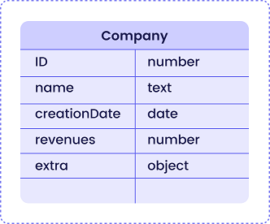
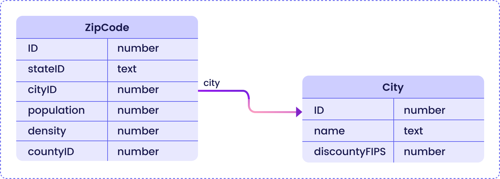
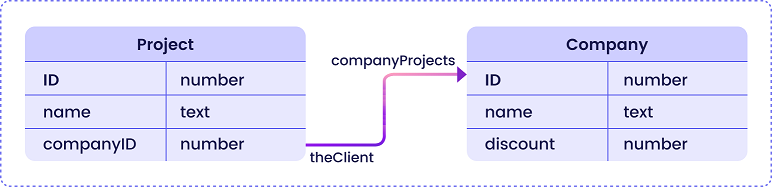

## Introduction

### Database as Objects

The [ORDA technology](../concepts/platform/#the-orda-concept) is based upon an automatic mapping of an underlying relational database structure to a data model (this concept can be viewed as an included and enhanced [ORM](https://en.wikipedia.org/wiki/Object%E2%80%93relational_mapping)), along with powerful features such as calculated attributes or dataclass functions. It also provides [access to data](data.md) through entity and entity selection objects. 

As a result, ORDA exposes the whole database as a set of data model objects, including **model objects** as well as **data objects**.  
 


### Objects have Classes

With ORDA, you can declare and use high-level [user class functions](../language/basics/lang-classes.md#function) above the data model. This allows you to write business-oriented code and "publish" it just like an API. Datastore, dataclasses, entity selections, and entities are all available as class objects that can contain functions.

For example, you could create a `getNextWithHigherSalary()` function in the `EmployeeEntity` class to return employees with a salary higher than the selected one. It would be as simple as calling:

```qs
nextHigh=ds.Employee.get(1).getNextWithHigherSalary()
```

Thanks to this feature, the entire business logic of your Qodly application can be stored as a independent layer so that it can be easily maintained and reused with a high level of security:

- You can "hide" the overall complexity of the underlying physical structure and only expose understandable and ready-to-use functions. 
- If the physical structure evolves, you can simply adapt function code and client applications will continue to call them transparently. 
- By default, all of your data model class functions (including [calculated attribute functions](#calculated-attributes)) are **not exposed** to remote calls. You must explicitly declare each public function with the [`exposed`](#exposed-vs-non-exposed-functions) keyword.


### Class Architecture

ORDA provides **generic classes** exposed through a **`4D`** class store, as well as specific **user classes** (extending generic classes) exposed in the [**`cs`** class store](../language/basics/lang-classes.md):


All ORDA data model classes are exposed as properties of the **`cs`** class store. The following ORDA classes are available:

|Class|Example name|Instantiated by|
|---|---|---|
|cs.DataStore|cs.DataStore|[`ds`](../language/commands/ds) command|
|cs.*DataClassName*|cs.Employee|[`dataStore.DataClassName`](../language/DataStoreClass.md#dataclassname), `dataStore["DataClassName"]`|
|cs.*DataClassName*Entity|cs.EmployeeEntity|[`dataClass.get()`](../language/DataClassClass.md#get), [`dataClass.new()`](../language/DataClassClass.md#new), [`entitySelection.first()`](../language/EntitySelectionClass.md#first), [`entitySelection.last()`](../language/EntitySelectionClass.md#last), [`entity.previous()`](../language/EntityClass.md#previous), [`entity.next()`](../language/EntityClass.md#next), [`entity.first()`](../language/EntityClass.md#first), [`entity.last()`](../language/EntityClass.md#last), [`entity.clone()`](../language/EntityClass.md#clone)|
|cs.*DataClassName*Selection|cs.EmployeeSelection|[`dataClass.query()`](../language/DataClassClass.md#query), [`entitySelection.query()`](../language/EntitySelectionClass.md#query), [`dataClass.all()`](../language/DataClassClass.md#all), [`dataClass.fromCollection()`](../language/DataClassClass.md#fromcollection), [`dataClass.newSelection()`](../language/DataClassClass.md#newselection), [`entitySelection.drop()`](../language/EntitySelectionClass.md#drop), [`entity.getSelection()`](../language/EntityClass.md#getselection), [`entitySelection.and()`](../language/EntitySelectionClass.md#and), [`entitySelection.minus()`](../language/EntitySelectionClass.md#minus), [`entitySelection.or()`](../language/EntitySelectionClass.md#or), [`entitySelection.orderBy()`](../language/EntitySelectionClass.md#or), [`entitySelection.orderByFormula()`](../language/EntitySelectionClass.md#orderbyformula), [`entitySelection.slice()`](../language/EntitySelectionClass.md#slice)|

Also, object instances from ORDA data model user classes benefit from their parent's properties and functions:

- a Datastore class object can call functions from the [ORDA Datastore generic class](../language/DataStoreClass.md).
- a Dataclass class object can call functions from the [ORDA Dataclass generic class](../language/DataClassClass.md).
- an Entity selection class object can call functions from the [ORDA Entity selection generic class](../language/EntitySelectionClass.md).
- an Entity class object can call functions from the [ORDA Entity generic class](../language/EntityClass.md).


## Datastore

The datastore is the interface object to a database. It builds a representation of the whole database as object. A datastore is made of a **model** and **data**:

- The model contains and describes all the dataclasses that make up the datastore. It is independant from the underlying database itself.
- Data refers to the information that is going to be used and stored in this model. For example, names, addresses, and birthdates of employees are pieces of data that you can work with in a datastore.

When handled through the code, the datastore is an object named DataStore, returned by the [`ds`](../language/commands/ds) command, whose properties are all of the [dataclasses](#dataclass) which have been specifically **exposed**. 

The DataStore object itself cannot be copied as an object:

```qs 
mydatastore=objectCopy(ds) //returns null
```


The datastore properties are however enumerable:


```qs 
 var names : collection
 names=objectKeys(ds)
  //names contains the names of all the dataclasses
```

### DataStoreImplementation Class


A database exposes its own DataStoreImplementation class, named DataStore, in the `cs` class store. 

- **Extends**: 4D.DataStoreImplementation 
- **Class name in *cs* class store**: DataStore

You create functions in the DataStore class that will be available through the `ds` object, from any context of the application. 

#### Example

```qs  
// DataStore class

extends DataStoreImplementation

exposed function getDesc
  return "Database exposing employees and their companies"
```


This function can then be called:

```qs
desc=ds.getDesc() //"Database exposing..."
```


## Dataclass

A dataclass is the equivalent of a database table. It is used as an object model and references all fields as attributes, including relational attributes (attributes built upon relations between dataclasses) as well as calculated and alias attributes. Relational, computed and alias attributes can be used in queries like any other attribute.

All dataclasses in a Qodly project are available as a property of the `ds` datastore. The **Expose as REST resource** option must be selected at the model level for each dataclass that you want to be called from the Web. 

For example, consider the following database table:



The `Company` [dataclass](#dataclass) is available in the `ds` datastore. You can write:

```qs 
var compClass : cs.Company //declares a compClass object variable of the Company class
compClass=ds.Company //assigns the Company dataclass reference to compClass
```

The dataclass offers an abstraction of the physical database and allows handling a conceptual data model with specific features such as computed attributes or alias attributes. 

A dataclass object can contain:

*	storage attributes
*	relation attributes
*	computed attributes
*	alias attributes
*	functions


The dataclass is the only means to query the datastore. A query is done from a single dataclass. Queries are built around attributes and relation attribute names of the dataclasses. So the relation attributes are the means to involve several linked dataclasses in a query.

The dataclass object itself cannot be copied as an object:

```qs 
mydataclass=objectCopy(ds.Employee) //returns null
```

The dataclass properties are however enumerable:

```qs
 var names : collection
 names=objectKeys(ds.Employee)
//names contains the names of all the dataclass attributes
```

### DataClass Class

Each dataclass offers a DataClass class in the `cs` class store.

- **Extends**: 4D.DataClass 
- **Class name in *cs* class store**: *DataClassName*
- **Example name**: Employee


#### Example 1

```qs
// Company class


extends DataClass

// Returns companies whose revenue is over the average
// Returns an entity selection related to the Company DataClass

function getBestOnes() : cs.CompanySelection 
	sel=this.query("revenues >= :1",this.all().average("revenues"))
	return sel
```

Then you can get an entity selection of the "best" companies by executing: 

```qs
	var best : cs.CompanySelection
	best=ds.Company.getBestOnes()
```

:::note

[Calculated attributes](#calculated-attributes) are defined in the [Entity Class](#entity-class). 

:::

#### Example 2

Considering the following model (partial view):



Zipcodes are used as primary keys of the *ZipCode* table. The many-to-one relation attribute between *cityID* and *ID* is named *city*.

The `City Class` provides an API:

```qs  
// City class

extends DataClass

exposed function getCityName(zipcode : integer) -> result : string
	var zip : cs.ZipCodeEntity

	zip=ds.ZipCode.get(zipcode)
	result="" 

	if (zip!=null)
		result=zip.city.name
	end
```

The application can use the API to get the city matching a zip code:

```qs
city=ds.City.getCityName(zipcode)

```


## Entity

An entity is the equivalent of a record. It is actually an object that references a record in the database. It can be seen as an instance of a [dataclass](#dataclass), like a record of the table matching the dataclass. 

However, an entity also contains data correlated to the datastore. The purpose of the entity is to manage data (create, read, update, delete). When an entity reference is obtained by means of an entity selection, it also retains information about the entity selection which allows iteration through the selection.

For example, to create an entity:

```qs
 var status : object
 var employee : cs.EmployeeEntity //declares a variable of the EmployeeEntity class type

 employee=ds.Employee.new()
 employee.firstName="Mary"
 employee.lastName="Smith"
 status=employee.save()
```

The entity object itself cannot be copied as an object:

```qs
 myentity=objectCopy(ds.Employee.get(1)) //returns null
```

The entity properties are however enumerable:

```qs
 var names : collection
 names=objectKeys(ds.Employee.get(1))
  //names contains the names of all the entity attributes
```

### Entity Class

Each dataclass offers an Entity class in the `cs` class store.

- **Extends**: 4D.Entity 
- **Class name in *cs* class store**: *DataClassName*Entity
- **Example name**: CityEntity

#### Calculated attributes

Entity classes allow you to define **calculated attributes** using specific keywords:

- `function get` *attributeName*
- `function set` *attributeName*
- `function query` *attributeName*
- `function orderBy` *attributeName*

For more information, please refer to the [Calculated attributes](#calculated-attributes-1) section below. 


#### Example


```qs
// cs.CityEntity class

extends Entity

function getPopulation() -> result : integer
    result=this.zips.sum("population")


function isBigCity() -> result : boolean
// The getPopulation() function is usable inside the class
result=this.getPopulation()>50000
```

Then you can call this code: 

```qs
var city : cs.CityEntity
var message : string

city=ds.City.getCity("Caguas")

if (city.isBigCity())
	message=city.name + " is a big city"
end
```


## Entity selection

An entity selection is an object containing one or more reference(s) to entities belonging to the same dataclass. It is usually created as a result of a query or returned from a relation attribute. An entity selection can contain 0, 1 or X entities from the dataclass -- where X can represent the total number of entities contained in the dataclass.

Example:

```qs
var e : cs.EmployeeSelection //declares a e object variable of the EmployeeSelection class type
e=ds.Employee.all() //assigns the resulting entity selection reference to the e variable
``` 

The entity selection object itself cannot be copied as an object:

```qs
 myentitysel=objectCopy(ds.Employee.all()) //returns null
``` 
 
The entity selection properties are however enumerable:

```qs
 var names : collection
 names=objectKeys(ds.Employee.all())
  //names contains the names of the entity selection properties
  //("length", "00", "01"...)
```

### EntitySelection Class

Each dataclass offers an EntitySelection class in the `cs` class store.

- **Extends**: 4D.EntitySelection 
- **Class name in *cs* class store**: *DataClassName*Selection
- **Example name**: EmployeeSelection


#### Example

```qs
// EmployeeSelection class


extends EntitySelection

//Extract the employees with a salary greater than the average from this entity selection 

function withSalaryGreaterThanAverage() -> result : cs.EmployeeSelection
	result=this.query("salary > :1",this.average("salary")).orderBy("salary")

```

Then you can get employees with a salary greater than the average in any entity selection by executing: 

```qs
moreThanAvg=ds.Company.all().employees.withSalaryGreaterThanAverage()
```


### Ordered or unordered entity selection

For optimization reasons, by default ORDA usually creates unordered entity selections, except when you call the [`orderBy()`](../language/EntitySelectionClass.md#orderby) function or use specific options. In this documentation, unless specified, "entity selection" usually refers to an "unordered entity selection".

Ordered entity selections are created only when necessary or when specifically requested using options, i.e. in the following cases:

*	result of an `orderBy()` on a selection (of any type)
*	result of an `orderByFormula()` on a selection (of any type)
*	result of the `newSelection()` function with the `dk keep ordered` option

:::note

Ordered entity selections support duplicated entity references. On the other hand, when an ordered entity selection becomes an unordered entity selection, any repeated entity references are removed.

:::


Unordered entity selections are created in all other cases, including:

*	result of a `query()` on a selection (of any type) or a `query()` on a dataclass,
*	result of a `all()`, `fromCollection()`, or `newSelection()` (without option) function on a dataclass,
*	result of various functions from the entity selection class, whatever the input selection types: `or()`, `and()`, `add()`, `copy()`, `extract()`, `slice()`, `drop()`...
*	result of a relation such as `empSel=company.employees`, or a projection such as `empSel.name`,
*	result of an `entity.getSelection()` function.


## Attributes

There is no specific class for attribute objects. Basically, dataclass properties are attribute objects describing the underlying fields or relations. For example:

```qs 
 var nameAttribute, revenuesAttribute : object
 nameAttribute=ds.Company.name //reference to class attribute
 revenuesAttribute=ds.Company["revenues"] //alternate way to reference
```

This code assigns to `nameAttribute` and `revenuesAttribute` references to the `name` and `revenues` attributes of the `Company` dataclass. This syntax does NOT return values held inside of the attribute, but instead returns objects describing the attributes themselves, that you can handle by calling the [dataclass *attribute name*](../language/DataClassClass.md#attributename). To handle values, you need to go through [Entities](#entity).

The **Expose as REST resource** option must be selected at the model level for each attribute that you want to be called from the Web (by default this option is inherited from the dataclass level). 

Dataclass attributes come in several kinds: storage, relatedEntity, relatedEntities, computed (*aka* calculated), or alias. Attributes that are scalar (*i.e.*, provide only a single value) support all the standard data types (integer, text, object, etc.).

### Storage and Relation attributes  

*	A **storage attribute** is equivalent to a field in a database and can be indexed. Values assigned to a storage attribute are stored as part of the entity when it is saved. When a storage attribute is accessed, its value comes directly from the datastore. Storage attributes are the most basic building block of an entity and are defined by name and data type.
*	A **relation attribute** provides access to other entities. Relation attributes can result in either a single entity (or no entity) or an entity selection (0 to N entities). Relation attributes are built upon "classic" relations in the relational structure to provide direct access to related entity or related entities. Relation attributes are directy available in ORDA using their names.

For example, consider the following partial model and the relation properties:



All storage attributes will be automatically available:

*	in the Project dataclass: "ID", "name", and "companyID"
*	in the Company dataclass: "ID", "name", and "discount"


In addition, the following relation attributes will also be automatically available:

*	in the Project dataclass: **theClient** attribute, of the "relatedEntity" kind; there is at most one Company for each Project (the client)
*	in the Company dataclass: **companyProjects** attribute, of the "relatedEntities" kind; for each Company there is any number of related Projects.

All dataclass attributes are exposed as properties of the dataclass:

```qs  
	// Company available attributes
ds.Company.companyProjects  //relatedEntities
ds.Company.discount  
ds.Company.ID
ds.Company.name
	  
	//Project available attributes
ds.Project.companyID  
ds.Project.ID  
ds.Project.name
ds.Project.theClient //relatedEntity

```

Keep in mind that these objects describe attributes, but do not give access to data. Reading or writing data is done through [entity objects](#entity).


### Alias attributes

An [alias attribute](../studio/model/attributes.md#alias-attributes) is built above another attribute of the data model, named target attribute. The target attribute can belong to a related dataclass (available through any number of relation levels) or to the same dataclass. An alias attribute stores no data, but the path to its target attribute. You can define as many alias attributes as you want in a dataclass.


## Calculated attributes

[Calculated attributes](../studio/model/attributes.md#calculated-attributes) are declared using a `get <attributeName>` function in the [Entity class definition](#entity-class). Their value is not stored but evaluated each time they are accessed. They do not belong to the underlying database structure, but are usually built upon it and can be used as any attribute of the data model. 

:::info

ORDA calculated attributes are not [**exposed**](#exposed-vs-non-exposed-functions) by default. You expose a calculated attribute by adding the `exposed` keyword to the **get function** definition.

:::


### `function get <attributeName>`

#### Syntax

```qs
{exposed} function get <attributeName>({event : object}) -> result : type
// code
```
The *getter* function is mandatory to declare the *attributeName* calculated attribute. Whenever the *attributeName* is accessed, the `function get` code is evaluated and the *result* value is returned. 

> A calculated attribute can use the value of other calculated attribute(s). Recursive calls generate errors. 

The *getter* function defines the data type of the calculated attribute thanks to the *result* parameter. The following resulting types are allowed:

- Scalar (string, boolean, date, time, number)
- object
- Image
- BLOB
- Entity (i.e. cs.EmployeeEntity)
- Entity selection (i.e. cs.EmployeeSelection)

The *event* parameter contains the following properties:

|Property|Type|Description|
|---|---|---|
|attributeName|string|Calculated attribute name|
|dataClassName|string|Dataclass name|
|kind|string|"get"|
|result|variant|Optional. Add this property with null value if you want a scalar attribute to return null|


#### Examples

- *fullName* calculated attribute:

```qs
function get fullName(event : object)-> fullName : string

  switch 	
	: (this.firstName==null) & (this.lastName==null)
		event.result=null //use result to return null
	: (this.firstName==null)
		fullName=this.lastName
	: (this.lastName==null)
		fullName=this.firstName
	else 
		fullName=this.firstName+" "+this.lastName
	end 
```

- A calculated attribute can be based upon an entity related attribute:

```qs
function get bigBoss(event : object)-> result: cs.EmployeeEntity
	result=this.manager.manager
    
```

- A calculated attribute can be based upon an entity selection related attribute:

```qs
function get coWorkers(event : object)-> result: cs.EmployeeSelection
    if (this.manager==null)
        result=ds.Employee.newSelection()
    else 
        result=this.manager.directReports.minus(this)
    end
```
    
### `function set <attributeName>`

#### Syntax

```qs
function set <attributeName>(value : type {, event : object})
// code
```

The *setter* function executes whenever a value is assigned to the attribute. this function usually processes the input value(s) and the result is dispatched between one or more other attributes.

The *value* parameter receives the value assigned to the attribute. 

The *event* parameter contains the following properties:

|Property|Type|Description|
|---|---|---|
|attributeName|string|Calculated attribute name|
|dataClassName|string|Dataclass name|
|kind|string|"set"|
|value|variant|Value to be handled by the calculated attribute|

#### Example

```qs
function set fullName(value : string , event : object)
	var p : integer
    p=position(" ",value) 		
	this.firstname=substring(value, 1, p-1)  // "" if p<0
	this.lastname=substring(value, p+1)
```


### `function query <attributeName>`

#### Syntax

```qs
function query <attributeName>(event : object)
function query <attributeName>(event : object) -> result : string
function query <attributeName>(event : object) -> result : object
// code
```

This function supports three syntaxes:

- With the first syntax, you handle the whole query through the `event.result` object property.
- With the second and third syntaxes, the function returns a value in *result*:
	- If *result* is a string, it must be a valid query string
	- If *result* is an object, it must contain two properties:
	
	|Property|Type|Description|
	|---|---|---|
	|result.query|string|Valid query string with placeholders (:1, :2, etc.)|
	|result.parameters|collection|values for placeholders|

The `query` function executes whenever a query using the calculated attribute is launched. It is useful to customize and optimize queries by relying on indexed attributes. When the `query` function is not implemented for a calculated attribute, the search is always sequential (based upon the evaluation of all values using the `get <AttributeName>` function).

:::note

The following features are not supported:

- calling a `query` function on calculated attributes of type Entity or Entity selection, 
- using the `order by` keyword in the resulting query string.

:::

The *event* parameter contains the following properties:

|Property|Type|Description|
|---|---|---|
|attributeName|string|Calculated attribute name|
|dataClassName|string|Dataclass name|
|kind|string|"query"|
|value|variant|Value to be handled by the calculated attribute|
|operator|string|Query operator (see also the [`query` class function](../language/DataClassClass.md#query)). Possible values:<li>== (equal to, @ is wildcard)</li><li>=== (equal to, @ is not wildcard)</li><li>!= (not equal to, @ is wildcard)</li><li>!== (not equal to, @ is not wildcard)</li><li>< (less than)</li><li><= (less than or equal to)</li><li>> (greater than)</li><li>>= (greater than or equal to)</li><li>IN (included in)</li><li>% (contains keyword)</li>|
|result|variant|Value to be handled by the calculated attribute. Pass `null` in this property if you want to execute a default query (always sequential for calculated attributes).|

> If the function returns a value in *result* and another value is assigned to the `event.result` property, the priority is given to `event.result`. 

#### Examples

- Query on the *fullName* calculated attribute. 

```qs
function query fullName(event : object)->result : object

	var fullname, firstname, lastname, myQuery : string
	var operator, myQuery : string
	var p : integer
	var parameters : collection

	operator=event.operator
	fullname=event.value

	p=position(" ",fullname) 
	if (p>0)
		firstname=substring(fullname, 1, p-1)+"@"
		lastname=substring(fullname, p+1)+"@"
		parameters=newCollection(firstname, lastname) // two items collection
	else 
		fullname=fullname+"@"
		parameters=newCollection(fullname) // single item collection
	end 

	switch 
	: (operator=="==") | (operator=="===")
		if (p>0)
			myQuery="(firstName = :1 and lastName = :2) or (firstName = :2 and lastName = :1)"
		else 
			myQuery="firstName = :1 or lastName = :1"
		end 
	: (operator="!=")
		if (p>0)
			myQuery="firstName != :1 and lastName != :2 and firstName != :2 and lastName != :1"
		else 
			myQuery="firstName != :1 and lastName != :1"
		end 
	end 

	result=newObject("query", myQuery, "parameters", parameters)
```

> Keep in mind that using placeholders in queries based upon user text input is recommended for security reasons (see [`query()` description](../language/DataClassClass.md#query)).

Calling code, for example:

```qs
emps=ds.Employee.query("fullName = :1", "Flora Pionsin")
```

- This function handles queries on the *age* calculated attribute and returns an object with parameters:

```qs
function query age(event : object)->result : object
	
	var operator, myQuery : string
	var age : integer
	
	operator=event.operator
			
	age=num(event.value)  // integer
	d1=addToDate(currentDate, -age-1, 0, 0)
	d2=addToDate(d1, 1, 0, 0)
	parameters=newCollection(d1, d2)
	
	switch 
			
		: (operator=="==")
			myQuery="birthday > :1 and birthday <= :2"  // after d1 and before or egal d2
			
		: (operator=="===") 

			myQuery="birthday = :2"  // d2 = second calculated date (= birthday date)

		: (operator==">=")
			myQuery="birthday <= :2"
			
			//... other operators			
			
			
	end 
	
	
	if (undefined(event.result))
		result=newObject
		result.query=myQuery
		result.parameters=parameters
	end

```  

Calling code, for example:

```qs
// people aged between 20 and 21 years (-1 day)
twenty=people.query("age = 20")  // calls the "==" case

// people aged 20 years today
twentyToday=people.query("age === 20") // equivalent to people.query("age is 20") 

```


### `function orderBy <attributeName>`

#### Syntax

```qs
function orderBy <attributeName>(event : object)
function orderBy <attributeName>(event : object)-> result : string

// code
```

The `orderBy` function executes whenever the calculated attribute needs to be ordered. It allows sorting the calculated attribute. For example, you can sort *fullName* on first names then last names, or conversely.
When the `orderBy` function is not implemented for a calculated attribute, the sort is always sequential (based upon the evaluation of all values using the `get <AttributeName>` function).

:::info

Calling an `orderBy` function on calculated attributes of type Entity class or Entity selection class **is not supported**. 

:::

The *event* parameter contains the following properties:

|Property|Type|Description|
|---|---|---|
|attributeName|string|Calculated attribute name|
|dataClassName|string|Dataclass name|
|kind|string|"orderBy"|
|value|variant|Value to be handled by the calculated attribute|
|operator|string|"desc" or "asc" (default)|
|descending|boolean|`true` for descending order, `false` for ascending order|
|result|variant|Value to be handled by the calculated attribute. Pass `null` if you want to let Qodly execute the default sort.|

> You can use either the `operator` or the `descending` property. It is essentially a matter of programming style (see examples).   

You can return the `orderBy` string either in the `event.result` object property or in the *result* function result. If the function returns a value in *result* and another value is assigned to the `event.result` property, the priority is given to `event.result`. 


#### Example

You can write conditional code:

```qs
function orderBy fullName(event : object)-> result : string
    if (event.descending==true)
        result="firstName desc, lastName desc" 
    else 
        result="firstName, lastName" 
    end
```

You can also write compact code:

```qs
function orderBy fullName(event : object)-> result : string
	result="firstName "+event.operator+", "lastName "+event.operator

```

Conditional code is necessary in some cases:

```qs
function orderBy age(event : object)-> result : string
    if (event.descending==true)
        result="birthday asc" 
    else 
        result="birthday desc" 
    end

```

## Exposed vs non-exposed functions

For security reasons, all of your data model class functions are **not exposed** (i.e., private) by default to web requests. 

A function that is not exposed is not available from web requests and cannot be called on any object instance. You define non-exposed functions (as well as dataclasses or attributes) if you want them to be only available on the server through local code. If a web request tries to access a non-exposed function, the "-10729 - Unknown member method" error is returned. 

To allow a data model class function to be called by a remote request, you must explicitly declare it using the `exposed` keyword. The formal syntax is:

```qs  
// declare an exposed function
exposed function <functionName>   
```

:::note

The `exposed` keyword can only be used with Data model class functions as well as [shared singleton functions](../language/basics/lang-classes.md#singleton-classes). If used with a [regular user class](../language/basics/lang-classes.md) function, it is ignored.

:::

### Example 

You want an exposed function to use a private function in a dataclass class:

```qs
extends DataClass

//Public function
exposed function registerNewStudent(student : object) -> status : object

var entity : cs.StudentsEntity

entity=ds.Students.new()
entity.fromObject(student)
entity.school=this.query("name=:1", student.schoolName).first()
entity.idNumber=this.computeIDNumber()
status=entity.save()

//Not exposed (private) function
function computeIDNumber()-> id : integer
//compute a new ID number
id=...

```

When the code is called:

```qs
var student , status : object
var id : integer

student=newObject("firstname", "Mary", "lastname", "Smith", "schoolName", "Math school")

status=ds.Schools.registerNewStudent(student) //can be called from a web request
// id=ds.Schools.computeIDNumber() // Error "Unknown member method" if called from a web request 
```

