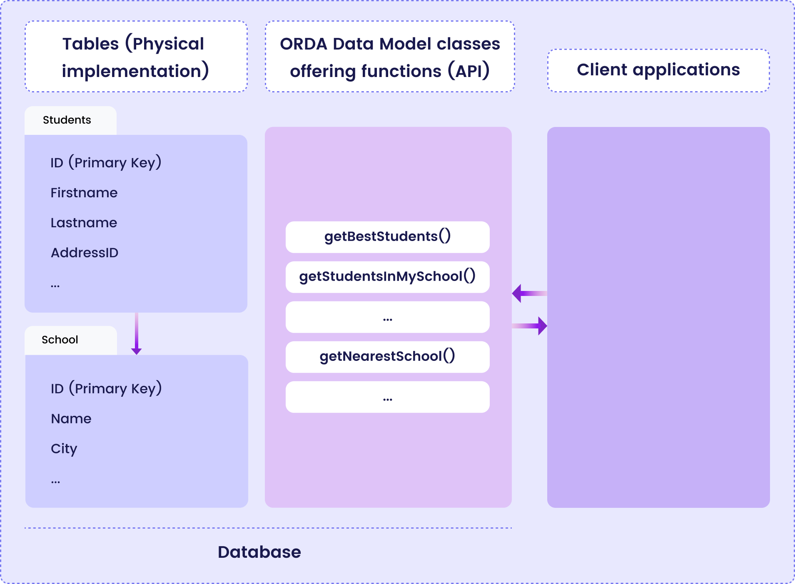
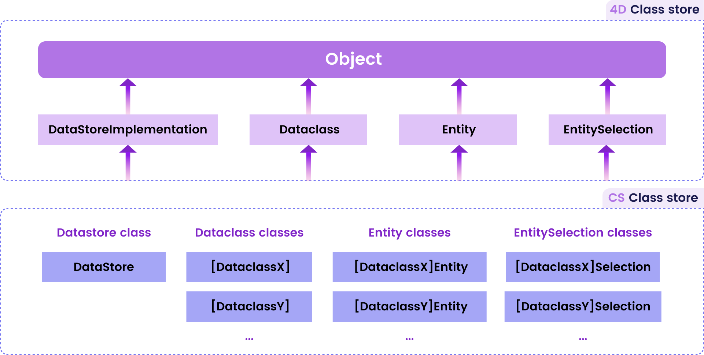

ORDA uses high-level [class](../language/basics/lang-classes.md) functions above the data model. This allows you to write business-oriented code and "publish" it just like an API. Datastore, dataclasses, entity selections, and entities are all available as class objects that can contain functions.

For example, you could create a `getNextWithHigherSalary()` function in the `EmployeeEntity` class to return employees with a salary higher than the selected one. It would be as simple as calling:

```qs
nextHigh=ds.Employee.get(1).getNextWithHigherSalary()
```

Thanks to this feature, the entire business logic of your Qodly application can be stored as a independent layer so that it can be easily maintained and reused with a high level of security:

- You can "hide" the overall complexity of the underlying physical structure and only expose understandable and ready-to-use functions. 
- If the physical structure evolves, you can simply adapt function code and client applications will continue to call them transparently. 
- By default, all of your data model class functions (including [calculated attribute functions](#calculated-attributes)) are **not exposed** to remote calls. You must explicitly declare each public function with the [`exposed`](#exposed-vs-non-exposed-functions) keyword.




## Architecture

ORDA provides **generic classes** exposed through a **`4D`** class store, as well as specific **user classes** (extending generic classes) exposed in the [**`cs`** class store](../language/basics/lang-classes.md):



All ORDA data model classes are exposed as properties of the **`cs`** class store. The following ORDA classes are available:

|Class|Example name|Instantiated by|
|---|---|---|
|cs.DataStore|cs.DataStore|[`ds`](../language/DataStoreClass.md#ds) command|
|cs.*DataClassName*|cs.Employee|[`dataStore.DataClassName`](../language/DataStoreClass.md#dataclassname), `dataStore["DataClassName"]`|
|cs.*DataClassName*Entity|cs.EmployeeEntity|[`dataClass.get()`](../language/DataClassClass.md#get), [`dataClass.new()`](../language/DataClassClass.md#new), [`entitySelection.first()`](../language/EntitySelectionClass.md#first), [`entitySelection.last()`](../language/EntitySelectionClass.md#last), [`entity.previous()`](../language/EntityClass.md#previous), [`entity.next()`](../language/EntityClass.md#next), [`entity.first()`](../language/EntityClass.md#first), [`entity.last()`](../language/EntityClass.md#last), [`entity.clone()`](../language/EntityClass.md#clone)|
|cs.*DataClassName*Selection|cs.EmployeeSelection|[`dataClass.query()`](../language/DataClassClass.md#query), [`entitySelection.query()`](../language/EntitySelectionClass.md#query), [`dataClass.all()`](../language/DataClassClass.md#all), [`dataClass.fromCollection()`](../language/DataClassClass.md#fromcollection), [`dataClass.newSelection()`](../language/DataClassClass.md#newselection), [`entitySelection.drop()`](../language/EntitySelectionClass.md#drop), [`entity.getSelection()`](../language/EntityClass.md#getselection), [`entitySelection.and()`](../language/EntitySelectionClass.md#and), [`entitySelection.minus()`](../language/EntitySelectionClass.md#minus), [`entitySelection.or()`](../language/EntitySelectionClass.md#or), [`entitySelection.orderBy()`](../language/EntitySelectionClass.md#or), [`entitySelection.orderByFormula()`](../language/EntitySelectionClass.md#orderbyformula), [`entitySelection.slice()`](../language/EntitySelectionClass.md#slice)|

Also, object instances from ORDA data model user classes benefit from their parent's properties and functions:

- a Datastore class object can call functions from the [ORDA Datastore generic class](../language/DataStoreClass.md).
- a Dataclass class object can call functions from the [ORDA Dataclass generic class](../language/DataClassClass.md).
- an Entity selection class object can call functions from the [ORDA Entity selection generic class](../language/EntitySelectionClass.md).
- an Entity class object can call functions from the [ORDA Entity generic class](../language/EntityClass.md).


## DataStore Class


A database exposes its own DataStore class in the `cs` class store. 

- **Extends**: 4D.DataStoreImplementation 
- **Class name in *cs* class store**: DataStore

You can create functions in the DataStore class that will be available through the `ds` object. 

#### Example

```qs  
// DataStore class

extends DataStoreImplementation

exposed function getDesc
  return "Database exposing employees and their companies"
```


This function can then be called:

```qs
desc=ds.getDesc() //"Database exposing..."
```


## DataClass Class

Each dataclass offers a DataClass class in the `cs` class store.

- **Extends**: 4D.DataClass 
- **Class name in *cs* class store**: *DataClassName*
- **Example name**: Employee


#### Example 1

```qs
// Company class


extends DataClass

// Returns companies whose revenue is over the average
// Returns an entity selection related to the Company DataClass

function getBestOnes() : cs.CompanySelection 
	sel=this.query("revenues >= :1",this.all().average("revenues"))
	return sel
```

Then you can get an entity selection of the "best" companies by executing: 

```qs
	var best : cs.CompanySelection
	best=ds.Company.getBestOnes()
```

:::note

[Calculated attributes](#calculated-attributes) are defined in the [Entity Class](#entity-class). 

:::

#### Example 2

Considering the following model (partial view):


Zipcodes are used as primary keys of the *ZipCode* table. The many-to-one relation attribute between *cityID* and *ID* is named *city*.

The `City Class` provides an API:

```qs  
// City class

extends DataClass

exposed function getCityName(zipcode : integer) -> result : string
	var zip : cs.ZipCodeEntity

	zip=ds.ZipCode.get(zipcode)
	result="" 

	if (zip!=null)
		result=zip.city.name
	end
```

The application can use the API to get the city matching a zip code:

```qs
city=ds.City.getCityName(zipcode)

```


## EntitySelection Class

Each dataclass offers an EntitySelection class in the `cs` class store.

- **Extends**: 4D.EntitySelection 
- **Class name in *cs* class store**: *DataClassName*Selection
- **Example name**: EmployeeSelection


#### Example

```qs
// EmployeeSelection class


extends EntitySelection

//Extract the employees with a salary greater than the average from this entity selection 

function withSalaryGreaterThanAverage() -> result : cs.EmployeeSelection
	result=this.query("salary > :1",this.average("salary")).orderBy("salary")

```

Then you can get employees with a salary greater than the average in any entity selection by executing: 

```qs
moreThanAvg=ds.Company.all().employees.withSalaryGreaterThanAverage()
```

## Entity Class

Each dataclass offers an Entity class in the `cs` class store.

- **Extends**: 4D.Entity 
- **Class name in *cs* class store**: *DataClassName*Entity
- **Example name**: CityEntity

#### Calculated attributes

Entity classes allow you to define **calculated attributes** using specific keywords:

- `function get` *attributeName*
- `function set` *attributeName*
- `function query` *attributeName*
- `function orderBy` *attributeName*

For more information, please refer to the [Calculated attributes](#calculated-attributes) section. 


#### Example


```qs
// cs.CityEntity class

extends Entity

function getPopulation() -> result : integer
    result=this.zips.sum("population")


function isBigCity() -> result : boolean
// The getPopulation() function is usable inside the class
result=this.getPopulation()>50000
```

Then you can call this code: 

```qs
var city : cs.CityEntity
var message : string

city=ds.City.getCity("Caguas")

if (city.isBigCity())
	message=city.name + " is a big city"
end
```

### Specific rules

When creating or editing data model classes, you must pay attention to the following rules:

- Since they are both defined in the **cs** [class store](lang-classes.md#class-stores), do not give the same name to a dataclass and to a user class. If such a case occurs, the constructor of the user class becomes unusable. 
- Do not use a reserved name for a user class (e.g., "DataClass").
- In an ORDA class, `this` designates the instance of the object matching the dataclass.
- You cannot instantiate a data model class object with the `new()` keyword (an error is returned). You must use a regular method as listed in the [`Instantiated by` column of the ORDA class table](#architecture).
- You cannot override a native ORDA class function from the **`4D`** [class store](Concepts/classes.md#class-stores) with a data model user class function.


## Glossary

Here is an reminder for the main concepts handled by ORDA.

#### *any* data type  

In this documentation, "any" data type is used to designate the various type of values that can be stored within dataclass attributes. It includes:

*	number
*	string
*	null
*	boolean
*	date
*	object
*	collection
*	picture(\*)

*(\*) picture type is not supported by statistical methods such as* `entitySelection.max( )`.


#### Attribute 
 
An attribute is the smallest storage cell in a relational database (see also [Relation attribute](#relation-attribute)). Do not confuse dataclass attributes and entity attributes:

*	In a dataclass object, each property is a dataclass attribute that maps to a corresponding field in the corresponding table (same name and type).
*	In an entity object, entity attributes are properties that contain values for the corresponding datastore attributes.

*Attributes* and *properties* are similar concepts. "Attribute" is used to designate dataclass properties that store data, while "property" is more generic and defines a piece of data stored within an object. 

#### AttributePath  

An attributePath is the path of an attribute inside a given dataclass or entity. See also [PropertyPath](#propertyPath).

#### Calculated attribute

A calculated attribute doesn't actually store information. Instead, it determines its value based on other values from the same entity or from other entities, attributes or functions. When a calculated attribute is referenced, the underlying "calculation" is evaluated to determine the value. Calculated attributes may even be assigned values where user-defined code determines what to do during the assignment.

#### Class code

Code for the user class function(s). 

#### Class function

ORDA objects such as datastores, dataclasses, entity selections, and entities, define classes of objects. They provide specific functions to directly interact with them. These functions are called class functions. Such functions are used by calling them on an instance of the object.

For example, the `query()` function is a dataclass class function. If you have stored a dataclass object in the `$myClass` variable, you can write:

```code4d
$myClass.query("name = smith")
```

#### Data model class

Extended class available for a data model object. 

#### Data model object

Database objects available through the ORDA concept, i.e. datastore, dataclasses, entities and entity selections.

#### Data model function

Function of an ORDA data model class.

#### Dataclass  

A dataclass is an object model that describes the data. Tables in the database provided by the datastore are handled through dataclasses. Each table in the database provided by the datastore has a corresponding dataclass with the same name. Each field of the table is an attribute of the dataclass.

A dataclass is related to a single datastore.


#### DataClass class

Class for specific dataclass objects, in which you can add custom functions. 

#### Datastore  

A datastore is the interface object provided by ORDA to reference a model and access its data. The model, returned by the `ds` command, is available as a datastore (the main datastore).

A datastore provides:

*	a connection to a database
*	a set of dataclasses to work with the database


#### DataStore class

Class for datastore objects, in which you can add custom functions. 


#### DataStoreImplementation

Internal name of the generic DataStore class in the `4D` class store.

#### Deep copy 
 
A deep copy duplicates an object and all the references it contains. After a deep copy, a copied collection contains duplicated elements and thus, new references, of all of the orginal elements. See also [Shallow copy](#shallow-copy).

#### ds  

`ds` is the language command that returns a [datastore](dsMapping.md#datastore) object reference. It matches the datastore available upon the Qodly database.

#### Entity  

An entity is an object that corresponds to a dataclass model. An entity contains the same attributes as the dataclass.

An entity can be seen as an instance of the dataclass, like a record of the table matching the dataclass in its associated datastore. However, an entity also contains related data. The purpose of the entity is to manage data (create, update, delete).


#### Entity selection  

An entity selection is an object. When querying the datastore, an entity selection is returned. An entity selection is a set of references to entities related to the same dataclass.

An entity selection contains:

*	a set of 0 to X entity references,
*	a length property (always),
*	queryPlan and queryPath properties (if asked while querying).

An entity selection can also be empty.

#### Function

See [Class function](#class-function).

#### Generic class

Built-in class for ORDA objects such as entities, or dataclasses. Functions and properties of generic classes are automatically available in user extended classes, e.g. `EmployeeEntity`. 


#### Lazy loading 
 
Since entities are managed as references, data is loaded only when necessary, i.e. when accessing it in the code or through interface widgets. This optimization principle is called lazy loading.

#### Main datastore  

The Datastore object matching the opened Qodly database (standalone or client/server). The main datastore is returned by the `ds` command. 

#### Optimistic Lock  

In "optimistic lock" mode, entities are not locked explicitly before updating them. Each entity has an internal stamp that is automatically incremented each time the entity is saved on disk. The entity.save( ) or entity.drop( ) methods will return an error if the stamp of the loaded entity (in memory) and the stamp of the entity on disk do not match, or if the entity has been dropped. Optimistic locking is only available in ORDA implementation. See also "Pessimistic lock".

#### ORDA

Object Relational Data Access. See [What is ORDA?](overview)


#### Pessimistic Lock  

A "pessimistic lock" means that an entity is locked prior to its being accessed, using the `entity.lock()` function. Other processes can neither update nor drop the entity until it is unlocked. See also [Optimistic lock](#optimistic-lock).

#### Property  

See [Attribute](#attribute).

#### PropertyPath  

A propertyPath is the path to a property in a given object. If the property is nested in several levels, each level separated is by a dot (".").

#### Regular class  

User class not related to an ORDA object.

#### Related dataclass  

These are dataclasses linked by relation attributes.

#### Relation attribute  

Relation attributes are used to conceptualize relations between dataclasses (many-to-one and one-to-many).

*	Many-to-one relation (dataclassA references an occurrence of dataclassB): a relation attribute is available in dataclassA and references one instance of dataclassB.
*	One-to-many relation (an occurence of dataclassB references several occurrences of dataclassA): a relation attribute is available in dataclassB and references several instances of dataclassA.

A dataclass can have recursive relation attributes.

In an entity, the value of a relation attribute can be an entity or an entity selection.

#### Related entities  

A related entity can be seen as the instance of a relation attribute in a dataclass.

Entity selections may refer to related entities according to the relation attributes defined in the corresponding dataclasses.


#### Session  

When a user connects to a Qodly application, a Session object is created on the Server (HTTP). A session cookie is generated. 

Each Session object provides a `.storage` property which is a shared object. Privileges are associated to user sessions. 


#### Shallow copy 
 
A shallow copy only duplicates the structure of elements, and keeps the same internal references. After a shallow copy, two collections will both share the individual elements. See also [Deep copy](#deep-copy).

#### Stamp 
 
Used in "optimistic" locking technology. All entities have an internal counter, the stamp, which is incremented each time the entity is saved. By automatically comparing stamps between an entity being saved and its version stored on disk, ORDA can prevent concurrent modifications on the same entities.

#### Storage attribute

A storage attribute (sometimes referred to as a scalar attribute) is the most basic type of attribute in a datastore class and most directly corresponds to a field in a relational database. A storage attribute holds a single value for each entity in the class.

