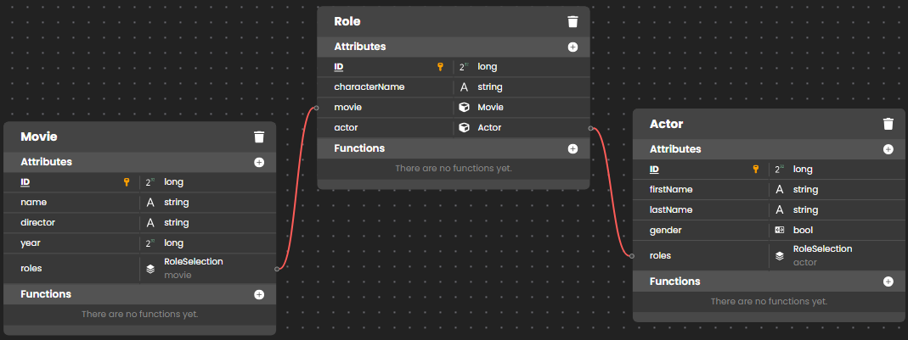

Querying data is the most common database operation. You will always need to search, filter, and sort your data in datasources using different criteria.

Querying the Qodly datastore can be done through two APIs:

- the QodlyScript language - using the [entity selection `query()` function](../language/EntitySelectionClass.md#query) or the [dataclass `query()` function](../language/DataClassClass.md#query).  
- the REST API - using the **$filter** command 

Queries always return **entity selections**. 

:::note

The [`Collection class`](../language/CollectionClass.md#query) contains also a [`query()`](../language/CollectionClass.md#query) function that returns a collection. The query string is identical as dataclass/entity selection queries, except that queries on collections do not support *formula* parameter.

:::


## `query()` syntaxes

The `query()` function is available in both the [entity selection class](../language/EntitySelectionClass.md#query) and the [dataclass class](../language/DataClassClass.md#query).  

**.query**( *queryString* : string { , *...value* : any } { , *querySettings* : object } ) : 4D.EntitySelection <br/>**.query**( *formula* : object { , *querySettings* : object } ) : 4D.EntitySelection

|Parameter|Type| &nbsp;&nbsp;&nbsp;&nbsp;|Description|
|---|---|-----|---|
|queryString |string |->|Search criteria as string|
|formula |object | -> |Search criteria as formula object|
|value|any|->|Value(s) to use for indexed placeholder(s)|
|querySettings|object| -> |Query options: parameters, attributes, args, allowFormulas, context, queryPath, queryPlan|
|Result|4D.EntitySelection| <- |New entity selection made up of entities from dataclass meeting the search criteria specified in *queryString* or *formula*|


The `.query()` function searches for entities that meet the search criteria specified in *queryString* or *formula* and (optionally) *value*(s), for all the entities in the dataclass or the entity selection. 

The function returns a new object of type `EntitySelection` containing all the entities that are found. Lazy loading is applied.

If no matching entities are found, an empty `EntitySelection` is returned.


### Using a *queryString* or a *formula*

Using a *queryString* is a more straightforward way to write queries and can save time for simple cases. However, using a *formula* object is usually **recommended** since you benefit from tokenization, and code is easier to search/read.  


## *queryString* parameter
 
The *queryString* parameter uses the following syntax:

```
attributePath|formula comparator value   
	{logicalOperator attributePath|formula comparator value}   
	{order by attributePath {desc | asc}}
```

where:

*	**attributePath**: path of attribute on which you want to execute the query. this parameter can be a simple name (for example "country") or any valid attribute path (for example "country.name".) In case of an attribute path whose type is `collection`, \[ ] notation is used to handle all the occurences (for example "children\[ ].age"). You can also [use a **placeholder**](#using-placeholders).

	>*You cannot use directly attributes whose name contains special characters such as ".", "\[ ]", or "=", ">", "#"..., because they will be incorrectly evaluated in the query string. If you need to query on such attributes, you must consider [using placeholders](#using-placeholders), which allow an extended range of characters in attribute paths.* 

*	**formula**: a valid formula passed as `string` or `object`. The formula will be evaluated for each processed entity and must return a boolean value. Within the formula, the entity is available through the `this` object.  

	*	**string**: the formula string must be preceeded by the `eval()` statement, so that the query parser evaluates the expression correctly. For example: *"eval(length(this.lastname) >=30)"*
	*	**object**: the [formula object](../language/FunctionClass.md) is passed as a **placeholder** (see below). The formula must have been created using the [`formula`](../language/FunctionClass.md#formula) or [`formulaFromString`](../language/FunctionClass.md#formulafromstring) command. 

	>* Keep in mind that formulas only support `&` and `|` symbols as logical operators. 
	>* If the formula is not the only search criteria, the [query engine optimizer](#about-queryplan-and-querypath) could prior process other criteria (e.g. indexed attributes) and thus, the formula could be evaluated for only a subset of entities.
	>*	You can also pass directy a *formula* parameter object instead of the *queryString* parameter (recommended when formulas are more complex). See [**formula parameter**](#formula-parameter) paragraph. 

	Formulas in queries can receive **parameters** through `$1`. This point is detailed in the [**formula parameter**](#formula-parameter) paragraph.

:::info

For security reasons, formula calls within `query()` methods can be disallowed. See [*querySettings* parameter](#querysettings-parameter) description. 

:::

*	**comparator**: symbol that compares *attributePath* and *value*. The following symbols are supported:

	|Comparison|	Symbol(s)|	Comment|
	|---|---|---|
	|Equal to	|==, =	|Gets matching data, supports the wildcard (@), neither case-sensitive nor diacritic.|
	||===, IS|	Gets matching data, considers the @ as a standard character, neither case-sensitive nor diacritic|
	|Not equal to|	!=, #	|Supports the wildcard (@)|
	||!==, IS NOT|	Considers the @ as a standard character|
	|Less than|	<|	|
	|Greater than|	>	||
	|Less than or equal to|	<=||	
	|Greater than or equal to|	>=	||
	|Included in|	IN	|Gets data equal to at least one of the values in a collection or in a set of values, supports the wildcard (@)|
	|Not condition applied on a statement|	NOT|	Parenthesis are mandatory when NOT is used before a statement containing several operators|
	|Contains keyword|	%|	Keywords can be used in attributes of string or picture type|

*	**value**: the value to compare to the current value of the property of each entity in the entity selection or element in the collection. It can be a **placeholder** (see **Using placeholders** below) or any expression matching the data type property. When using a constant value, the following rules must be respected:
	*	**text** type constant can be passed with or without simple quotes (see **Using quotes** below). To query a string within a string (a "contains" query), use the wildcard symbol (@) in value to isolate the string to be searched for as shown in this example: "@Smith@". The following keywords are forbidden for text constants: true, false.
	*	**boolean** type constants: **true** or **false** (case sensitive).
	*	**numeric** type constants: decimals are separated by a '.' (period).
    * **date type constants** : "YYYY-MM-DD" format
	*	**null** constant: using the "null" keyword will find **null** and **undefined** properties.  
	*	in case of a query with an IN comparator, value must be a collection, or values matching the type of the attribute path between \[ ] separated by commas (for strings, " characters must be escaped with "\").

*	**logicalOperator**: used to join multiple conditions in the query (optional). You can use one of the following logical operators (either the name or the symbol can be used):

	|Conjunction|Symbol(s)|
	|---|---|
	|AND|&, &&, and|
	|OR | &#124;,&#124;&#124;, or|

*	**order by attributePath**: you can include an order by *attributePath* statement in the query so that the resulting data will be sorted according to that statement. You can use multiple order by statements, separated by commas (e.g., order by *attributePath1* desc, *attributePath2* asc). By default, the order is ascending. Pass 'desc' to define a descending order and 'asc' to define an ascending order.
	> If you use this statement, the returned entity selection is ordered (for more information, please refer to [Ordered or Unordered entity selections](data-model.md#ordered-or-unordered-entity-selection)). 

### Using quotes

When you use quotes within queries, you must use single quotes ' ' inside the query and double quotes " " to enclose the whole query, otherwise an error is returned. For example:

```
"employee.name = 'smith' AND employee.firstname = 'john'"
```

> Single quotes (') are not supported in searched values since they would break the query string. For example "comp.name = 'John's pizza' " will generate an error. If you need to search on values with single quotes, you may consider using [placeholders](#using-placeholders).

### Using parenthesis

You can use parentheses in the query to give priority to the calculation. For example, you can organize a query as follows:

```
"(employee.age >= 30 OR employee.age <= 65) AND (employee.salary <= 10000 OR employee.status == 'Manager')"
```


### Using placeholders

Qodly allows you to use placeholders for *attributePath*, *formula* and *value* arguments within the *queryString* parameter. A placeholder is a parameter that you insert in query strings and that is replaced by another value when the query string is evaluated. The value of placeholders is evaluated once at the beginning of the query; it is not evaluated for each element.

Two types of placeholders can be used: **indexed placeholders** and **named placeholders**:

|-	|Indexed placeholders|	Named placeholders|
|---|---|---|
|Definition	|Parameters are inserted as :paramIndex (for example :1, :2...) in *queryString* and their corresponding values are provided by the sequence of value parameter(s). You can use up to 128 value parameters|	Parameters are inserted as :paramName (for example :myparam) and their values are provided in the attributes and/or parameters objects in the *querySettings* parameter|
|Example|`r=class.query(":1=:2","city","Chicago")`| `o.attributes={att:"city"}`<br/>` o.parameters={name:"Chicago"}`<br/>` r=class.query(":att=:name",o)`|
 
You can mix all argument kinds in *queryString*. A *queryString* can contain, for *attributePath*, *formula* and *value* parameters:

*	direct values (no placeholders), 
*	indexed placeholders and/or named placeholders.

**Using placeholders in queries is recommended** for the following reasons:

1.	It prevents malicious code insertion: if you directly use user-filled variables within the query string, a user could modifiy the query conditions by entering additional query arguments. For example, imagine a query string like:
 
	```qs
	 vquery="status == 'public' & name == "+myname //user enters their name
	 result=col.query(vquery)
	```

	this query seems secured since non-public data are filtered. However, if the user enters in the *myname* area something like *"smith OR status='private'*, the query string would be modified at the interpretation step and could return private data.

	When using placeholders, overriding security conditions is not possible:

	```qs
	 result=col.query("status=='public' & name==:1",myname)
	```

	In this case if the user enters *smith OR status='private'* in the *myname* area, it will not be interpreted in the query string, but only passed as a value. Looking for a person named "smith OR status='private'" will just fail.

2.	It prevents having to worry about formatting or character issues, especially when handling *attributePath* or *value* parameters that might contain non-alphanumeric characters such as ".", "['... 
 
3.	It allows the use of variables or expressions in query arguments. Examples:

	```qs
 	result=col.query("address.city == :1 & name =:2",city,myVar+"@")
	result2=col.query("company.name == :1","John's Pizzas")
	``` 

### Looking for null values

When you look for null values, you cannot use the placeholder syntax because the query engine considers null as an unexpected comparison value. For example, if you execute the following query:

```qs
vSingles=ds.Person.query("spouse == :1",null) // will NOT work
```

You will not get the expected result because the null value will be evaluated by Qodly as an error resulting from the parameter evaluation (for example, an attribute coming from another query). For these kinds of queries, you must use the direct query syntax:

```qs
vSingles=ds.Person.query("spouse == null") //correct syntax
``` 

### Not equal to in collections

When searching within dataclass object attributes containing collections, the "not equal to *value*" comparator (`!==` or `#`) will find elements where ALL properties are different from *value* (and not those where AT LEAST one property is different from *value*, which is how work other comparators). Basically, it is equivalent to search for "Not(find collection elements where property equals *value*"). For example, with the following entities:

```
Entity 1:
ds.Class.name: "A"
ds.Class.info:
    { "coll" : [ {
                "val":1,
                "val":1
            } ] }

Entity 2:
ds.Class.name: "B"
ds.Class.info:
    { "coll" : [ {
                "val":1,
                "val":0
            } ] }

Entity 3:
ds.Class.name: "C"
ds.Class.info:
    { "coll" : [ {
                "val":0,
                "val":0
            } ] }
```

Consider the following results:

```qs
ds.Class.query("info.coll[].val == :1",0) 
// returns B and C
// finds "entities with 0 in at least one val property"

ds.Class.query("info.coll[].val != :1",0)
// returns A only
// finds "entities where all val properties are different from 0"
// which is the equivalent to 
ds.Class.query(not("info.coll[].val == :1",0)) 
```

If you want to implement a query that finds entities where "at least one property is different from *value*", you need to use a special notation using a letter in the `[]`:

```qs
ds.Class.query("info.coll[a].val != :1",0)  
// returns A and B
// finds "entities where at least one val property is different from 0"
```

You can use any letter from the alphabet as the `[a]` notation.


### Linking collection attribute query arguments

When searching in collections within object attributes using multiple query arguments joined by the AND operator, you may want to make sure that only entities containing elements that match all arguments are returned, and not entities where arguments can be found in different elements. To do this, you need to link query arguments to collection elements, so that only single elements containing linked arguments are found.

For example, with the following two entities: 

```
Entity 1:
ds.People.name: "martin"
ds.People.places: 
    { "locations" : [ {
                "kind":"home",
                "city":"paris" 
            } ] }

Entity 2:
ds.People.name: "smith"
ds.People.places: 
    { "locations" : [ {
                "kind":"home",
                "city":"lyon" 
            } , {
                "kind":"office",
                "city":"paris" 
            } ] }
```

You want to find people with a "home" location kind in the city "paris". If you write:

```qs
ds.People.query("places.locations[].kind= :1 and places.locations[].city= :2","home","paris")
```

... the query will return "martin" **and** "smith" because "smith" has a "locations" element whose "kind" is "home" and a "locations" element whose "city" is "paris", even though they are different elements.

If you want to only get entities where matching arguments are in the same collection element, you need to **link arguments**. To link query arguments:

- Add a letter between the `[]` in the first path to link and repeat the same letter in all linked arguments. For example: `locations[a].city and locations[a].kind`. You can use any letter of the Latin alphabet (not case sensitive).
- To add different linked criteria in the same query, use another letter. You can create up to 26 combinations of criteria in a single query. 

With the above entities, if you write:

```qs
ds.People.query("places.locations[a].kind== :1 and places.locations[a].city== :2","home","paris")
```

... the query will only return "martin" because it has a "locations" element whose "kind" is "home" and whose "city" is "paris". The query will not return "smith" because the values "home" and "paris" are not in the same collection element. 


#### Queries in many-to-many relations

ORDA offers a special syntax to facilitate queries in many-to-many relations. In this context, you may need to search for different values with an `AND` operator BUT in the same attribute. For example, take a look at the following structure:



Imagine that you want to search all movies in which *both* actor A and actor B have a role. If you write a simple query using an `AND` operator, it will not work:

```qs
// invalid code
es=ds.Movie.query("roles.actor.lastName == :1 AND roles.actor.lastName == :2","Hanks","Ryan")  
// es is empty
```

Basically, the issue is related to the internal logic of the query: you cannot search for an attribute whose value would be both "A" and "B". 

To make it possible to perform such queries, ORDA allows a special syntax: you just need to add a *class index* between **{}** in all additional relation attributes used in the string:

```qs
"relationAttribute.attribute == :1 AND relationAttribute{x}.attribute == :2 [AND relationAttribute{y}.attribute...]"
```
**{x}** tells ORDA to create another reference for the relation attribute. It will then perform all the necessary bitmap operations internally. Note that **x** can be any number **except 0**: {1}, or {2}, or {1540}... ORDA only needs a unique reference in the query for each class index.

In our example, it would be:

```qs
// valid code
es=ds.Movie.query("roles.actor.lastName == :1 AND roles.actor{2}.lastName == :2","Hanks","Ryan")  
// es contains movies (You've Got Mail, Sleepless in Seattle, Joe Versus the Volcano)
```


## *formula* parameter

As an alternative to formula insertion within the *queryString* parameter (see above), you can pass directly a formula object as a boolean search criteria. Using a formula object for queries is usually recommended since you benefit from tokenization, and code is easier to search/read.  

The *formula* must have been created using the [`formula`](../language/FunctionClass.md#formula) or [`formulaFromString`](../language/FunctionClass.md#formulafromstring) command. In this case:

*	the *formula* is evaluated for each entity and must return `true` or `false`. During the execution of the query, if the *formula*'s result is not a boolean, it is considered as `false`. 
*	within the *formula*, the entity is available through the `this` object. 
*	if the `formula` object is **null**, the errror 1626 ("Expecting a text or formula") is generated, that you call intercept using a method installed with `onErrCall`.

:::info

For security reasons, formula calls within `query()` methods can be disallowed. See [*querySettings* parameter](#querysettings-parameter) description. 

:::


## Passing parameters to formulas

Any *formula* called by the `query()` class function can receive parameters:

*	Parameters must be passed through the **args** property (object) of the *querySettings* parameter.
*	The formula receives this **args** object as a **$1** parameter.

This small code shows the principles of how parameters are passed to methods:

```qs
 settings=newObject("args",newObject("exclude","-")) //args object to pass parameters
 es=ds.Students.query("eval(checkName($1.exclude))",$settings) //args is received in $1
```

Additional examples are provided in example 3.


## *querySettings* parameter 

In the *querySettings* parameter, you can pass an object containing additional options. The following properties are supported:

|Property|	Type|	Description|
|---|---|---|
|parameters|object|**Named placeholders for values** used in the *queryString* or *formula*. Values are expressed as property / value pairs, where property is the placeholder name inserted for a value in the *queryString* or *formula* (":placeholder") and value is the value to compare. You can mix indexed placeholders (values directly passed in value parameters) and named placeholder values in the same query.|
|attributes|object|**Named placeholders for attribute paths** used in the *queryString* or *formula*. Attributes are expressed as property / value pairs, where property is the placeholder name inserted for an attribute path in the *queryString* or *formula* (":placeholder"), and value can be a string or a collection of strings. Each value is a path that can designate either a scalar or a related attribute of the dataclass or a property in an object field of the dataclass<p><table><tr><th>Type</th><th>Description</th></tr><tr><td>String</td><td>attributePath expressed using the dot notation, e.g. "name" or "user.address.zipCode"</td></tr><tr><td>collection of strings</td><td>Each string of the collection represents a level of attributePath, e.g. \["name"] or \["user","address","zipCode"]. Using a collection allows querying on attributes with names that are not compliant with dot notation, e.g. \["4Dv17.1","en/fr"]</td></tr></table></p>You can mix indexed placeholders (values directly passed in *value* parameters) and named placeholder values in the same query.|
|args|object|Parameter(s) to pass to formulas, if any. The **args** object will be received in $1 within formulas and thus its values will be available through *$1.property* (see example 3).| 
|allowFormulas|	Boolean|True to allow the formula calls in the query (default). Pass false to disallow formula execution. If set to false and `query()` is given a formula, an error is sent (1278 - formula not allowed in this member method).|
|queryPlan|	Boolean	|In the resulting entity selection, returns or does not return the detailed description of the query just before it is executed, i.e. the planned query. The returned property is an object that includes each planned query and subquery (in the case of a complex query). this option is useful during the development phase of an application. It is usually used in conjunction with queryPath. Default if omitted: false. **Note**: this property is supported only by the `entitySelection.query( )` and `dataClass.query( )` functions.|
|queryPath|Boolean|	In the resulting entity selection, returns or does not return the detailed description of the query as it is actually performed. The returned property is an object that contains the actual path used for the query (usually identical to that of the queryPlan, but may differ if the engine manages to optimize the query), as well as the processing time and the number of records found. this option is useful during the development phase of an application. Default if omitted: false. **Note**: This property is supported only by the `entitySelection.query()` and `dataClass.query()` functions.|

## About *queryPlan* and *queryPath*

On Qodly server, queries are processed by the Qodly **query analyzer** that translates the user query in a SQL-like statement, including automatic joins and subqueries: the **query plan**. It also optimizes the **query path**, depending on the query context. For example, the query analyzer can dynamically convert an indexed query into a sequential one if it estimates that it is faster. This particular case can occur when the number of entities being searched for is low.

The information recorded in `queryPlan`/`queryPath` include the query type (indexed and sequential) and each necessary subquery along with conjunction operators. Query paths also contain the number of entities found and the time required to execute each search criterion. You may find it useful to analyze this information while developing your application(s). Generally, the description of the query plan and its path are identical but they can differ because the query parser can implement dynamic optimizations when a query is executed in order to improve performance. 

For example, if you execute the following query:

```qs
 sel=ds.Employee.query("salary < :1 and employer.name == :2 or employer.revenues > :3",\  
 50000,"Lima West Kilo",10000000,newObject("queryPath",true,"queryPlan",true))
```

queryPlan:


```
{Or:[{And:[{item:[index : Employee.salary ] < 50000},  
	{item:Join on Table : Company  :  Employee.employerID = Company.ID,  
	subquery:[{item:[index : Company.name ] = Lima West Kilo}]}]},  
	{item:Join on Table : Company  :  Employee.employerID = Company.ID,  
	subquery:[{item:[index : Company.revenues ] > 10000000}]}]}
```

queryPath:

```
{steps:[{description:OR,time:63,recordsfounds:1388132,  
	steps:[{description:AND,time:32,recordsfounds:131,  
	steps:[{description:[index : Employee.salary ] < 50000,time:16,recordsfounds:728260},{description:Join on Table : Company  :  Employee.employerID = Company.ID,time:0,recordsfounds:131,  
	steps:[{steps:[{description:[index : Company.name ] = Lima West Kilo,time:0,recordsfounds:1}]}]}]},{description:Join on Table : Company  :  Employee.employerID = Company.ID,time:31,recordsfounds:1388132,  
	steps:[{steps:[{description:[index : Company.revenues ] > 10000000,time:0,recordsfounds:933}]}]}]}]}
```

## Examples of queries with queryString

Query on a string:

```qs
entitySelection=ds.Customer.query("firstName == 'S@'")
```

Query with a NOT statement:

```qs
entitySelection=ds.Employee.query("not(firstName == Kim)")
```

Queries with dates:

```qs
entitySelection=ds.Employee.query("birthDate > :1","1970-01-01")
entitySelection=ds.Employee.query("birthDate <= :1",currentDate-10950)
```

Query with indexed placeholders for values:

```qs
entitySelection=ds.Customer.query("(firstName == :1 or firstName == :2) and (lastName == :3 or lastName == :4)","D@","R@","S@","K@")
```

Query with indexed placeholders for values on a related dataclass:

```qs
entitySelection=ds.Employee.query("lastName == :1 and manager.lastName == :2","M@","S@")
```

Query with indexed placeholder including a descending order by statement:

```qs
entitySelection=ds.Student.query("nationality == :1 order by campus.name desc, lastname","French")
```

Query with named placeholders for values:

```qs
var querySettings : object
var managedCustomers : cs.CustomerSelection
querySettings=newObject()
querySettings.parameters=newObject("userId",1234,"extraInfo",newObject("name","Smith"))
managedCustomers=ds.Customer.query("salesperson.userId == :userId and name == :extraInfo.name",querySettings)
```

Query that uses both named and indexed placeholders for values:

```qs
var querySettings : object
var managedCustomers : cs.CustomerSelection
querySettings.parameters=newObject("userId",1234)
managedCustomers=ds.Customer.query("salesperson.userId == :userId and name == :1","Smith",querySettings)
```

Query with queryPlan and queryPath objects:

```qs
entitySelection=ds.Employee.query("(firstName == :1 or firstName == :2) and (lastName == :3 or lastName == :4)","D@","R@","S@","K@",newObject("queryPlan",true,"queryPath",true))
 
  //you can then get these properties in the resulting entity selection
var queryPlan, queryPath : object
queryPlan=entitySelection.queryPlan
queryPath=entitySelection.queryPath
```

Query with an attribute path of collection type:

```qs
entitySelection=ds.Employee.query("extraInfo.hobbies[].name == :1","horsebackriding")
```

Query with an attribute path of collection type and linked attributes:

```qs
entitySelection=ds.Employee.query("extraInfo.hobbies[a].name == :1 and extraInfo.hobbies[a].level==:2","horsebackriding",2)
```

Query with an attribute path of collection type and multiple linked attributes:

```qs
entitySelection=ds.Employee.query("extraInfo.hobbies[a].name == :1 and
	extraInfo.hobbies[a].level == :2 and extraInfo.hobbies[b].name == :3 and
	extraInfo.hobbies[b].level == :4","horsebackriding",2,"Tennis",5)
```

Query with an attribute path of object type:

```qs
entitySelection=ds.Employee.query("extra.eyeColor == :1","blue")
```

Query with an IN statement:

```qs
entitySelection=ds.Employee.query("firstName in :1",newCollection("Kim","Dixie"))
```

Query with a NOT (IN) statement:

```qs
entitySelection=ds.Employee.query("not (firstName in :1)",newCollection("John","Jane"))
```

Query with indexed placeholders for attributes:

```qs
var es : cs.EmployeeSelection
es=ds.Employee.query(":1 == 1234 and :2 == 'Smith'","salesperson.userId","name")
  //salesperson is a related entity
```

Query with indexed placeholders for attributes and named placeholders for values: 

```qs
var es : cs.EmployeeSelection
var querySettings : object
querySettings=newObject()
querySettings.parameters=newObject("customerName","Smith")
es=ds.Customer.query(":1 == 1234 and :2 == :customerName","salesperson.userId","name",querySettings)
  //salesperson is a related entity
```

Query with indexed placeholders for attributes and values: 


```qs
var es : cs.EmployeeSelection
es=ds.Clients.query(":1 == 1234 and :2 == :3","salesperson.userId","name","Smith")
  //salesperson is a related entity
```

## Examples of queries with named placeholders for attributes

Given an Employee dataclass with 2 entities:

Entity 1:

```qs
name: "Marie"
number: 46
softwares:{
"Word 10.2": "Installed",
"Excel 11.3": "To be upgraded",
"Powerpoint 12.4": "Not installed"
}
```

Entity 2:

```qs
name: "Sophie"
number: 47
softwares:{
"Word 10.2": "Not installed",
"Excel 11.3": "To be upgraded",
"Powerpoint 12.4": "Not installed"
}
```

Query with named placeholders for attributes:

```qs
 var querySettings : object
 var es : cs.EmployeeSelection
 querySettings=newObject()
 querySettings.attributes=newObject("attName","name","attWord",newCollection("softwares","Word 10.2"))
 es=ds.Employee.query(":attName == 'Marie' and :attWord == 'Installed'",querySettings)
  //es.length=1 (Employee Marie)
```

Query with named placeholders for attributes and values: 

```qs
 var querySettings : object
 var es : cs.EmployeeSelection
 var name : string
 querySettings=newObject()
  //Named placeholders for values
 querySettings.parameters=newObject("givenName",name)
  //Named placeholders for attribute paths
 querySettings.attributes=newObject("attName","name")
 es=ds.Employee.query(":attName== :givenName",querySettings)
```

## Examples of queries with formulas

These examples illustrate the various ways to use formulas with or without parameters in your queries.

The formula is given as text with `eval()` in the *queryString* parameter:

```qs
 var es : cs.StudentsSelection
 es=ds.Students.query("eval(length(this.lastname) >=30) and nationality=='French'")
```

The formula is given as a `formula` object through a placeholder:

```qs
 var es : cs.StudentsSelection
 var aform : object
 aform=formula(length(this.lastname)>=30)
 es=ds.Students.query(":1 and nationality=='French'",aform)
```

Only a `formula` object is given as criteria:

```qs
 var es : cs.StudentsSelection
 var aform : object
 aform=formula(length(this.lastname)>=30)
 es:=ds.Students.query(aform)
```

Several formulas can be applied:

```qs
 declare(formula1 : 4D.Function) -> result : cs.StudentsSelection
 var formula2 : 4D.Function
 formula2=formula(length(this.firstname)>=30)
 result=ds.Students.query(":1 and :2 and nationality=='French'",formula1,formula2)
```


A text formula in *queryString* receives a parameter:

```qs
 var es : cs.StudentsSelection
 var settings : object
 settings=newObject()
 settings.args=newObject("filter";"-")
 es=ds.Students.query("eval(checkName($1.filter)) and nationality==:1","French",settings)
```

```qs
  //checkName method
 declare(exclude : string) -> result : boolean
 result=(position(exclude,this.lastname)=0)
```

Using the same **checkName** method, a `formula` object as placeholder receives a parameter:

```qs
 var es : cs.StudentsSelection
 var settings : object
 var aformula : 4D.Function
 aformula=formula(checkName($1.filter))
 settings=newObject()
 settings.args=newObject("filter","-")
 es=ds.Students.query(":1 and nationality==:2",aformula,"French",settings)
 settings.args.filter="*" // change the parameters without updating the aformula object
 es=ds.Students.query(":1 and nationality==:2",aformula,"French",settings)
```

We want to disallow formulas, for example when the user enters their query:

```qs
 var es : cs.StudentsSelection
 var settings : object
 var queryString : string
 // queryString is entered by the user
 settings=newObject("allowFormulas",false)
 es=ds.Students.query(queryString,settings) //An error is raised if queryString contains a formula
``` 
