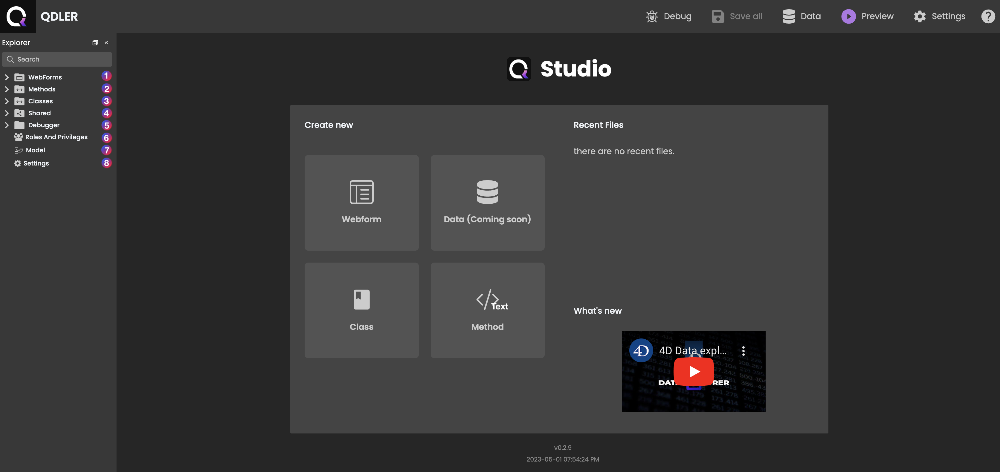

 

Now, let me direct your attention to **Qodly Studio** - the **QDroid** of our group and your gateway to success with Qodly.

---

 

What's great about accessing **Qodly Studio** in the cloud is that it's both easy and convenient. Simply visit our website, create an account, and you'll be ready to start working. So, why wait?

:::tip [See Cloud-based Qodly Studio Access documentation.](accessingQodly)
:::

 

---

 

As soon as you enter the **Qodly Studio** platform, get ready to dive into the **Explorer** section. This is where you'll find all the crucial sub-elements you need for the development process, from webforms to methods and classes - it's all right there at your fingertips. My intuitive platform is designed to make your experience seamless and hassle-free, enabling you to focus on creating your ideal web application. 

 

1. First, we have the mighty **Webforms**, which are versatile containers where you can design the user interface of your application using drag-and-drop components like buttons, grids, and style boxes to create your desired layout.

:::tip [See WebForms documentation for more information.](webforms/intro)
:::

 
 

2. Next, we have **Methods**, which are blocks of code that perform specific tasks, such as creating custom actions for buttons or manipulating data.

:::tip [See Methods documentation for more information.](#)
:::

 
 

3. In the **Classes** section, you'll find all the data classes used in your application. These classes define the structure of your database and allow you to access and manipulate data.

:::tip [See Classes documentation for more information.](#)
:::

 
 

4. The **Shared** section allows you to store and share resources across multiple web forms or data classes, including shared datasources that can be used in several webforms within the same project. This makes it easy to reuse functions and improve efficiency.

:::tip [See Shared documentation for more information.](#)
:::

 
 

5. The **Debugger** is like the all-seeing eye that allows you to test your application and identify and fix any errors or issues that may arise. You can step through your code, view variables, and identify and fix any bugs in your application.

:::tip [See Debugger documentation for more information.](#)
:::

 
 

6. In **Roles & Privileges**, you can define user roles and assign privileges to them, granting you greater control over who can access sensitive information within your application.

:::tip [See Roles & Privileges documentation for more information.](#)
:::

 
 

7. Finally, the **Model** editor allowing you to directly build datastore classes using JSON. Unlike traditional data modeling tools that use XML or other structured formats, our Model Editor gives you greater flexibility and control over your data model, allowing you to create complex data structures with ease. 

:::tip [See Model documentation for more information.](#)
:::