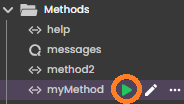
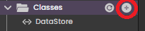
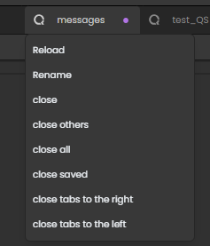
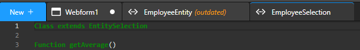
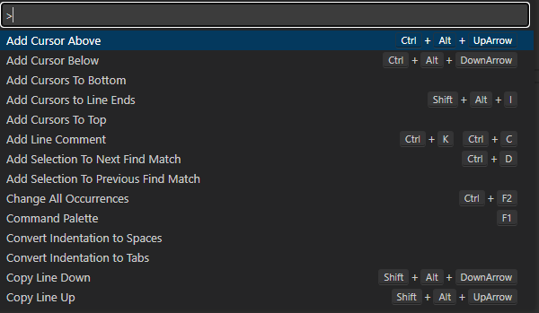
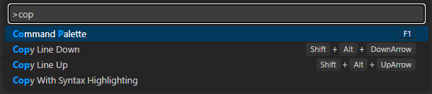

In Qodly Studio, you use [events](design-webforms/events/events.md) in conjunction with class functions and methods to manage the information inside your web application.

## Methods and Classes

In QodlyScript, you can organize your code in two kinds of structures: **methods** and **classes**.

- [**methods**](../language/basics/lang-methods.md) are independant pieces of code. They can be called from class functions or form other methods, but not directly from your components. For testing purposes, a method can also be executed from the Explorer: 

- [**classes**](../language/basics/lang-classes.md) allow you to organize your code according to objects. Only class functions can be called from your components. 
	- User classes allow you to set the behavior of your components. For example, to display or hide a component when an event occurs, you can use the [4D.WebFormItem class functions](../language/WebForm.md). 
	- [ORDA classes](../language/basics/orda-classes.md) are used to configure your data model and your business logic.  

Both code structures are handled in the code editor. 

## Code Editor

Qodly Studio has an embedded code editor that allows you to create, edit, and manage your methods and class functions. 

### Managing methods and classes

#### Creating

To create a method or a class, click on the **+** button at the right side of a title area (**Methods** or **Classes**) in the Explorer.

A new "UntitledN" entry is added to the list of methods or classes and a new tab is created. The entry area is editable, so that you can give a [compliant name](../language/basics/lang-identifiers.md) to the method or class. Press **Enter** to validate the modification.

:::info

To actually create the method or class file, do not forget to press **Enter**.

:::

#### Duplicating

You can create a new method or class by duplicating an existing one: the code it contains is copied and the new item named by default `*itemName*_copyN_`. 

#### Renaming

To rename a method or a class:

-  
In the Explorer, click on the icon at the right side of the item to rename in the Explorer. The item name becomes editable, so that you can give a [compliant name](../language/basics/lang-identifiers.md). Press **Enter** to validate the modification.

-  
Or, in the pop up menu of the item tab, select **Rename**. The tab name becomes editable, so that you can give a [compliant name](../language/basics/lang-identifiers.md). Press **Enter** to validate the modification.

#### Deleting

To delete a method or class, display the options menu from the right side of the item to delete and select **Delete**:

A warning dialog will ask you to confirm the deletion of the file associated to the method or class.

### Opening and closing tabs

To open a method or a class in a tab of the code editor window, double-click on the method or class name in the [Explorer]. If a tab containing the method or class code was already open, it is moved to front. Only one instance of a method or class code can be open in the same code editor window.

To close a tab, you can click on the **[x]** button on the right side of the tab title. You can also right-click on a tab and select one of the closing commands from the tab pop up menu:

### Saving

When you write or edit code, modifications are automatically saved in method and class files stored on the server, on a regular basis.
If you want to make sure a modification is immediately saved (for example if you want the new code to available for other developers), click **Save all** to force the save of all edited tabs. 
 

### Reload code

When a class function or a method is open in the studio, and that class function or method is edited elsewhere, its Tab displays *(outdated)*, meaning that the code displayed is not the latest version. To obtain the latest version, right click the Tab and then choose **Reload**.

### LSP

Qodly Studio relies on the [LSP technology](https://en.wikipedia.org/wiki/Language_Server_Protocol) to provide you with advanced features such as code completion or syntax highlighting in the code editor. This technology requires that a connection be established between the LSP server and the code editor window. When it's not the case, a warning message indicates that the LSP is not loaded:

You can still write and save your code, but LSP related features will be missing. It is recommended to **Reload** the LSP. 

### Type-ahead features

The Qodly Studio code editor includes standard type-ahead and autocompletion features, i.e. accurate contents is suggested in a list while you enter code. 

- The suggestion list appears automatically when you enter text.
- Press the **Tab** key to write down the selected entry from the suggestion list. 
- To display the suggestion list at any moment, press **Ctrl+Space bar**.

### Command Palette

Right-click in the code editor window and select **Command Palette** or press **F1** to display a palette containing all commands availabla in the code editor window, along with their shortcuts (if any). 

The entry area at the top of the palette allows you to filter the list of commands: 

