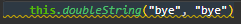
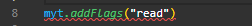
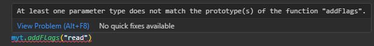

import Column from '@site/src/components/Column'

Qodly is a groundbreaking hybrid **low-code** application development platform that redefines how you build applications. With Qodly, you'll find yourself needing only a minimal amount of code, and sometimes, no code at all. It's as simple as designing your application, and the Studio takes care of generating all the necessary code on your behalf.

While Qodly empowers you with its low-code capabilities, there are situations where coding expertise becomes essential. Within the Studio, you'll harness the power of [events](pageLoaders/events/bindingActionToEvents.md) in combination with class functions to effectively manage the intricacies of your web application.

## Coding Structures

In **QodlyScript**, you can structure your code using two fundamental constructs: methods and classes.

### Methods

[Methods](../language/basics/lang-methods.md) are isolated blocks of code that serve various functions within your application. They can be invoked from class functions or other methods but cannot be directly accessed from components.

### Classes

[Classes](../language/basics/lang-classes.md) allow you to organize your code around objects. Only class functions can be accessed from components. Qodly offers two main types of classes: **ORDA classes** and **user classes**.

#### ORDA Classes

[ORDA Classes](../orda/data-model.md) are used to configure the data model and implement business logic. ORDA classes are automatically available (empty by default) in the [Explorer](overview.md#qodly-studio-home-page):

- The [DataStore class](../orda/data-model.md#datastore) is always displayed in first position.
- Dataclass names are listed along with icons that you can expand/collapse. When expanded, a dataclass gives access to its related [DataClass class](../orda/data-model.md#dataclass-class), [Entity class](../orda/data-model.md#entity-class), and [Entity selection class](../orda/data-model.md#entity-class).

Non-created element names appear in light grey. To create an ORDA class, just click on the element: its name is then displayed in white. When you delete an ORDA class, the code is removed and the element name gets back to a light grey color.

#### User Classes

User classes are used for controlling component behavior or any part of your application, without no specific connection to the data model. User classes can declare functions and properties. [Singleton classes](../language/basics/lang-classes.md#singleton-classes) are user classes.

### .4qs files

Each method and each class is stored in its own QodlyScript file (.4qs): `<methodName>.4qs` for methods and `<className>.4qs` for classes.

## Method and Function Management

When working with methods and classes in Qodly, it's essential to understand how to create, duplicate, rename, and delete them. Here's how you can effectively manage these aspects:

### Creating

You can create a method or class using one of the three methods:

<Column.List align="center" justifyContent="between">
	<Column.Item width="60%">
        <ol>
            <li> You can create them individually from dedicated grids on the <a href="./overview#qodly-studio-homepage">Studio Homepage</a>.</li>     
            <li>In the <strong>Explorer</strong>, simply click the plus icon located next to either <code>Methods</code> or <code>Classes</code>. </li>    
            <li>While in the <strong>Page Editor</strong>, go to the <code>New +</code> tab and opt for either <code>Methods</code> or <code>Classes</code>.</li>
        </ol>
	</Column.Item>
	<Column.Item width="35%">
          
          
        
	</Column.Item>
</Column.List>

 

<Column.List align="center" justifyContent="between">
    <Column.Item width="65%">
      A new entry, labeled as <code>UntitledN</code> appears in the list, where N is a number incrementing with each new creation. You can provide a <a href="../language/basics/lang-identifiers">compliant name</a> and press <strong>Enter</strong> to confirm the modification.
    </Column.Item>
    <Column.Item width="30%">
		
    </Column.Item>
</Column.List>

### Duplicating

<Column.List align="center" justifyContent="between">
    <Column.Item width="65%">
        When duplicating existing methods or classes, Qodly suggests a naming convention in the <code>itemName_copy_N</code> format.
    </Column.Item>
    <Column.Item width="30%">
		
    </Column.Item>
</Column.List>

### Renaming

To rename a method or class, you can either:

<Column.List align="center" justifyContent="between">
    <Column.Item width="65%">
        <ul>
			<li>Click on the icon at the right side of the item in the Explorer.</li>
			 
			<li>Or, in the <a href="./overview#contextual-menu">tab pop-up menu</a>, select <code>Rename</code>. The tab name becomes editable, and you can give it a <a href="../language/basics/lang-identifiers">compliant name</a>.</li>
		</ul>
    </Column.Item>
    <Column.Item width="30%">
		
    </Column.Item>
</Column.List>

### Deleting

Deleting a method or class is straightforward:

<Column.List align="center" justifyContent="between">
    <Column.Item width="65%">
      <ol>
        <li>In the Explorer, open the options menu for the item you wish to delete.</li>
         
        <li>Select <code>Delete</code>.</li>
		  </ol>
    </Column.Item>
    <Column.Item width="30%">
		
    </Column.Item>
</Column.List>

<Column.List align="center" justifyContent="between">
    <Column.Item width="65%">
      <ol>
			  <li value="3">Confirm the deletion in the subsequent warning dialog.</li>
		  </ol>
    </Column.Item>
    <Column.Item width="30%">
		
    </Column.Item>
</Column.List>

### Tab Management

<Column.List align="center" justifyContent="between">
    <Column.Item width="65%">
      To work on a method or class, you can open it in a <a href="./overview#tabs">tab</a> by double-clicking its name in the <strong>Explorer</strong>. Only one instance of a method or class code can be open in the same code editor window.    
		To close a tab, either click the <code>x</code> button or use the tab's pop-up menu
    </Column.Item>
    <Column.Item width="30%">
		
    </Column.Item>
</Column.List>

### Executing Methods

For testing purposes, a method can be executed from the Explorer   
Or directly from the toolbar 

:::info
For comprehensive information on debugging your code, please refer to the [Debugger](./debugging.md) section.
:::

## Code Preservation and Synchronization

Ensure the integrity and consistency of your method and class code in Qodly with these preservation and synchronization tools.

### Saving

Your code modifications are automatically saved at regular intervals. However, if you want to ensure immediate saving, you can click `Save all` to save all edited tabs. 

### Reloading code

<Column.List align="center" justifyContent="between">
    <Column.Item width="65%">
        If you're working on a class function or method, and it gets edited elsewhere, the tab displays <code>(outdated)</code>.     
		    To fetch the latest version, right-click the tab and choose <code>Reload</code>. This action initiates an immediate refresh of the code content directly from the server, ensuring that you are always working with the latest code, even if you haven't made any local edits.
    </Column.Item>
    <Column.Item width="30%">
		
    </Column.Item>
</Column.List>

### Collaborative Editing Behavior

Methods and class functions in the Studio feature real-time synchronization when multiple users are editing the same class function. These collaborative editing capabilities are accompanied by safeguards to prevent data loss in specific scenarios. Here's how it works:

- **Automatic Synchronization**: Whenever a user edits and saves a method or class function, those changes are instantly synchronized across all open tabs where other users are working on the same class function. This guarantees that every user has access to the most current version of the code.

- **Unsaved Changes and "Outdated" Status**: Consider the scenario where `User A` makes changes to a method or class function but neglects to save them, and then `User B`, who is also working on the same method or class function, makes different changes and saves them. In this scenario, `User A`'s method or class function tab, which contains unsaved changes, will recognize that it now holds outdated content compared to the version saved by `User B`. This recognition is indicated by an `outdated` status.

- **Page Refresh and Data Persistence**: the Studio employs client-side data persistence through the browser's local storage to store and retrieve the state information. When `User A` initiates a page refresh, the following actions are performed:

	- **Checking Local Storage**: the Studio checks the local storage for any saved state data associated with the tab that `User A` was working on.

	- **Retrieving Saved Data**: Upon discovery, the Studio retrieves this stored data, which includes the current content of the method or class function that `User A` was editing.

	- **Assessing the "Outdated" Status**: Additionally, the application assesses the `outdated` status based on an attribute within the tab state flags section. This attribute serves as an indicator of whether the current state is outdated compared to the version stored on the server.

	- These measures ensure that even after a page refresh, `User A` remains fully informed about any changes made by others, such as `User B`, while preserving their own unsaved changes.

<Column.List align="center" justifyContent="between">
    <Column.Item width="65%">
        <ul>
          <li><strong>Reload Option</strong>: Within the method/class tab of the Studio, you'll find the <a href="#reloading-code">Reload</a> feature. Upon selecting this option, a confirmation message will promptly appear, indicating that your local changes will be lost. Should <code>User A</code> choose to reload the content will trigger an immediate refresh of the code content directly from the server.</li>
        </ul>
    </Column.Item>
    <Column.Item width="30%">
		
    </Column.Item>
</Column.List>

<Column.List align="center" justifyContent="between">
    <Column.Item width="65%">
        <ul>
          <li><strong>Save all</strong>: Should <code>User A</code> choose to <a href="#saving">save</a> the outdated code in their tab, a confirmation message will appear, alerting them to the presence of new content saved by <code>User B</code>. This serves as a safeguard to prevent unintentional overwriting of more recent changes made by different users.</li>
        </ul>
    </Column.Item>
    <Column.Item width="30%">
		
    </Column.Item>
</Column.List>

- **Data Loss Prevention**: If `User A` proceeds to save the outdated code, the changes made in their tab become the current version, potentially overwriting `User B`'s changes.

This collaborative editing behavior aligns with common practices in collaborative environments, offering users flexibility while minimizing the risk of data loss or conflicts during concurrent edits.

## Code Editor

### LSP

The Studio relies on the Language Server Protocol ([LSP technology](https://en.wikipedia.org/wiki/Language_Server_Protocol)) to offer advanced coding features like code completion and syntax highlighting. 

:::info
Reloading is recommended in cases where a connection is not established. Without this connection, while you can still write and save your code, you will miss out on LSP-related features.
:::

### Type-ahead features

The Studio code editor includes helpful type-ahead and auto-completion features. You can easily incorporate these suggestions into your code using the following methods:

- The suggestion list automatically appears as you start typing.
- To insert the selected suggestion, simply press the `Tab` key.
- At any point, you can manually trigger the suggestion list by pressing `Ctrl + Space bar`.

### Show documentation

When a QodlyScript command or function is entered in the code editor, you can get documentation on this command or function by hovering the cursor over the command or function name:

- a tooltip appears, displaying the parameters of the command or function along with a short description;
- you can also click on the **Show documentation** link within the tip, which opens the complete documentation for the command or function on [developer.qodly.com](https://developer.qodly.com/docs) in your browser.

### Command Palette

The Command Palette offers easy access to all available commands in the code editor, including any associated shortcuts. You can open it by right-clicking in the code editor window or pressing `F1`.

The palette includes a filtering option to find specific commands quickly.

### Warnings and errors

The Studio includes a Code Live Checker feature. The syntax, consistency, and structure of the entered code are automatically checked in order to prevent execution errors. For example, the Code Live Checker can detect that a right parenthesis is missing or that you used an unknown dataclass attribute.

Qodly automatically checks the code syntax to see if it is correct. If you enter text or select a component that is not correct, Qodly underlines the incorrect expression. Two underline colors are used:

- Yellow underlines are **warnings** 
 
Warnings are intended to draw your attention to statements that might lead to execution errors. They are not considered as coding errors.
- Red underlines are **errors**  
 
Errors are anomalies that prevent the code from being executed correctly. It includes syntax errors, declaration errors, etc. They must be fixed, otherwise the code will not run correctly.

Whatever the incorrect expression, you can move the mouse over the line to display a help tip providing the cause of the warning/error:

The Code Live Checker is activated while you enter the code. When a line of a method, class or function is marked as having improper syntax, check and fix the entry. If the line becomes correct, Qodly removes the underline.

The Code Live Checker checks for:

- basic syntax errors (wrong operators, misspellings and the like)
- the structure of statements (`if`, `end if` and so on)
- matching enclosing characters in the code such as parentheses or brackets
- the calls of attributes and functions according to your model (ORDA) and user class definitions. For example, the Code Live Checker generates an error when a call to a dataclass computed attribute is not compatible with the declared computed attribute type.

The Code Live Checker cannot detect some errors that only occur during execution. Execution errors are caught by Qodly when the code is executed.
