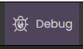
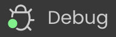
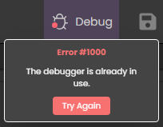

## Starting a debug session

To be able to execute your code line-by-line and evaluate expressions, you need to start a **debug session** on the server. To do this, click on the **Debug** button in the Studio toolbar:

If the debug session has been correctly started, a green bullet is displayed on the button label:

You can only open one debug session per instance. If another instance of the application has already started a debug session (e.g. a debug session was launched from another browser), the debug button displays a warning message:

In this case, you have to wait until the other debug session be closed before opening a new debug session.

## Breakpoints

Breakpoints pause the code execution (and display the debugger window if not already displayed) at a desired step. You set breakpoints on any line of code where you want the execution to be paused. 

To create a breakpoint, click in the left margin of the code editor. A red bullet is displayed:

When the code is launched, a yellow arrow is displayed in the left margin to show where the execution was paused, and mark the next line to be executed. The yellow arrow is called the *program counter*. At this step, you can use the debugger panel at the bottom of the window to evaluate and debug your code.

### Breakpoint status

