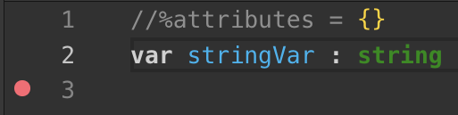
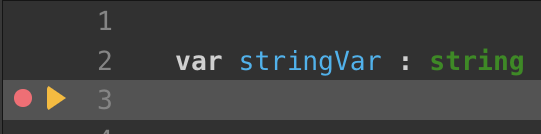

Errors are common. It would be unusual to write a substantial number of lines of code without generating any errors. Conversely, treating and/or fixing errors is normal, too!

The Qodly development environment provides several debugging tools for all types of errors.

## Starting a debug session

To be able to execute your code line-by-line and evaluate expressions, you need to start a **debug session** on the server and *attach* it to your browser. To do this, click on the **Debug** button in the Studio toolbar:

If the debug session has been correctly started, a green bullet is displayed on the button label:

When you start executing code in the debug session, the bullet becomes orange. 

You can only open one debug session per instance. If another instance of the application has already started a debug session (e.g. a debug session was launched from another browser), the debug button displays a warning message:

In this case, you have to wait until the other debug session be closed before opening a new debug session.

### Stopping a debug session

When you click on the **Debug** button in the Studio toolbar while a debug session has started, a warning dialog box asks you to confirm that you want to *detach* the debugger, i.e. close the debug session attached to your browser. Several options are proposed:

- **Keep in progress**: Qodly continues the evaluation of the code until the end of the current method or function and then, the debugger is detached. 
- **Stop**: The debugger is immediately detached. 
- **Cancel**: The debugger is not detached. 

## Breakpoints

Breakpoints pause the code execution (and display the debugger window if not already displayed) at a desired step. You set breakpoints on any line of code where you want the execution to be paused. 

To create a breakpoint, click in the left margin of the code editor. A red bullet is displayed:

When the code is launched, a yellow arrow is displayed in the left margin to show where the execution was paused, and mark the next line to be executed. The yellow arrow is called the *program counter*:

At this step, you can use the debugger panel at the bottom of the window to evaluate and debug your code.

### Breakpoint status

Depending on the context, breakpoints can have different status, represented through the beakpoint appearance and tip.

|Appearance|Status|Context|
|---|---|---|
||Breakpoint|The breakpoint is validated in the debug session and will stop execution| 
||Draft breakpoint|The breakpoint is registered but no debug session is started | 
||Unverified breakpoint|The method or function where the breakpoint is set is not correctly saved. You might have to fix the code| 

