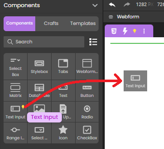
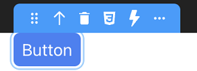
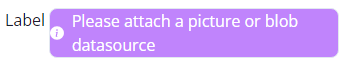
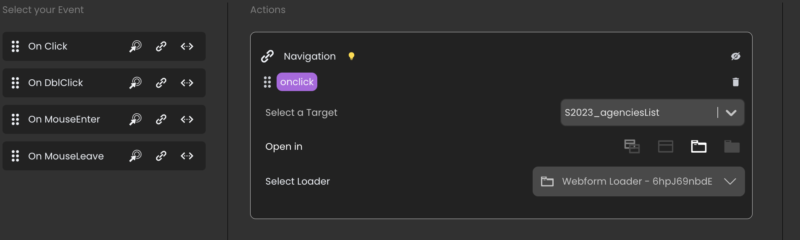
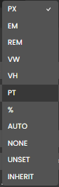

Components are the building blocks of your application. 

## Managing components

### Adding components

The Component library lets you search for a component or choose one from the list. 

To add a component, drag it from the Components library section and drop it on the canvas.

Once a component is on the canvas, you can [customize its look](styling.md) and bind a [data source](datasources.md) to it (if possible).

### Tooltip

When you select a component in the canvas, the tooltip displays its type and offers several actions:

|Action|Description|
|---|---|
|Move|Moves the selected component on the canvas|
|Select Parent Component|Selects the parent component of the element. For example, selects the Text Input component when you click on its Label or Input part. |
|Delete component|Removes the selected component from the canvas|
|Export styles|Exports the [overridden CSS properties](styling.md#overriding-style-properties) to a new CSS class|
|Open Events panel|Opens the bottom panel, allowing you to bind [events](events/events.md) to the component|
|Copy, Cut, Paste, Paste into|Standard edit actions|
|Duplicate|Duplicates the component|
|Save as craft|Saves the component, its child components, and their styles as a reusable component named [crafted component](#crafted-components)|
|Copy contents|Copies the contents of the component|
|Clear styles|Clears the styles of the selected element (resets the [overridden CSS properties](styling.md#overriding-style-properties))|
|Clear Contents|Clears the contents of the component|

The tooltip is contextual, which means that some actions are available to certain elements, and not others. For example, you can duplicate a Text input component, but not its individual parts (Label and Input).

When you select some text in the Text component, additional actions are proposed in its [tooltip](#tooltip).

## Description of components

### Overview

Two types of components are available:

- **containers**, which contain and organize other components
- **data sources**, components whose actions are bound to datasources 

|Component|Type|Description|
|---|---|---|
|Button|data source|Triggers actions on a web page|
|Checkbox|data source|Allows the user to make a binary choice (boolean value)|
|Columns|data source|Displays data inside columns|
|Datatable|data source|[Iterative](datasources.md#iterative-components). Displays data in the form of a table. User can select a row to interact with the server|
|File upload|data source| Allows you to upload a file to the server|
|Icon|data source|Displays an icon|
|Image|data source|Displays an image|
|Matrix|container|[Iterative](datasources.md#iterative-components). Container of repeated Styleboxes. Its Stylebox must have a fixed height set in pixels|[Iterative](datasources.md#iterative-components)|
|Radio button|data source|Allows selecting one of a set of options|
|Range input|data source|Allows selecting a value in a range|
|Select box|data source|[Iterative](datasources.md#iterative-components). Allows selecting an item in a list|
|Stylebox|container| Container used to keep the content centered and legible|
|Tabs|data source|Organizes and allows navigation between groups of content that are related and at the same level of hierarchy|
|Text|data source|Displays text on a web page|
|Text input|data source|Allows users to enter data in a form|
|Webform|container| Base container that holds all the other components|
|Webform loader|container| Displays a webform inside the current Webform component|

### DataTable

The **DataTable** component is designed to display data as a table from a datasource. Usually when a DataTable is bound to a catalog datasource, attributes are represented as columns, and entities are represented as rows. A DataTable also contains a header. 

Basic features include column sorting, resizable columns, columns movable by drag and drop, tips display with cell value, and selectable/tabbable rows. 

Note that all DataTable components parts are highly customizable thanks to a specific [CSS class].

The DataTable can be configured with the following properties, available from the **Properties** panel:

- **Header height**: Height of the header row in pixels.
- **Row height**: Height of each row (except the header) in pixels.
- **columns area**: Use this area to add, move, or remove colums from the DataTable.
	+ to **add** a column, click on the `+` icon to display a new column configuration area at the bottom of the column list (see below)
	+ to **remove** a column: click the trash icon of the column
	+ to **move** a column: select the icon at the left of the column name, then drag and drop the column.
- ***column name***: Each added column is configured individually and has the following properties:
	+ **Title**: Column title to be displayed in the header and as column name in the properties area. 
	+ **Source**: datasource for the column. Usually, it is an attribute whose value depends on each element of the DataTable's DataSource. 
	+ **Format**: Display format for the column.
	+ **Width**: Column width in pixels. You can define the width in pixels or in percentage by using the unit menu at the right side of the entry area (**PX** or **%**)
	+ **Sorting**: Check this selector if you want that the user can sort the column by clicking the header area at runtime (alternatively for ascending/descending sort). 

#### Styling

The DataTable component supports dedicated CSS classes that allow customizing specific parts such as even columns or selected row. Refer to the [**Customizing DataTable Styles**](styling.md#customizing-datatable-styles) section for class definition and examples. 

#### Events

The DataTable component supports the following specific [server event](../API/web-event.md):

|Property|Type|Description|
|---|---|---|
|eventType|Text|"onheaderclick"|
|data|Object|-|
|index|Number|index of the clicked column header (starting from 0)|
|name|Text|the datasource of the column (i.e; address.city)|

### File upload

The **File upload** component provides a convenient way to upload files to the server. Thanks to this component, the user can upload a binary or a picture file and store it in an entity attribute.

A File upload component is made of two elements (that you can select separately):

- a **Label**, usually displaying basic instructions such as "Please drop a file" (can be hidden)
- the **File input** area. 

The File input area can be configured with the following properties, available in the **Properties** panel:

- **Icon position**: relative position of the icon regarding the label. You can also select **hidden** to not display an icon.
- **Size limit**: maximum file size that the user will be allowed to upload. You can select the unit: KB, MB, GB. If the user selects a file with a larger size, an error is displayed on the browser. 
- **Media type**: file type. Supported type: text, image, video, audio.

You must select an Entity datasource based upon an attribute of type Blob or picture to bind to the component. This attribute will be used to store the uploaded file. 

### Image

The **Image** component displays an image in the webform.

You can upload an image to the studio and display it in your application. That image is available to all the webforms in your project and is stored in the **Explorer** panel > **Shared** > **assets** > **images**. 

An uploaded image is displayed in the WebForm window when you select it in the **images** directory.

### Matrix

[**Iterative** component](#iterative-components).

A **matrix** component displays a variable number of stylebox components (based upon the number of elements in the matrix's datasource). For example, you can display an entity selection using a matrix, where each included stylebox contains some attributes of the entity selection (text, images, etc). 

The matrix is an [iterative component](#iterative-components). You can iterate on the matrix contents using the `$This` keyword.

#### Orientation

A matrix automatically displays as many stylebox composents as possible in the defined height and width. You can select the **orientation** of the matrix, i.e. the order stylebox components are displayed and how they can be scrolled. Two options are available:

 

- **Horizontal**: stylebox components are ordered horizontally and a horizontal scrollbar is automatically displayed if necessary.
- **Vertical** (default): stylebox components are ordered vertically and a vertical scrollbar is automatic
ally displayed if necessary.

### Select box

[**Iterative** component](datasources.md#iterative-components).

A **select box** component allows users to select an item from a list of stylebox components. A select box proposes the following properties:

- **Placeholder:**: text to display dimmed in the select box, for example "Select an activity" 
- **Number of items:** maximum number of items to display simultaneously in the box
- **Show length**: display a string with the total number of items above the component in the web page. By defaut, the "{{ length }} items" is used, but you can customize this pattern in the area that appears when you select this option.
- **Enable search**: adds a search area in the web form, in which the user can enter characters to automatically filter the datasource contents displayed in the select box (the search is triggered on each key stroke).   
When you select this option, a **searchAttributes** area is displayed so that you can define the datasource attribute(s) in which the entered string will be searched. Only attributes of type *string* or *number* can be searched. 

 

### Stylebox

A **stylebox** component is a container that is used to keep the content centered and legible.

Styleboxes can be inserted at the root level of a webform, and can be nested to create a hierarchy of elements. 

The following components automatically include a stylebox component that organizes their contents:

- columns,
- grid,
- tabs,
- matrix,
- select box.

For example, the matrix's stylebox is the first element of a matrix:

It is automatically replicated in the matrix area depending on its orientation and datasource:

When you drag and drop a datasource attribute to a stylebox, a new [Text](#text) component bound with the datasource is automatically created inside the stylebox:

|Datasource type|New text component bound with|
|---|---|
|Entity attribute|entity.attribute|
|Selection attribute|$iterator.attribute|
|Length of a selection|selection.length|
|Scalar datasource|datasourceName|

### Text

The **Text** component displays some text on the web page. 

When you select some text in the Text component, additional actions are proposed in its [tooltip](#tooltip):

- **Style buttons**: Applies style to the selected text: Bold, Italic, Underline, Strikethrough
- **Toggle DataSource**: Allows you to display the contents of a datasource as a text. It means that the text contents is defined dynamically by the datasource value. In **Text** you can insert a placeholder to display on the canvas, and in **Datasource** the datasource path (for example, "employer.name"). In an [iterative component](#iterative-components), use the `$This` keyword.   
    
If you selected a datasource of type date, an additional **Format** area allows you to enter a date format pattern:  
  
See [this page on unicode.org](https://www.unicode.org/reports/tr35/tr35-dates.html#Date_Field_Symbol_Table) for a detailed of available symbols and patterns. 
- **Toggle Link**: Allows you to insert a text label bound to an hypertext link. Select **Open in a new tab** if you want that the link be opened a new browser tab.   
The link can be a static **URL** or a dynamic value based upon a **datasource**. For example, if the datasource is an object property, the property value is used as the URL.  

  

### Text input

The **Text input** component allows users to enter data as text in the web form.

The Text input component supports a **Type** property with the following values:

- *text*: standard
- *number*: the user can only enter a number
- *password*: data entered is not displayed in clear<
- *date*: the user can only enter a date. A date picker is automatically displayed on the client when the user enters the form area.

### Webform loader

The **Webform loader** component displays a webform inside the current Webform component.

A Webform loader's initial value determines which webform it displays when it loads. You can set that initial value in one of the following ways: 

* using the Properties panel
* by binding a local datasource of type Text to it and giving it an initial value. 

> If you apply both methods to the same Webform loader, the contents of the bound datasource are displayed in priority.

The initial value must match the name of the webform to display.

The difference between these methods is that binding a local datasource allows you to dynamically update the contents of the Webform loader. Every time the value of the datasource changes, the contents of the Webform loader are updated accordingly.

When implementing navigation actions in a Webform loader, you need to use the component [`Ref` property](create-webform.md#ref) to designate the components to process:

## Server-side reference

The server-side reference of a component is its "address" on the server. To set the behavior of a component, you can give it a server-side reference, and then [use that reference in class functions](../API/WebFormItemClass.md).

To assign a server-side reference to a component, enter a value in the Properties panel > Server Side:

## Crafted components

You can craft your own components, that is, turn any component and its child components into a reusable component. 

Any component can be saved as crafted component, except for the Webform component.

A crafted component includes the initial component's:
* styles, including CSS classes
* child components and their properties
* event configuration
* datasource references

### How to craft a component

1. On the canvas, select the element you want to turn into a crafted component.
2. In the **Tooltip**, click **...** and select **Save as craft**.
3. (Optional) Enter a name for the crafted component.
4. Click **Add**.

The crafted component is now available in the **Components** > **Crafted** section and can be dragged and dropped on the Canvas.

### Handling styles, datasources and events

When you drop a crafted component on the Canvas:
* its CSS classes are imported into the target Webform, unless that Webform already has CSS classes with the same names.
* its datasources are not imported into the target webform. That's because crafted components only include references to datasources, not the datasources themselves.
* its event configuration is preserved, so you'll need to modify that configuration or make sure it matches the webform where you drop the crafted component.

## Templates

Templates are a great way to jump-start your building process. 4D Web Studio offers templates to help you design things more quickly. These templates come as-is and may require customization.

:::note

The current list of available templates is not representative of what will be available in the final product, and it will keep expanding.

:::

To use a template:

1. Open or create a new webform.
2. In the Components section, click **Templates**.
3. Select a template. A panel opens with several components to choose from.
4. Choose a component you want to use and drag it from the list.
5. Drop the component on the Canvas.

### Ref

The internal ID for the selected component. This ID is automatically assigned at the component creation and used to reference it during [Webform loader component](components.md#webform-loader) navigation action.

A webform has always `ROOT` as reference. 

### Search

This area allows you to search among the property names, for an instant access to the desired setting. 

### Server Side

The server-side reference of a component is its "address" on the server. To set the behavior of a component, you can give it a server-side reference, and then [use that reference in class functions](../language/WebFormItemClass.md).

To assign a server-side reference to a component, enter a value in the Properties panel > Server Side:

### Class

This area allows you to apply default or custom CSS class(es) to the selected component. When you select or enter a CSS class name, the CSS is applied to the component and its name is displayed under the area. Involved style and color properties are updated accordingly in the panel, allowing you to alter some parts of the CSS.

You can apply more than one CSS, [Cascading and inheritance rules](https://developer.mozilla.org/en-US/docs/Learn/CSS/Building_blocks/Cascade_and_inheritance) will be applied. 

To remove a CSS from the component, just click the `x` at the right side of the CSS label. 

### Text Color and Background

Text and Background color of the selected component. For each property, you can:

- enter a rgb value with the syntax `rgb(<number>,<number>,<number>)`
- enter a hexadecimal color value such as `#cf737300`
- click on the color picker button and select a color; its hexadecimal value is then inserted in the area. 

### Height and Width

Height and Width of the selected component. You can use these properties to modify the component's size. You can change the [unit](#display-unit) for these properties. 

### Margin and Padding

This area allows you to define the margin and padding values for the selected components. When you click on a padding or a margin, an additonal area is displayed, so that you can enter or display values.   

  

### Display

:::info

This property is only available for a whole webform.

:::

Overall display organization of components within the webform. 

  

The following options are available:

- **Block** (default): components are displayed sequentially from top to bottom, without specific settings.
- **Flex**: components are displayed depending on a defined schema that includes multiple customized parameters (alignment, gap between components, justification, wrap). When you select this option, an additional area is displayed so that you can modify any relevant parameters. 

  

- **None**: components are hidden.

### Display unit 

CSS size properties such as "Height" & "Width" are expressed using the `PX` (pixels) default display unit. You can modifiy this unit using the menu at the right side:

  

For a description of these units, you can refer to [this page](https://developer.mozilla.org/en-US/docs/Learn/CSS/Building_blocks/Values_and_units#lengths).
