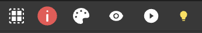
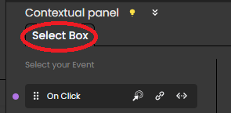

## Creating a webform

In Qodly, everything starts with a webform. A webform is a container that holds all the other components (buttons, grids, style boxes, etc.) of your application.

To create a webform:
* from the homepage, click **Webform** and enter a name for the new webform
* from the Webform Editor, click the **New +** tab > **Webform**

## Overview

The Webform Editor provides several tools to customize the interface and contents of your application:

1. Explorer: Lists your project's webforms, methods, classes, shared elements (such as images), and debuggger sessions. Use the **...** contextual menu at the right side of each element to access actions available for the element (usually **Delete**, **Duplicate**, **Open** or **Edit**). The Explorer also provides access to the project's definition files: roles and privileges, data model, and settings.
2. Tabs: They let you keep track of your currently opened elements, such as your forms and methods.
3. Components: The building blocks of your application.
4. Data Sources: Create and explore your datasources.
5. Styles Library: Holds predefined and customized styles for your components.
6. Outline: Presents the structure of your webform and allows you to navigate between the different elements.
7. Canvas: This is where you combine your components, styles and datasources. You can drag and drop components onto your canvas, then drag and drop CSS classes and datasources onto these components, and preview or render your webforms.
8. Properties panel: Allows for advanced style customization. Also allows binding datasources to components.
9. Contextual panel: Link events and code to your components, edit CSS styles, etc.
10. Header: Save and preview your work, access the Data Explorer as well as additional settings.

## Breadcrumbs

When you select a component in the canvas, the breadcrumbs display its hierarchy:

To select any parent component displayed in the breadcrumbs trail, click its name. 

## Outline

The outline section displays the hierarchy of your webform:

Click an element in the list to select it, or click and drag it anywhere in the outline to move it somewhere else.

To display or hide an element, click the eye icon.

## Header panel

- **Toggle Airy Layout:** Airy mode is a specially crafted feature that enriches the creation of user-friendly web forms by automatically incorporating default margins between components. When enabled, it introduces a spacious layout by inserting a gap between the components within the form. This not only streamlines the process of designing visually appealing and user-friendly web forms but also significantly reduces the necessity for manual adjustments to style properties. To reflect the selected mode, a convenient toggle is incorporated on the canvas, allowing developers to easily switch between Airy mode and Neutral mode. The initial state of the toggle is context-dependent, adapting to the specific form being worked on.
- **Sanity Check**: No more unnoticed website issues. The [Sanity Check](#sanity-check) tool scans for any issues that need fixing, like text bound to non-existing data classes, ensuring a smooth user experience for your visitors.
- **Datasources Color**: Simplify component management with the Datasources Color feature. Easily identify the background color of datasources bound to the component, streamlining your workflow.
- **Preview in Studio** and Preview in a new Tab: Render your webform either directly in Qodly Studio or using the webform URL. See [Rendering a webform](../rendering.md). 

## Sanity check

The Webfom editor includes a **Sanity check** tool, allowing you to easily and quickly check the consistency of your Webforms. This tool is useful to avoid errors at runtime and save time. In particular, the sanity check will detect if a component is bound with a non existing datasource. 

The Sanity check is automatically enabled when an opened webform is being edited. Its icon is located at the upper right area above the canvas. When there are no errors, the icon looks like this:

When errors have been detected, the number of errors is displayed on the icon and you can click on it to display more information about the error(s):

:::note

The Sanity check is only informative. A webform can always be saved even if it contains errors. 

:::

## Contextual panel

The Contextual panel can be used to:

- configure actions to execute when [events](events.md) occur in your webform and components,
- edit your [CSS](styling.md).

The contents of the panel depends on the currently selected element, whose name is always displayed at the top of the panel:

 

## Properties panel

The Properties panel is used to display or modify all available properties for the selected webform or component.  

### Display modes

Two modes are proposed:

- **Standard mode**: displays a compact, straighforward view where essential properties can be set. Use this mode to quickly configure the main properties of your webform components. 
- **Advanced mode**: displays an comprehensive view of all available properties. Use this mode for greater granularity in property definition, allowing precise configuration of design options and parameters. 

To select a mode, use the switch on the top right area of the editor:

Whatever the mode, available properties depend on the selected element. 

Three groups of properties are available:

- **Properties**: specific properties for the selected component. These properties are documented with each component.
- **Data Access**: configure the interaction between the selected component and its data source (if any). These properties are documented in the [**Datasources**](datasources.md) section.
- **Style**: defines graphical properties of the components. These properties are documented in the [**Styling**](styling.md) section.

### Ref

The internal ID for the selected component. This ID is automatically assigned at the component creation and used to reference it during [Webform loader component](webformloader.md) navigation action.

A webform has always `ROOT` as reference

### Search box

The area allows you to search among the property names, for an quick access to the desired property. As you enter characters, the property list is updated to show only properties with matching names. 

