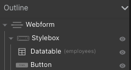
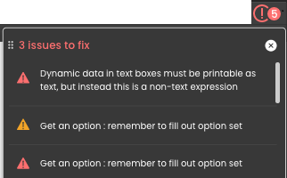
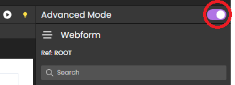
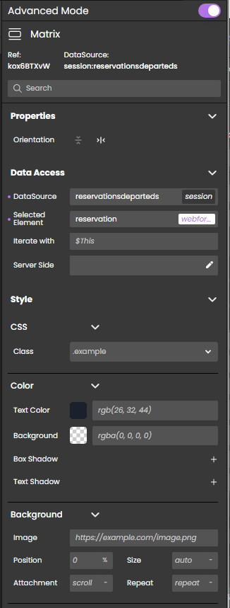

## Creating a webform

In Qodly, everything starts with a webform. A webform is a container that holds all the other components (buttons, grids, style boxes, etc.) of your application.

To create a webform:
* from the homepage, click **Webform** and enter a name for the new webform
* from the Webform Editor, click the **New +** tab > **Webform**

## Overview

The Webform Editor provides several tools to customize the interface and contents of your application:

<ol class="interface-numbers">
<li class="interface-item">Explorer: Lists your project's webforms, methods, classes, shared elements (such as images), and debuggger sessions. Use the **...** contextual menu at the right side of each element to access actions available for the element (usually **Delete**, **Duplicate**, **Open** or **Edit**). The Explorer also provides access to the project's definition files: roles and privileges, data model, and settings. </li>
<li class="interface-item">Tabs: They let you keep track of your currently opened elements, such as your forms and methods.</li>
<li class="interface-item">Components: The building blocks of your application.</li>
<li class="interface-item">Data Sources: Create and explore your datasources.</li>
<li class="interface-item">Styles Library: Holds predefined and customized styles for your components.</li>
<li class="interface-item">Outline: Presents the structure of your webform and allows you to navigate between the different elements. </li>
<li class="interface-item">Canvas: This is where you combine your components, styles and datasources. You can drag and drop components onto your canvas, then drag and drop CSS classes and datasources onto these components, and preview or render your webforms.</li>
<li class="interface-item">Properties panel: Allows for advanced style customization. Also allows binding datasources to components.</li>
<li class="interface-item">Contextual configuration panel: Link events and methods to your components, edit CSS styles, etc.</li>
<li class="interface-item-2"> Header: Save and preview your work, access the Data Explorer as well as additional settings.</li>
</ol>

### Breadcrumbs

When you select a component in the canvas, the breadcrumbs display its hierarchy:

To select any parent component displayed in the breadcrumbs trail, click its name. 

### Outline

The outline section displays the hierarchy of your webform:

Click an element in the list to select it, or click and drag it anywhere in the outline to move it somewhere else.

To display or hide an element, click the eye icon.

## Sanity check

The Webfom editor includes a **Sanity check** tool, allowing you to easily and quickly check the consistency of your Webforms. This tool is useful to avoid errors at runtime and save time. In particular, the sanity check will detect if a component is bound with a non existing datasource. 

The Sanity check is automatically enabled when an opened webform is being edited. Its icon is located at the upper right area above the canvas. When there are no errors, the icon looks like this:

When errors have been detected, the number of errors is displayed on the icon and you can click on it to display more information about the error(s):

:::note

The Sanity check is only informative. A webform can always be saved even if it contains errors. 

:::

## Properties panel

The Properties panel is used to display or modify all properties of the selected form or component. Two modes are proposed:

- **Standard mode**: displays a compact, straighforward view where essential properties can be set. Use this mode to quickly configure the main properties of your webform components. 
- **Advanced mode**: displays an comprehensive view of all available properties. Use this mode for greater granularity in property definition, allowing precise configuration of design options and parameters. 

To select a mode, use the switch on the top right area of the editor:

Whatever the mode, available properties depend on the selected element. The following properties are generic. Additional properties are proposed per component.  

### Graphical control 

Some of the key features that can be accessed through the Properties panel include:

- CSS: The CSS class contains styles that are applied to the component, encompassing font sizes, colors, and layout styles, which influence its appearance and layout. You can refer to the Style Library for more information and available style options.
- Color scheme: The color scheme feature permits the customization of the component's color scheme, encompassing background colors, text colors, and border colors. This functionality provides flexibility in adapting the component's visual aesthetics to match the desired design.
- Background image: With the background image feature, you have the ability to assign a background image to the component. This capability enhances the visual appeal of the component and facilitates conveying a specific theme or mood effectively.
- Dimensions: The dimensions feature enables you to define the width, height, and other size-related properties of the component. By utilizing this feature, you can ensure that the component fits seamlessly within the layout of the webpage.
- Layout: The layout feature empowers you to specify the position of the component within the page, align it with other elements, and define its behavior when the page is resized. This functionality provides control over the overall structure and arrangement of the component.
- Appearance: The appearance attribute encompasses the component's position (relative, absolute, etc.), overflow behavior, and display style (block, flex, etc.). By adjusting these attributes, you can effectively control how the component is presented and interacted with on the webpage.
- Font: The font feature allows you to choose the font type, size, alignment, and style for the component's text. This versatility enables you to achieve the desired visual look and feel for the component's textual content.
- Borders and Border radius: You can define borders around the component, specifying attributes such as thickness, color, and style. The border radius feature enables you to determine the curvature or roundness of the component's corners. By adjusting this attribute, you can create various shapes and styles, adding aesthetic appeal to the component's design.

### Data access

In essence, the Properties panel is the heart of the component, offering the ability to customize it to suit preferences and create a visually appealing and unique web application. But it goes far furthur with the **Data Access** properties. This feature is available in all components, except for the  WebForm, and it's a complete game-changer. With Data Access, developers can access and manipulate the component's properties directly from the server, giving them complete control over the component's behavior.

The **Data Access** properties contain a `Server Side` field, which displays a reference to the component on the server side. This reference is like the component's address, allowing developers to access the component from anywhere in the application. These properties can be used to dynamically change the content of the website without any manual intervention, making it truly interactive by responding to user actions in real-time.

The **Data Access** properties contains other options/fields as well, depending on the component at hand. For instance:

- The `DataSource` field allows developers to define the source of data for the component to iterate on.
- The `Selected Element` field allows them to specify which element in the component is selected. 
- The `Iterate field` is available for developers to loop through that same set of data.

