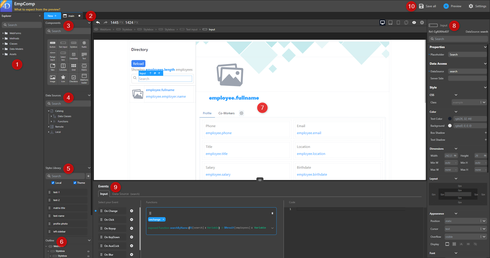

import Column from '@site/src/components/Column'

## Creating a webform

In Qodly, the foundation of your work begins with a webform, a container encompassing all other components (buttons, style boxes, etc.) within your application.

* From the homepage, select **Webform** and input a name for the new webform
* Within the Webform Editor, access the **New +** tab and choose **Webform**

## Overview

The Webform Editor furnishes an array of tools for tailoring your application's interface and content:

1. **Explorer**: Showcases your project's webforms, methods, classes, shared elements (like images), and debugger sessions. Each element features a contextual menu (**...**) for actions such as **Delete**, **Duplicate**, **Open** or **Edit**. You can also access project definition files for roles, privileges, data model, and settings.
2. **Tabs**: These keep track of your currently opened elements, including webforms and methods.
3. **Components**: Fundamental building blocks of your application.
4. **Data Sources**: Create and explore datasources.
5. **Styles Library**: Houses pre-defined and customized styles for components.
6. **Outline**: Offers a view of your webform's structure and facilitates element navigation.
7. **Canvas**: Here, components, styles, and datasources come together. Drag and drop components onto the canvas, then further refine by adding CSS classes and datasources. Preview or render your webforms.
8. **Properties panel**: Allows advanced style customization and facilitates datasource binding to components.
9. **Contextual panel**: Establish event links, code associations, edit CSS styles, and more.
10. **Header**: Save and preview your work, access the Data Explorer, and configure additional settings.

## Breadcrumbs

<Column.List align="center" justifyContent="between">
	<Column.Item width="60%">
        The Breadcrumbs feature showcases the hierarchy of your selected components. As you follow the trail, you can click on any parent component's name to choose it.
	</Column.Item>
	<Column.Item width="30%">
        
	</Column.Item>
</Column.List>

## Outline

<Column.List align="center" justifyContent="between">
	<Column.Item width="65%">
        The outline section provides a visual representation of your webform's hierarchy, allowing you to grasp the structural arrangement. 
        By clicking on an element within the list, you can select it for further action, or utilize the drag-and-drop functionality within the outline to reposition elements. To manage the visibility of specific elements, simply click the eye icon , toggling their display on or off as needed.
	</Column.Item>
	<Column.Item width="30%">
        
	</Column.Item>
</Column.List>

## Header panel

<Column.List align="center" justifyContent="between">
	<Column.Item width="60%">
        For simplified project tracking, utilize the Project Management tools. Here are the key features:
	</Column.Item>
	<Column.Item width="30%">
        
	</Column.Item>
</Column.List>

 

- **Toggle Airy Layout:** Airy mode is a specially crafted feature that enriches the creation of user-friendly web forms by automatically incorporating default margins between components. When enabled, it introduces a spacious layout by inserting a gap between the components within the form. This not only streamlines the process of designing visually appealing and user-friendly web forms but also significantly reduces the necessity for manual adjustments to style properties. To reflect the selected mode, a convenient toggle is incorporated on the canvas, allowing developers to easily switch between Airy mode and Neutral mode. The initial state of the toggle is context-dependent, adapting to the specific form being worked on.

- **Sanity Check**: The Sanity Check tool ensures your Webforms's consistency and saves time by identifying errors before runtime. Particularly, it spots components bound with nonexistent datasources. It's automatically activated while editing an opened webform, visible as an icon in the upper right corner above the canvas. 
    - The icon appears like this when there are no errors 
    - When errors arise, the icon displays the error count, and clicking on it provides detailed error information.

    
    
     

    Note that:
    :::info
    The Sanity Check serves as an informative tool. Even if errors are present, a webform can still be saved. 
    :::

- **Datasources Color**: Simplify component management with the Datasources Color feature. Easily identify the background color of datasources bound to the component, streamlining your workflow.

- **Preview in Studio** and Preview in a new Tab: Render your webform either directly in Qodly Studio or using the webform URL. See [Rendering a webform](../rendering.md). 

## Contextual panel

The **Contextual** panel allows you to bind class functions, navigation actions, and standard actions to specific events within your application. Additionally, you can modify CSS classes directly from the Contextual panel to fine-tune your application's appearance.

### Modifying CSS Classes

You can adjust CSS classes right from the Contextual panel, offering you granular control over your application's visual styling. For more detailed information, refer to the [Styling](styling.md) section.

### Bind Class Functions to Events
Connect class functions to events for streamlined interactions. For more detailed information, refer to the [Bind Class Functions to Events](events.md#bind-class-functions-to-events) section.

### Bind Navigation Actions to Events
Associate navigation actions with events to enable navigation based on user interactions. For more detailed information, refer to the [Bind Navigation Actions to Events](events.md#bind-navigation-actions-to-events) section.

### Bind Standard Actions to Events
Link standard actions to events, ensuring consistent actions in response to specific events. For more detailed information, refer to the [Bind Standard Actions to Events](events.md#bind-standard-actions-to-events) section.

## Properties panel

The Properties panel is a powerful tool for customizing a wide array of component attributes, enabling you to shape their behavior and appearance to suit your needs. The available properties are contingent upon the specific component you have selected.

### Display Modes

The Properties Panel offers a pair of distinctive modes:

- **Standard mode**: This mode presents a concise and straightforward view, ideal for configuring essential properties swiftly. Utilize it to quickly set up key attributes for your webform components. 
- **Advanced mode**: In this mode, a comprehensive view showcasing all available properties is provided. Choose this mode for intricate property definition, enabling meticulous configuration of design choices and parameters.

<Column.List align="center" justifyContent="between">
    <Column.Item width="65%">
        To toggle between modes, utilize the switch located in the top-right corner of the editor.
    </Column.Item>
    <Column.Item width="30%">
        
    </Column.Item>
</Column.List>

### Component Reference (Ref)

<Column.List align="center" justifyContent="between">
    <Column.Item width="60%">
        This section introduces the internal ID assigned to the chosen component during creation. This unique identifier is utilized for referencing during <a href="./components/webformloader">Webform loader component</a> navigation actions. The reference for a webform component is consistently set to ROOT .
    </Column.Item>
    <Column.Item width="30%">
        
    </Column.Item>
</Column.List>

### Search box

<Column.List align="center" justifyContent="between">
    <Column.Item width="60%">
        The search box feature streamlines property name searches, ensuring swift and convenient access. As you input characters, the property list dynamically updates, displaying only properties with corresponding names.
    </Column.Item>
    <Column.Item width="30%">
        
    </Column.Item>
</Column.List>

### Properties Category

Enhance a component to align with your application's requirements using the available customization options, depending on the component selected.

:::info 
Each component's documentation contains its own dedicated section explaining these customization possibilities.
:::

### Data Access Category

Configure the interaction between your chosen component and its associated datasource, if applicable. These property details are extensively covered in the [**Datasources**](datasources.md) section.

The Data Access properties encompass distinct options and fields tailored to each specific component, including:

- **DataSource**: Identifies the data source for component iteration.
- **Selected Element**: Specifies the currently selected element within the component.
- **Iterate with**: Utilizes a datasource for looping through the same dataset.
- **Server Side**: Provides the means to exercise server-side control over a component's behavior. This involves assigning a server-side reference, essentially an "address" on the server, to the component. By doing so, you enable the utilization of this reference in class functions, thereby governing the component's actions.

### Style Category

Discover numerous customization avenues that empower you to fine-tune components according to distinct needs. Explore below for specific options:

| Section       | Description |
|-----------------|-------------|
| CSS             | The CSS class contains styles influencing visual attributes, affecting the component's appearance and positioning. Refer to the Style Library for comprehensive style options and additional details. |
| Color scheme    | Customize the component's color palette including background colors, text colors, and box shadows.         |
| Background      | Assign a background image to the component with options like position, size, attachment, and repeat settings.                                              |
| Dimensions      | Define component dimensions: width, height, and other size properties for seamless integration into the webpage layout.                                                         |
| Layout          | Gain control over component alignment using margins and paddings.                             |
| Appearance      | The appearance attribute covers position (e.g., relative, absolute), overflow behavior, and display styles (e.g., block, flex), shaping component presentation and interaction.|
| Font            | Tailor font type, size, alignment, and style achieving desired textual visual style.                                         |
| Borders         | Define borders using attributes like thickness, color, and style to visually distinguish the component.                                   |
| Border radius   | Adjust component corner curvature for various shapes and styles. |

:::info 
For additional styling insights, refer to the [**Styling**](styling.md) section.
:::

