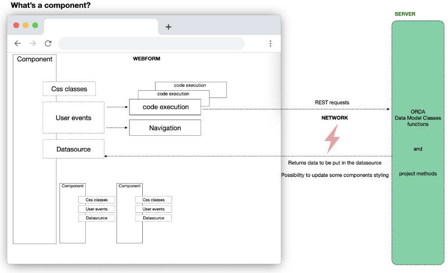
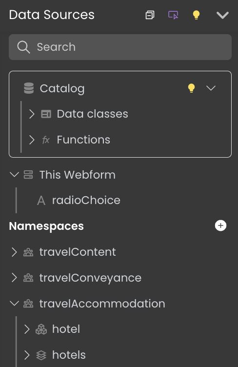
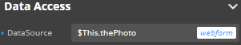

Datasources are a central concept to Qodly's architecture and are intended to make developping Web applications as simple as possible. A **datasource references data and automatically generates events when this data is changed**. Your webform components can **subscribe** to datasources to determine how and where the data is displayed in your application.

## What are datasources?

### Components and datasources

Components are UI elements that can subscribe to datasources and display all or part of the attributes of the datasource (in case of ORDA or object datasources). When this datasource changes, the component reflects this change.
For example, if a datasource is returned as result by a function, after the function has been called the component reflects automatically the new or modified data of the datasource. 

### Events and datasources 

You can also attach **events** to datasources to trigger certain actions when these datasources are updated in the web browser. See [datasource events](design-webforms/events/events.md#datasource-events) for more details.

### Catalog datasources and scalar datasources

**Catalog datasources** (aka **ORDA datasources**) are references to entities and entity selections existing on the server and coming from the data model. Data exchange is optimized: only attributes displayed by the component are requested from the server and available on the browser (same concept as [contexts](https://developer.4d.com/docs/ORDA/datastores#context)). 

**Scalar datasources** exist locally in the browser. They can be created on the browser and then sent to the server during a function call but are not issued from the Data model and therefore are not persistant. Scalar datasources can be of type String, Number, Boolean, Date, Object, or Collection. 

### Webform datasources and shared datasources

You can create *webform datasources* or *shared datasources*.

The scope of a webform datasource is the webform, whereas the scope of the shared datasource is the application. A webform datasource can only be used in the webform from which it has been defined. A shared datasource can be used in several webforms inside the same project.

By default when you [create a datasource](#creating-a-datasource), if you do not enter a namespace, you define a webform datasource. 

Shared datasources are grouped under namespaces. You can create as many namespaces as you need in the application.

To create a shared datasource, follow the steps to [create a datasource from the catalog](#from-the-catalog) and enter a namespace before choosing **Confirm**, or create a datasource directly [from a namespace](#from-a-namespace). 

When you select a component bound to a datasource, the Properties panel allows you to identify if that datasource is shared:

* If the datasource is shared, its namespace appears next to its name.
* If the datasource is not shared, *webform* is displayed next to its name to indicate that it can only be used in the current webform.

Namespaces of shared datasources are also displayed in the Contextual panel when you configure events that trigger functions.

#### Shared functions 

By extension, when entity and entity selections are used as shared datasources, their functions are shared too and can be used in several webforms in the same project. 

When you configure a function event, the Contextual panel indicates if the function is shared:

* If it is shared, its namespace is displayed next to its name. 
* If it isn't shared, *webform* is displayed instead. 

## Creating a datasource 

### Data Sources section

Inside the Webform Editor, the **Data Sources** section groups the available datasources:

In this section, you'll find:

- A **Search** area, allowing to filter the datasource list 

- The **Catalog**, which holds:
    * dataclasses from your application. From this list, you can designate entities or entity selections from your [datastore](https://developer.4d.com/docs/en/ORDA/dsmapping.html), and they will be handled by the server as datasources.
    * the functions defined at the datastore level and in each dataclass

- **This Webform**: Datasources that can only be used within the webform.  

- **Namespaces**: Datasources that can be used in several webforms your project (**shared datasources**), grouped by namespaces. You can create a namespace by clicking on the **+** icon or when defining a shared datasource. 

#### From the Catalog

You can create webform or shared datasources from the Catalog. 

1. In the Data Sources section, choose **Catalog** > **Data Classes**
2. Click the **+** icon next to a dataclass
3. Enter the name of the datasource. 
4. Select Entity or Entity Selection.
5. Define its settings: initial value, page size, and depth (optional)
6. To create a shared datasource, enter a Namespace. To create a webform (non-shared) datasource, let the area empty. 
7. Click **Confirm**. 

The newly created Entity or Entity selection datasource now appears in the **This Webform** or **Namespaces** section, depending on your settings.

#### From This Webform

You can create webform datasources only from this line. 

1. Click the **+** icon near the **This Webform** line.
2. Enter the name of the datasource.
3. Select the datasource scalar Type.  
If you select Entity selection or Entity, you create an ORDA datasource. You need then to select its Dataclass and configure its settings (initial value, page size or depth).

#### From a Namespace

You can create shared datasources only from a namespace. 

1. Click the **+** icon near a defined namespace.
2. Enter the name of the datasource.
3. Select the datasource Type.  
If you select Entity selection or Entity, you create an ORDA datasource. You need then to select its Dataclass and configure its settings (initial value, page size or depth).
4. Click **Confirm**. 

### Renaming a datasource

You can rename a datasource from the contextual panel. In this case, the Studio allows you to rename the datasource references:

- in the components bound to this datasource 
- and in the origin of other datasources having the renamed datasource as origin

:::caution

When renaming a shared datasource, only opened web forms can have their references renamed.

:::

### Keeping track of your datasources

The **Inspect** option  allows you to check where your datasources are used in your webforms. Toggle the option by clicking the icon, then mouse over a datasource to highlight its location in your webform.

## Binding a datasource to a component

There are several ways to bind a datasource to a component:

* Drag it from the **Data Sources** section and drop it on a component
* Select a component and enter the name of the datasource in the **Properties** panel > **Data Access** > **DataSource** 

:::note Shortcuts

If you drag and drop an entity selection attribute to a [Select box](components.md#select-box) or [Matrix](components.md#matrix) component, the *$This.attributeName* binding is automatically done:

For [images](components.md#images), the binding is automatically displayed in the Data Access panel:

:::

### Iterative components

You can use components to iterate on data. These components allow you to select an item among the data as an independent datasource.

The following components are iterative: [**datatable**](components.md#matrix), [**matrix**](components.md#matrix), and [**select box**](components.md#select-box).

Iterative components can be bound to two data sources:

- **DataSource**: a data source to iterate on. Its attributes are bound to the component to display the iterative data (usually, an entity selection or a collection).
- **Selected Element**: a data source to get the item selected inside the iterative component. Usually, an entity or a collection element.

The data sources are assigned using the Data Access panel:

## Storing data in a datasource

You can store data in scalar and catalog datasources. For example, you can configure an event that calls a function, and store the result of that function in a datasource. See the [example from the user events section](design-webforms/events/events.md#example-search-feature-using-the-onchange-event).

