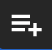

import Column from '@site/src/components/Column'

Events serve as a mechanism for initiating specific actions, often employed to trigger particular behaviors. They collaborate with various actions to establish dynamic interactions within an application.

For instance, when a user interacts with a webpage by clicking a button, you have the flexibility to determine the response, whether it involves invoking a function or opening another webpage. Furthermore, events can be activated in response to [updates in a datasource](#datasource-events).

Within Qodly Studio, events play a pivotal role in executing code on the Qodly web server, without requiring any supplementary JavaScript.

## Types of Events

Events can be set to trigger either when end-users perform specific actions or when datasources are updated.

### User events

You can configure events to activate in response to specific actions performed by end-users, such as clicking buttons, moving the mouse cursor, and more. 

Typical user events include `On Click`, `On DblClick`, `On MouseEnter`, `On Keyup`, and others. The available events may vary depending on the selected component, and detailed documentation can be found in the **Triggers and Events section** on [each component's page](components/stylebox.md#triggers-and-events).

### Datasource events

Besides events triggered by end-user actions, events can also be automated to respond when datasources undergo changes. The primary event for datasources is the `On Change` event.

When the `On Change` event is linked to a datasource, it will trigger in the following scenarios:

|Trigger|Description|
|---|---|
|Datasource|<li>The reference pointed to by the datasource changes in the web browser (not on the server)</li><li>The entity is [touched](../../language/EntityClass.md#touched)</li>|
|Entity datasource|The contents of the entity attribute change|
|Entity selection datasource| <li>The reference pointed by the datasource changes in the web browser (not on the server)</li><li>An entity is added to the entity selection</li>|
|Scalar datasource|The contents of the scalar datasource change|

## Managing Events

The Contextual panel facilitates the association of class functions, navigation actions, and standard actions with distinct events within your application.

### Adding an Event

To bind class functions, navigation actions or standard actions with events, follow these steps:

1. **Select a Component or Datasource**: Begin by choosing the component or datasource to which you want to attach an event. This selection can be made using the canvas, the [outline](./create-webform.md#outline), or, in the case of datasources, either the [shared datasources](datasources.md#from-a-namespace) area or the [local datasources](datasources.md#from-this-webform) area.

2. **Expand the Contextual Panel**: Once your selection is made, expand the `Contextual panel` . It will provide you with a list of compatible events specifically tailored to your chosen component or datasource. 

3. **Bind the Desired Action to the Event**: Next, select the type of action  you wish to bind to the event. You have three options:

    - [Standard Action](#binding-standard-actions-to-events): Configure automatic actions on datasources, such as create, save, drop, or order by, without the need for coding.
    - [Navigation Action](#binding-navigation-actions-to-events): Set up actions related to navigation within the application, such as opening another page or redirecting to an external URL.
    - [Class Function](#binding-class-functions-to-events): Use a custom function to handle the event.
    - [Dialog Action](#): 

4. **Action Bound to Event**: In the list of available events, you will notice a purple bullet  displayed on the left side of events that have already been configured (if any).

5. **Configure Event Properties**: Complete the remaining steps specific to each action type, as detailed in the respective sections within the [Configuring Events](#binding-actions-to-events) section.

:::tip
You can define different actions for the same event.
:::

### Removing an Event

<Column.List align="center" justifyContent="between">
	<Column.Item width="55%">
        To remove a defined action, simply click on the trash icon  located within the event box. This action will result in the removal of the event that is bound to an action.
	</Column.Item>
	<Column.Item width="40%">
		
	</Column.Item>
</Column.List>

### Toggling Event Execution

<Column.List align="center" justifyContent="between">
	<Column.Item width="55%">
        To manage whether an event should execute during rendering, you can toggle its execution status using the toggle icon . This allows you to enable or disable the event as needed to meet your specific requirements.
	</Column.Item>
	<Column.Item width="40%">
		
	</Column.Item>
</Column.List>

This feature is valuable for scenarios like debugging or temporarily pausing specific event executions without removing them from your application entirely.

### Toggle Event Card Visibility

When the contextual panel is opened for a component or a datasource, all events are initially collapsed to provide a concise representation of their content. To expand all event cards, click the  button at the top right of the contextual panel, and to collapse them, click on the  button.

:::tip
<Column.List align="center" justifyContent="between">
	<Column.Item width="54%">
        Choose between table (default) or line format by clicking the  button in the upper right corner of the event card.
	</Column.Item>
	<Column.Item width="46%">
		
	</Column.Item>
</Column.List>
:::

#### Standard Action

For events bound to Standard actions, the collapsed card displays the datasource name involved, followed by its namespace if it's shared or `Webform` when local, on the left side. On the right side, the icon of the standard action is shown.

<Column.List align="center" justifyContent="between">
    <Column.Item width="50%">
        
    </Column.Item>
    <Column.Item width="49%">
        
    </Column.Item>
</Column.List>

However, in specific cases, there may be minor differences in the display. For instance, in the case of the standard `Copy` action, the right side, instead of showing the icon of the standard action, displays the targeted datasource where the copying is intended.

<Column.List align="center" justifyContent="between">
    <Column.Item width="50%">
        
    </Column.Item>
    <Column.Item width="49%">
        
    </Column.Item>
</Column.List>

#### Navigation Action

For events bound to Navigation actions, the collapsed card displays only the targeted webform on the left side, with the icon of the transition method on the right side.

<Column.List align="center" justifyContent="between">
    <Column.Item width="50%">
        
    </Column.Item>
    <Column.Item width="49%">
        
    </Column.Item>
</Column.List>

#### Class Functions

For events bound to Class functions, the collapsed card displays the function signature, including its name, parameters with filled values, and the returned result. The keyword displayed in the event card varies depending on the type:

<Column.List align="center" justifyContent="between">
    <Column.Item width="50%">
        <ul>
            <li>Exposed <a href="../../orda/data-model#datastoreimplementation-class">datastore class functions</a> distinguishable by the keyword <code>Datastore</code>.</li>
        </ul>
    </Column.Item>
    <Column.Item width="49%">
        
    </Column.Item>
</Column.List>

<Column.List align="center" justifyContent="between">
    <Column.Item width="50%">
        <ul>
            <li>Exposed <a href="../../orda/data-model#dataclass-class">dataclass class functions</a> distinguishable by the keyword <code>Dataclass Name</code>.</li>
        </ul>
    </Column.Item>
    <Column.Item width="49%">
        
    </Column.Item>
</Column.List>

<Column.List align="center" justifyContent="between">
    <Column.Item width="50%">
        <ul>
            <li>Exposed <a href="../../orda/data-model#entity-class">entity class functions</a> and <a href="../../orda/data-model#entityselection-class">entity selection class functions</a>, distinguished by the <code>Namespace Of Datasource</code> keyword, encompass shared functions when these entities serve as shared datasources.</li>
        </ul>
    </Column.Item>
    <Column.Item width="49%">
        
    </Column.Item>
</Column.List>

### Reload Event Function Prototype

<Column.List align="center" justifyContent="between">
	<Column.Item width="60%">
		When you make modifications to the function prototype in the code editor, such as adding or removing parameters or changing their types, and you want these changes to be applied to the Function event card, you can easily do so by clicking the reload button. Qodly will then re-parse the function prototype to reflect the updated information while preserving the already assigned data sources as parameters.
	</Column.Item>
	<Column.Item width="35%">
		
	</Column.Item>
</Column.List>

### Chaining actions

In event coordination, actions are linked together sequentially. Pay attention to the alignment of each action with its predecessor, contributing to the overall flow and effectiveness of the process.

### Preview Section

In the preview section, various capabilities are available when actions are bound to a specific event, depending on the type of action. It's worth mentioning that standard actions have no effect in this context.

- <Column.List align="center" justifyContent="between">
	<Column.Item width="40%">
        <strong>Preview Function Code</strong>: Selecting a function bound to a particular event allows you to preview its content within the preview section.
	</Column.Item>
	<Column.Item width="55%">
		
	</Column.Item>
</Column.List>

 

- <Column.List align="center" justifyContent="between">
	<Column.Item width="40%">
        <strong>Edit Function Code</strong>: To directly open and edit a function associated with a specific event, simply select the function and click on the function edit icon .
	</Column.Item>
	<Column.Item width="55%">
		
	</Column.Item>
</Column.List>

 

- <Column.List align="center" justifyContent="between">
	<Column.Item width="40%">
        <strong>Open Linked Webform</strong>: When dealing with a navigation action bound to a specific event, selecting it allows you to access and open the webform associated with that event, using the same icon .
	</Column.Item>
	<Column.Item width="55%">
		
	</Column.Item>
</Column.List>

## Binding Standard Actions to Events

<Column.List align="center" justifyContent="between">
	<Column.Item width="55%">
        Standard actions are applicable to datasources or states, with their availability being determined by the type involved.
	</Column.Item>
	<Column.Item width="40%">
		
	</Column.Item>
</Column.List>

### Datasources

After binding a standard action with an event, follow these steps:

1. <Column.List align="center" justifyContent="between">
	<Column.Item width="55%">
        <strong>Select Type & Datasource</strong>: Initiate by choosing the "Datasource" option and identifying the specific Datasource for the intended standard action.
	</Column.Item>
	<Column.Item width="40%">
		
	</Column.Item>
</Column.List>

2. **Define Action**: Proceed to the Action section to unvail the available actions, which vary depending on the type of the datasource:

    | Datasource Type | Action                | Icon                                                                                                           | Description                                                                                                                     |
    |------------------|-----------------------|----------------------------------------------------------------------------------------------------------------|---------------------------------------------------------------------------------------------------------------------------------|
    | Scalar           | Copy                  |                                                                         | Copy the content of the datasource to a target datasource                                                                      |
    |                  | Set Value             |                                                                         | Update the datasource with a new value, which can be a String, Number, Boolean, Date, Array, or Object (with JSON validity). Note that this will trigger any configured OnChange event for the datasource.                                                                     |
    |                  | Clear                 |                                                                       | Erase the content within the datasource                                                                                       |
    |                  | Reset                 |                                                                       | Resets the datasource to its initial value                                                                                       |
    | Entity Selection | Order By              |                                                                 | Specify one or more attributes to sort and select direction                                                                    |
    |                  | Query                 |                                                                     | The query is provided as a string and supports the same syntax as an [ORDA query](../../orda/queries.md), except for formula (`eval`) and the `settings` object. Placeholders can be used with datasources or data as-is  |
    |                  | Reload                |                                                                   | Reload the entire entity selection from the server                                                                             |
    |                  | All                   |                                                                         | Load all entities of the same dataclass                                                                                        |
    |                  | Clear                 |                                                                     | Remove any content and create a new, empty selection of the same dataclass                                                    |
    |                  | Reset                 |                                                                       | Resets the entity selection datasource to its initial value (All or none)                                                                                       |
    |                  | Copy                  |                                                                       | Copy the entity selection to a target entity selection datasource                                                             |
    | Entity           | Create   |                                                | Generate a new entity from the corresponding dataclass                                                                         |
    |                  | Save       |                                                          | Save the entity on the server                                                                                                 |
    |                  | Reload                |                                                                   | Reload entity values from the server                                                                                          |
    |                  | Drop                  |                                                                       | Delete the entity on the server                                                                                                |
    |                  | Copy                  |                                                                       | Copy the entity to a target entity datasource                                                                                  |
    |                  | Clear                 |                                                                     | Put `null` in the datasource. If the datasource is the selected element of a component (Matrix, Select box, Datatable), clearing the datasource also unselects the selected element        |
    |                  | Reset                 |                                                                       | Resets the entity datasource to its initial value (First or none)                                                                                       |
    |                  | First                 |                                                      | Navigate to the first entity within the entity selection                                                                      |
    |                  | Previous              |                                                  | Move to the previous entity within the entity selection                                                                        |
    |                  | Next                  |                                                          | Advance to the next entity within the entity selection                                                                         |
    |                  | Last                  |                                                          | Navigate to the last entity within the entity selection                                                                        |
    | Entity (Standalone)| Create   |                                                | Generate a new entity from the corresponding dataclass                                                                         |
    |                  | Save       |                                                          | Save the entity on the server                                                                                                 |
    |                  | Reload                |                                                                   | Reload entity values from the server                                                                                          |
    |                  | Drop                  |                                                                       | Delete the entity on the server                                                                                                |
    |                  | Copy                  |                                                                       | Copy the entity to a target entity datasource                                                                                  |
    |                  | Clear                 |                                                                     | Put `null` in the datasource. If the datasource is the selected element of a component (Matrix, Select box, Datatable), clearing the datasource also unselects the selected element        |
    |                  | Reset                 |                                                                       | Resets the datasource to its initial value                                                                                       |

:::info
[Entities originating from an entity selection datasource](datasources.md#standalone-entity-vs-entity-from-es) enable iterative navigation within the selection, while [Independently Created Standalone Entities](datasources.md#standalone-entity-vs-entity-from-es) are generated independently and lack any selection affiliation.
:::

 

2. **Provide Feedback**: Enable the <code>Provide Feedback</code> checkbox to customize the handling of unexpected error messages, determining what will be displayed to end users. For more detailed information, refer to the <a href="#providing-feedback">Provide Feedback</a> section. Here, you have the ability to:

    <Column.List align="center" justifyContent="between">
        <Column.Item width="50%">
            <ul>
                <li>Provide simple UI feedback on a <code>Save</code>, <code>Reload</code>, or <code>Drop</code> standard action on an entity.</li> 
                <li>Provide simple UI feedback on a <code>Reload</code>, <code>Order by</code>, or <code>Query</code> standard action on an EntitySelection.</li>
            </ul>
        </Column.Item>
        <Column.Item width="45%">
            
        </Column.Item>
    </Column.List>

### States

After binding a standard action with an event, follow these steps:

1. <Column.List align="center" justifyContent="between">
	<Column.Item width="55%">
        <strong>Select Type</strong>: Initiate by choosing the "States" option.
	</Column.Item>
	<Column.Item width="40%">
		
	</Column.Item>
</Column.List>

2. **Define Action**: Proceed to the Action section to unvail the available actions:

    - <Column.List align="center" justifyContent="between">
        <Column.Item width="55%">
        <strong>Add Action</strong>: Utilized for incorporating modifications from selected states into the base state.
        </Column.Item>
        <Column.Item width="40%">
            
        </Column.Item>
    </Column.List>

    - <Column.List align="center" justifyContent="between">
        <Column.Item width="55%">
        <strong>Delete Action</strong>: This action facilitates the removal of selected states, along with their changes, in relation to the base state.
        </Column.Item>
        <Column.Item width="40%">
            
        </Column.Item>
    </Column.List>

:::tip
When a new state is applied or removed as a user interacts with an input field, the interaction remains uninterrupted ensuring that the focus on the input field is not lost by the state change.
:::

3. <Column.List align="center" justifyContent="between">
    <Column.Item width="55%">
        <strong>Add States</strong>: When triggering these actions, users can select from available states, which are then tagged in the state field. The "base" state, however, is not included among these selectable options.
    </Column.Item>
    <Column.Item width="40%">
        
    </Column.Item>
</Column.List>

 

:::warning
These standard actions are designed to be used solely with "Normal" states. Applying them to "Conditional" states will lead to errors.

Additionally, if a state is initially "Normal" but later transitions to a "Conditional" state, any standard actions previously applied to this state will trigger errors in the sanity check.
:::

## Binding Navigation Actions to Events

<Column.List align="center" justifyContent="between">
	<Column.Item width="55%">
        Navigation actions can be configured to direct users to particular targets by associating these actions with specific events.
	</Column.Item>
	<Column.Item width="40%">
		
	</Column.Item>
</Column.List>

The navigation target can be defined in two ways using the toggle :

- <Column.List align="center" justifyContent="between">
    <Column.Item width="60%">
         <strong> Datasources</strong>: When the destination Webform or external link is generated through server-side business logic. In such cases, provide a datasource of type string.
    </Column.Item>
    <Column.Item width="40%">
        
    </Column.Item>
</Column.List>

- <Column.List align="center" justifyContent="between">
    <Column.Item width="60%">
         <strong>Hardcoded values</strong>: When selecting a Webform from the webforms list or providing a direct link as a hardcoded value.
    </Column.Item>
    <Column.Item width="40%">
        
    </Column.Item>
</Column.List>

### Webforms

To set up a navigation action after linking it with an event, proceed as follows:

1. <Column.List align="center" justifyContent="between">
	<Column.Item width="55%">
        <strong>Choose Target Type</strong>: Select the "Webform" option.
	</Column.Item>
	<Column.Item width="40%">
		
	</Column.Item>
</Column.List>

2. Either:

    - **Specify Target Webforms for "Datasource" type targets**: Enter the string-type datasource containing the name of the intended webform.

    - **Explore Target Webforms for "Hardcoded Value" type targets**: Browse through the list of available webforms, each serving as a potential navigation destination.

3. **Define Transition Method**: Define the approach through which the target webform will be presented based on the following options:

    <Column.List align="center" justifyContent="between">
        <Column.Item width="55%">
            <ul>
                <li> <code>New Tab</code>: Induce the opening of a new browser tab.</li>
                <li> <code>Current Tab</code>: Replace the ongoing browser tab with the chosen webform.</li>
                <li> <code>Webform Loader</code>: Access the intended webform through a dedicated <a href="components/webformloader">Webform loader</a>.</li>
                <li> <code>Webform Loader (Self)</code>: Reveals content within the existing <a href="components/webformloader">Webform loader</a></li>.
            </ul>
        </Column.Item>
        <Column.Item width="40%">
            
        </Column.Item>
    </Column.List>
 
:::tip 
The feature for providing feedback is not applicable in the context of navigation events.
:::

### External Links

In addition to navigating to webforms, Qodly Studio offers a convenient way to direct users to external links. The process follows the same steps as outlined for [associating navigation actions with events for webforms](#webforms), with a slight variation in the "Target Type" step:

1. <Column.List align="center" justifyContent="between">
	<Column.Item width="55%">
        <strong>Choose Target Type</strong>: Select the "External Link" option and input the URL of the desired external link.
	</Column.Item>
	<Column.Item width="40%">
		
	</Column.Item>
</Column.List>

2. <Column.List align="center" justifyContent="between">
    <Column.Item width="55%">
        <strong>Define Transition Method</strong>: Similar to configuring webform navigation, you can specify how the external link will open. However, for external links, you have two options:
          
        <ul>
            <li><strong>New Tab</strong>: Induce the opening of a new browser tab.</li>
             
            <li><strong>Current Tab</strong>: Replace the ongoing browser tab with the chosen external link.</li>
        </ul>
    </Column.Item>
    <Column.Item width="40%">
        
    </Column.Item>
</Column.List>
 

### Shared Folder

Accessing content stored in the **Shared** folder follows a process similar to [navigating to external links](#external-links). You have the option to display items from this folder, like images, in either a new tab or the current tab by specifying the image path (e.g., `/$shared/visuals/banner.png`) in the target field. Ensure that the path begins with `/$shared`.

:::tip 
When the path points to a file, it doesn't open it in a new tab but instead initiates a download.
:::

## Binding Class Functions to Events

### Class Functions

<Column.List align="center" justifyContent="between">
	<Column.Item width="55%">
        Data model class functions can be linked to events, utilizing parameters from datasources or static values, with the option to assign the result to a datasource as needed. After binding a class function with an event, follow these steps:
	</Column.Item>
	<Column.Item width="40%">
		
	</Column.Item>
</Column.List>

1. **Select a Function**: Browse the available functions and select an appropriate class function. You can link events to various types of class functions, including datastore class functions, dataclass class functions, entity class functions, and entity selection class functions.

2. **Pass Parameters**: After selecting a class function, Qodly Studio automatically parses it, extracting its declared prototype. This allows you to visualize and configure its parameter(s) and return value. You can enhance the functionality of class functions by configuring parameters in two ways using the toggle  to define how the [function parameter(s)](#parameter-handling) should be filled, including the option to have [variadic parameters](#variadic-parameters).

3. **Select a Datasource for the returned result**: In the return parameter section, choose a datasource to store the function's returned result.  
    <Column.List align="center" justifyContent="between">
        <Column.Item width="55%">
            <ul>
                <li>If your class function defines a specific variable for the result, its name will be displayed in the label within the return parameter section. </li>  
                <li>However, if your class function does not specify a result name, the default label <code>result</code> will be used in the return parameter section.</li>
            </ul>
        </Column.Item>
        <Column.Item width="40%">
            
               
            
        </Column.Item>
    </Column.List>

 

4. <Column.List align="center" justifyContent="between">
	<Column.Item width="55%">
		<strong>Add Parameter</strong>: If your function accepts a <a href="../../language/basics/lang-parameters#optional-parameters">variable number of parameters</a>, you can use this button to declare and bind one or more appropriate parameter(s). They will be passed to the function in the defined order when called for the event.
	</Column.Item>
	<Column.Item width="40%">
		
	</Column.Item>
</Column.List>

5. <Column.List align="center" justifyContent="between">
	<Column.Item width="55%">
		<strong>Provide Feedback</strong>: Enable the <code>Provide Feedback</code> checkbox to display backend feedback on the user interface. For more detailed information, refer to the <a href="#providing-feedback">Provide Feedback</a> section. 
	</Column.Item>
	<Column.Item width="40%">
		
	</Column.Item>
</Column.List>

:::tip 
A single class function can be utilized across multiple events, allowing you to assign multiple events to a single function and observe a coordinated sequence of actions taking place.
:::

### Function Parameters & Variability

#### Parameter Handling

There are two primary methods for ensuring precise parameter handling: 

- <Column.List align="center" justifyContent="between">
    <Column.Item width="50%">
         <strong>Hardcoded values</strong>: Provide various types of values directly to the class function as parameters by selecting the type through the value icon . Whether it's a string, number, boolean, or any other supported data type, simply choose the desired type from the dropdown list ensuring compatibility with the expected parameter type for precise and accurate results.
    </Column.Item>
    <Column.Item width="47%">
        
    </Column.Item>
</Column.List>

<ul>
    The following types are supported as hard-coded values:
    <table>
        <thead>
            <tr> <th>Type</th> <th>Description</th> <th>Example</th> </tr>
        </thead>
        <tbody>
            <tr> <td>String</td> <td>Any string value</td> <td>Hello World</td> </tr>
            <tr> <td>Object</td> <td>JSON syntax</td> <td>&#123;"age": 12, "name": "Smith"&#125;</td> </tr>
            <tr> <td>Array</td> <td>Collection of values</td> <td>[10, 20, 30]</td> </tr>
            <tr> <td>Number</td> <td>Any numeric value</td> <td>42</td> </tr>
            <tr> <td>Date</td> <td>A short-format date</td> <td>20/12/2024</td> </tr>
            <tr> <td>Boolean</td> <td>True or False</td> <td>False</td> </tr>
        </tbody>
    </table>
</ul>

:::info
<Column.List align="center" justifyContent="between">
    <Column.Item width="50%">
        Toggling hardcoded values and entering values that differ from the specified type will promptly trigger an error message beneath the parameter field.
    </Column.Item>
    <Column.Item width="37%">
        
    </Column.Item>
</Column.List>
:::

 

- <Column.List align="center" justifyContent="between">
    <Column.Item width="50%">
         <strong>Datasources</strong>: Pass <a href="datasources#webform-datasources">local</a> or <a href="datasources#shared-datasources">shared datasources</a> as parameters to the class function. The scope of the datasource is indicated by a name tag. If the tag reads <code>webform</code>, it signifies a local datasource visible only within the current webform. On the other hand, if there is a tag with a specific name <code>shared</code>, it implies that you have passed a shared datasource belonging to a namespace.  
        Make sure the datasource value is of the same type as expected for the parameter by the function, otherwise an error will be returned.
    </Column.Item>
    <Column.Item width="47%">
        
    </Column.Item>
</Column.List>

#### Variadic Parameters

<Column.List align="center" justifyContent="between">
    <Column.Item width="50%">
        Utilize the <code>...</code> notation in function prototypes to handle a <a href="/language/basics/lang-parameters#declaring-variadic-parameters">variable number of parameters</a>.
    </Column.Item>
    <Column.Item width="45%">
        
    </Column.Item>
</Column.List>

<Column.List align="center" justifyContent="between">
    <Column.Item width="50%">
        When creating a variadic function, such as one of type integer, without parameters, associating it with an event initially generates an empty function prototype.
    </Column.Item>
    <Column.Item width="45%">
        
    </Column.Item>
</Column.List>

<Column.List align="center" justifyContent="between">
    <Column.Item width="50%">
        However, when parameters are added to the event, they all adopt the specified type (e.g., integer) for the variadic parameters. 
          
        <a href="#reload-event-function-prototype">Refreshing the Event Function Prototype</a> after changing one of the parameter types resets them to match the updated information.
    </Column.Item>
    <Column.Item width="45%">
        
    </Column.Item>
</Column.List>

:::info
<Column.List align="center" justifyContent="between">
    <Column.Item width="50%">
        If a variadic function incorporates mixed parameter types, like a string parameter followed by variadic parameters of type integer:
    </Column.Item>
    <Column.Item width="45%">
        
    </Column.Item>
</Column.List>
<Column.List align="center" justifyContent="between">
    <Column.Item width="50%">
        Qodly ensures the first parameter is of type string when associating it with an event. Subsequent parameters will align with their specified types, such as number for the variadic parameters.
    </Column.Item>
    <Column.Item width="45%">
        
    </Column.Item>
</Column.List>
:::

## Binding Dialog Actions to Events

<Column.List align="center" justifyContent="between">
    <Column.Item width="55%">
        Components within a web form can be configured to trigger dialog-related events. By choosing the <code>Add a dialog action</code> in a component's event configuration, you can define the following:
    </Column.Item>
    <Column.Item width="40%">
        
    </Column.Item>
</Column.List>

1. <Column.List align="center" justifyContent="between">
    <Column.Item width="55%">
        The type of action:
          
        <ul>
            <li><strong>Open</strong>: This action causes the dialog to be displayed.</li>
             
            <li><strong>Close</strong>: This action leads to the closing of the dialog.</li>
        </ul>
    </Column.Item>
    <Column.Item width="40%">
        
    </Column.Item>
</Column.List>

2. <Column.List align="center" justifyContent="between">
    <Column.Item width="55%">
        The name of the dialog to be affected by this interaction.
    </Column.Item>
    <Column.Item width="40%">
        
    </Column.Item>
</Column.List>

:::info
For further details, refer to the [Dialog](./components/dialog.md) section.
:::

## Providing feedback

To provide feedback within the user interface, enable the `Provide Feedback` checkbox. This feature allows the backend to communicate with the user by displaying relevant messages regarding the outcomes of different functions or standard actions. 

:::info 
Importantly, this customized feedback aligns with the application's business rules and does not disrupt the application's navigation flow.
:::

### Toast Notifications

When the `Provide Feedback` checkbox is enabled, it introduces a **hidden internal feedback element** into the web page, known as a **toast** notification. This element automatically showcases messages generated by the application code in response to events, using [dedicated webForm functions](../../language/WebFormClass.md) or by specifying them for `On Success` or `On Failure` in the WebForm editor interface, for the case of standard actions.

:::info 
If this feature is not enabled, feedback sent from the backend will not be displayed within the user interface.
:::

### Control of Feedback Display

The `Provide Feedback` checkbox offers manual control over the display of feedback messages when executing a specific function. This manual control is designed to determine when to provide and display feedback, ensuring that messages precisely align with the specific needs of the user and the context.

For example, in the context of a technical document, regular users may require feedback messages to stay informed about the status of their requests, such as waiting for admin approval. However, administrators using a different interface to make modifications to the same technical document, which invokes the same function, might not need to receive the same message due to their administrative roles.

### Three Tiers of Feedback

Three tiers of feedback are accessible and will be displayed as colored **toasts**:

- **Informative Messages**: Dispatches informative messages when invoked, either directly through the [`setMessage()`](../../language/WebFormClass.md#setmessage) function or by specifying them in the `On Success` field within the event section associated with a standard action.

- **Cautionary Messages**: Sends out cautionary messages, and these messages are exclusively triggered using the [`setWarning()`](../../language/WebFormClass.md#setwarning) function.

- **Error Messages**: Issues error messages when invoked, either directly through the [`setError()`](../../language/WebFormClass.md#seterror) function or by specifying them in the `On Failure` field within the event section associated with a standard action.

 

:::info 
Displaying multiple toasts through a single function is not supported.

Upon calling a function, it initiates an HTTP request, updating the UI simultaneously with the latest changes. This aligns with the principle that one HTTP request results in one response, leading to a single UI update.

Consequently, only the final update from the function will be visible in the UI, showcasing only the last toast.
:::

The time these **toast notifications** remain visible is typically managed by Qodly Studio's internal logic.

:::info 
They will automatically disappear after a preset **5-second** period. Users can also manually dismiss them by clicking on the `x` icon.
:::

## Example of datasource events

In this scenario: 

<Column.List align="center" justifyContent="between">
    <Column.Item width="55%">
        &nbsp; &bull; The Employee <a href="./components/datatable">Datatable component</a> displays a list of employees, utilizing an entity selection (bound to the <code>employees</code> catalog datasource).   
        &nbsp; &bull; The "General statistics/Detailed statistics" <a href="./components/radio">Radio component</a> is linked to the <code>choice</code> webform datasource.  
        &nbsp; &bull; Buttons are bound to standard actions that perform queries on the <code>employee</code> datasource (e.g., "salary &lt; 23000").  
        &nbsp; &bull; An <code>on Change</code> event is assigned to both the <code>employees</code> and <code>choice</code> datasources. These events call the same function from the <code>EmployeeSelection</code> class, named <code>statistics</code>.  
        &nbsp; &bull; For simplicity, the <code>statistics</code> scalar datasource (object) is visualized as a <a href="./components/text">Text component</a>
    </Column.Item>
    <Column.Item width="40%">
        
    </Column.Item>
</Column.List>

 

When a button is clicked or a radio button is selected, the `employees` datasource updates, prompting the `on Change` event. This function receives the value of the **choice** datasource as a parameter and produces general or detailed statistics as an object based on the parameter value.

Here's what you obtain after the button is clicked:

