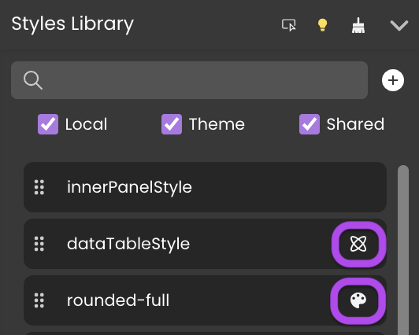

Once a component is on the Canvas, you can customize its look using styling tools.

## Styles Library 

One way of styling components is by dragging CSS classes from the Styles Library and dropping them on the components.

The Styles Library offers three types of styles: 
* Local: Styles you create
* Theme: Predefined CSS classes
* Shared: Shared CSS classes



Local styles can only be used in the Webforms in which they are created, while theme and shared CSS classes are usable by all Webforms through the whole project.

Theme classes cannot be modified. 

To create a local CSS class, click the "+" button and enter a name and let the **Export as Shared** option unchecked.
To create a shared CSS class, check the **Export as Shared** option. 

Local and shared CSS class code can be edited in the Contextual panel at the bottom. 

You can convert a local CSS to a shared CSS by clicking on the following button in the Contextual panel:


### Inspect button

The **Inspect** option   allows you to check where your CSS classes are used in your webforms. Toggle the option by clicking the icon, then mouse over a CSS class to highlight its location in your webform. 

## Properties panel

The Properties panel gives you extremely granular control over your elements. 

After you select an element, you can edit its properties using this panel. This includes style properties (as a rule, component properties and styling are separated).

Using the Properties panel, you can bind a CSS class to the element and define values individually.


Some visual properties such as grid areas or datatable columns can be edited directly on the canvas.

### Example 

To add a red background to a Button component: 
* from the Styles library:
drag the `bg-red-500` class from the Styles library and drop it on the Button component.

* using the Properties Panel:
    * select the Button component, and under Style, choose a red color for the background.
    * select the Button component, then in the Properties panel, select the `bg-red-500` class in the CSS section.

## Overriding style properties

Selecting a component displays its style properties in the Properties Panel. Values set by CSS classes are displayed in italics. For example, assigning the `bg-red-500` class to the component will get the Background property to display *rgb(239,68,68)*.

Modifying these values overrides the initial value for that property. Overriden CSS properties have a blue dot in front of them. 

You can export the new values to create a new CSS class.

## Working with CSS 

### Exporting styles as CSS classes for reuse 

You can export the style of an element as a CSS class to reuse it later: 
1. Select a an element on the canvas, the tooltip appears.
2. Click the CSS icon in the tooltip and enter a name for the new CSS class. 
3. If you want to export a shared CSS, check the **Export as shared** option.
4. Click **Export**.

:::note

This does not export all the styles of the component, only the properties you override.

:::

This exports the [new style properties](#overriding-style-properties) of the element as a new local or shared CSS class. Now it appears as a choice in the Styles library and in the property list, and you can apply the class to other elements on your canvas. 

### Naming CSS classes

If both a shared and a local CSS classes have the same name:
- in the Webform source, the shared CSS is placed first and the local one is placed in second
- as a result, if one of them is applied to a component, they are both applied and some local CSS properties may override the shared ones.


### Editing a CSS class

Once a local or shared class is created, you can hover over it in the Styles Library and click the **Edit Class** button next to its name to edit the CSS directly. The changes apply to all the components using this class.


## Customizing DataTable Styles

The [DataTable component](components/datatable.md) styles can be highly customized thanks to the support of specific CSS classes adressing all parts of the table:


### CSS table 

The following specific css classes are supported:

|Area|Class name|Applies to|
|---|---|----|
|Header|.header|the whole header|
||.header-cell|all the cells of the header|
||.header-even|header of even columns|
||.header-datasourceName (*)|the header of the corresponding datasource|
|Row|.row|all rows|
||.selected|the selected row|
||.row-even|all even rows|
||.hover|the hovered row|
|Cell|.cell|all the cells|
|Column|.col-datasourceName (*)|the column of the corresponding datasource|
||.col-even|even columns|
||.sorted|sorted colums|
||.sorted-asc|asc sorted columns|
||.sorted-desc|desc sorted columns|

(*) Ex: .header-lastname, .header-employer-name (use a - instead of . for relations)

### Examples

The following CSS definitions allow to design custom datatable components.

#### Example 1


```css
self {
  border-radius: 10px;
  box-shadow: 0 0 40px 0 rgb(0 0 0 / 15%);
}

self .header .header-cell {
  background-color: #6c7ae0;
  color: #fff;
  font-weight: bold;
  padding: 1.25rem 2rem;
}

self .row {
  align-items: center;
}

self .row .cell {
  padding: 0.5rem 2rem;
}

self .row .cell > span {
  justify-content: flex-start;
}

self .row.selected {
  background-color: #d2d7f5;
}

self .row-even:not(.selected):not(:hover) {
  background-color: #f8f6ff;
}

self .header .resizable > :not([hidden]) ~ :not([hidden]),
self .row > :not([hidden]) ~ :not([hidden]),
self .Grid .innerScrollContainer,
self .Grid .innerScrollContainer > :not([hidden]) ~ :not([hidden]) {
  border-width: 0;
}

```


#### Example 2


```css
self .header .header-cell {
  background-color: #324960;
  color: #fff;
  font-weight: bold;
  font-size: 14px;
  display: flex;
  align-items: center;
  justify-content: center;
}

self .header .header-even {
  background-color: #4fc3a1;
}

self .row {
  align-items: center;
}

self .row .cell {
  font-size: 14px;
  text-align: center;
}

self .row .cell > span {
  justify-content: center;
}

self .row.selected {
  background-color: #caede2;
}

self .row-even:not(.selected):not(:hover) {
  background-color: #f8f8f8;
}

self .header .resizable > :not([hidden]) ~ :not([hidden]),
self .row > :not([hidden]) ~ :not([hidden]),
self .Grid .innerScrollContainer,
self .Grid .innerScrollContainer > :not([hidden]) ~ :not([hidden]) {
  border-width: 0;
}
```

#### Example 3

This example requires that the DataTable contains a column associated to a `lastname` datasource.


```css
self {
 background-color: rgb(61, 54, 61);
}

self .row {
  align-items: center;
}

self .header {
 font-weight: bold;
}

self .header .header-cell {
 background-color: transparent;
 border-top: none;
 border-bottom: none !important;
 color: #fff;
 font-size: 11px;
 text-transform: uppercase;
 letter-spacing: .2rem;
}

self .row {
 background-color: rgba(0, 0, 0, 0.1);
 color: #777;
 transition: 0.3s all ease;
}

self .row:hover {
 background-color: rgba(0, 0, 0, 0.1);
 color: white;
}

self .row:hover .col-lastname {
 color: #b474e4;
 font-weight: bold;
 font-size: 18px;
 text-transform: uppercase;
}

self .row.row-even {
 background-color: unset;
}

self .row .cell > span {
  justify-content: flex-start;
}

self .header,
self .header .resizable > :not([hidden]) ~ :not([hidden]),
self .row > :not([hidden]) ~ :not([hidden]),
self .Grid .innerScrollContainer,
self .Grid .innerScrollContainer > :not([hidden]) ~ :not([hidden]) {
  border-width: 0;
}
``` 


## See also

If you're not familiar with CSS properties and styles, or you need a refresher, here are a few useful links and tools:

* Learn CSS on the [MDN website](https://developer.mozilla.org/en-US/docs/Learn/CSS/Building_blocks/Cascade_and_inheritance)
* A guide to [flexbox properties](https://css-tricks.com/snippets/css/a-guide-to-flexbox/) on css-tricks.com
* [Box-shadow examples](https://getcssscan.com/css-box-shadow-examples), [box-shadow generator](https://cssgenerator.org/box-shadow-css-generator.html)