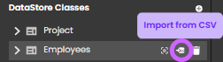
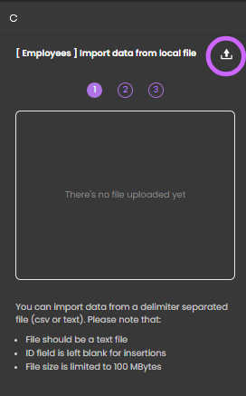

<iframe width="560" height="315" src="https://www.youtube-nocookie.com/embed/z_rRFbbm3YI?si=7HerOPXLziCwYWha&amp;controls=0" title="YouTube video player" frameborder="0" allow="accelerometer; autoplay; clipboard-write; encrypted-media; gyroscope; picture-in-picture; web-share" allowfullscreen></iframe>

The Model editor proposes an advanced wizard to help you import data from a local CSV or text file in any datastore class. This feature allows you to simply and quickly migrate data.

To import data from a CSV or text file:

1. In the outline area, select the data class in which you want to import data and click on its **Import from CSV** button:

2. In the import panel, click on the selection button and select the file you want to import.

You should pay attention to the following recommendations:

- The file format must be text (.csv or .txt). However, you will be able to define the column separator.
- A blank ID field will be automatically filled.
- The file size is limited to 100 MB.

:::tip
Once the file is selected, ensure that it meets the required specifications to avoid import errors.
:::

Once the file is selected, the lower part of the panel displays the import options:

- **Header row?**: Select this option if you want to use the first row of the import file as a header row. Otherwise, the labels "column_1"..."column_N" will be used in the Preview.
- **Column delimiter**: Character(s) used as the column delimiter in the file (default is ;)
- **Text delimiter**: Character(s) used as the text delimiter in the file
- **File encoding**: UTF-8 (default) or UTF-16 are supported
- **Quote escape char**: Character used to escape quotes if any (default is \)
- **Start import at**: Line number to start import
- **Decimal separator**: Default is .

3. Define your options and click **Next**.

The import wizard displays information about the file content as well as a preview of the imported rows:

4. Click on every column to import and assign it to the appropriate attribute of the data class.
   Do not select column(s) to ignore.

The lower part of the window shows a preview of the imported data in the corresponding attributes:

:::info
Make sure the importing format fits the format in the imported file. For dates, the format must use the [date-fns library](https://date-fns.org/v2.30.0/docs/format) formats:

::: 5. When all imported columns have been mapped and formatted, click **Start import** to launch the import.

The data is now available in your entities.
