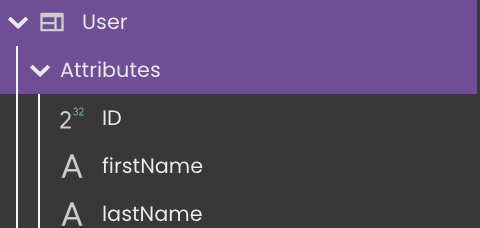

The Data Model Editor allows you to define the **model** for your application. A model is a description of how data will be accessed and stored into structures called "datastore classes".

In Qodly, following the [ORDA concepts](../../concepts/platform.md#the-orda-concept), in each datastore class, you create attributes that store, calculate data, or refer to data in other datastore classes (relation attributes), as well as functions to interact with the data in your model.

Included in the model view are also the permissions, allowing you to assign access right at any level of the model (datastore, dataclass, attributes and functions).

You access your current project's model in the **Model Editor** by double-clicking on  in your project's sidebar.

By default in blank applications, the model does not contain any default dataclasses; you have to create the datastore classes. 

The Data Model Editor is made up of the following areas:

-   Workspace
-   Toolbar
-   Miniature overview area
-   Outline
-   Properties area

## Workspace

In the workspace is where you create a datastore model for your Qodly project. A datastore model is made up of one or more datastore classes, containing attributes and functions, and you can also create relation attributes which are links between datastore classes. Below is an example datastore model for a simple structure of employees and companies:

You can identify the currently selected datastore class by its highlighted border in the workspace. In our example, the Employee datastore class is selected. Note that the panel color of datastore classes can be customized. You can move a datastore class in the Workspace by a select and drag action.

## Toolbar

The toolbar bordering the top of your workspace contains the following buttons:

**On the left side:**

- **Fit view**: By clicking on the  icon you will get a fitted view of your entire model in the workspace area.
- **Reload model** : Reloads the model definition. This button is useful when you modify model functions or properties in different browser windows. 

**On the right side:**

- **Zoom setting** : Controls the percentage of zoom in your workspace area. Note that you can also use the **mouse wheel** to modify the zoom setting. 

## Miniature Overview Area 

The Miniature Area allows you to view an overview of your model at a smaller scale. This feature is especially useful when you have a large number of datastore classes and you want to quickly visualize them.

## Outline

On the left side of the model editor, the Outline lists all **datastore classes** and **datastore functions** (i.e. functions defined at the [cs.DataStore](../../orda/data-model#datastore) class level) defined in your model:

Use the **Search** area to dynamically reduce the list of displayed datastore classes and datastore functions to those that contain the entered character(s). 

You can expand a dataclass name to display its attributes:

You can select the datastore class in the workspace by clicking on it in the list.

From this area, you can execute any of the following actions for a specific datastore class:

-    fit to view: to show a fitted view of the selected datastore class in your workspace area.
-    import from CSV: Allows you to import data from a CSV file in this dataclass. See XXX
-   : Removes the dataclass from the project.

:::info

Removing a dataclass from the model does not remove its associated functions. 

:::

## Properties Area 

The Properties area displays the properties for the selected element: datastore class, attribute, or function. 
