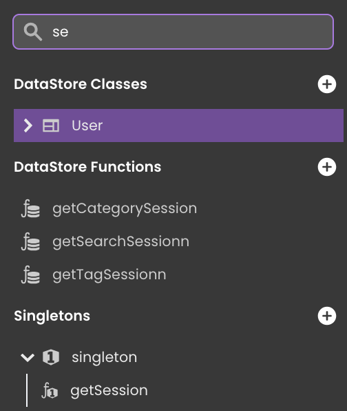

import Column from '@site/src/components/Column'

The Data Model Editor allows you to create and modify the **model** for your application. A model is a description of how data will be accessed and stored into structures called "datastore classes".

In Qodly, following the [ORDA concepts](../../concepts/platform.md#the-orda-concept), in each datastore class, you create attributes that store, calculate data, or refer to data in other datastore classes (relation attributes), as well as functions to interact with the data in your model.

Included in the model view are also the permissions, allowing you to assign access right at any level of the model (datastore, dataclass, attributes and functions).

You access your current project's model in the **Model Editor** by clicking on  in your project's sidebar.

:::note

You can also open your model as a [json file](#json-view).  

:::

By default in blank applications, the model does not contain any default dataclasses; you have to create the datastore classes. 

The Data Model Editor is made up of several areas, including a workspace, a toolbar with a contextual menu, a miniature overview area, an outline and a properties area.

## Workspace

In the workspace, you create a datastore model for your Qodly project. A datastore model is made up of one or more datastore classes, containing attributes and functions, and you can also create relation attributes which are links between datastore classes. Below is an example datastore model for a simple structure of employees and companies:

You can identify the currently selected datastore class by its highlighted border in the workspace. In our example, the Employee datastore class is selected. Note that the panel color of datastore classes can be customized. You can move a datastore class in the workspace by a select and drag action.

## Toolbar

The toolbar bordering the top of your workspace contains the following buttons:

- **Fit view**: By clicking on the  icon you will get a fitted view of your entire model in the workspace area.
- **Zoom setting** : Controls the percentage of zoom in your workspace area. Note that you can also use the **mouse wheel** to modify the zoom setting. 

## Reload

The **Reload** command of the model tab contextual menu reloads the model definition from the server. This button is useful when you modify model functions or properties in different browser windows. 

## Miniature Overview Area 

The Miniature Area allows you to view an overview of your model at a smaller scale. This feature is especially useful when you have a large number of datastore classes and you want to quickly visualize them.

## Outline

On the left side of the model editor, the Outline lists all **datastore classes** and **datastore functions** (i.e. functions defined at the [cs.DataStore](../../orda/data-model#datastore) class level) defined in your model:

Use the **Search** area to dynamically reduce the list of displayed datastore classes and datastore functions to those that contain the entered character(s). 

You can expand a dataclass name to display its attributes:

You can select the datastore class in the workspace by clicking on it in the list.

From this area, you can execute any of the following actions for a specific datastore class:

-    fit to view: to show a fitted view of the selected datastore class in your workspace area.
-    import from CSV: Allows you to [import data](import.md) from a CSV file in this dataclass. 
-   : Removes the dataclass from the project.

:::info

Removing a dataclass from the model does not remove its associated functions. 

:::

## Data Model Classes Button

The Data Model Classes button allows you to generate the [QodlyScript classes](../../orda/data-model.md) related to your data model. You can generate all classes at once for the model or separately for a selected dataclass.

For more information, please refer to [this section](../../orda/data-model.md#creating-data-model-classes).

## Properties Area 

The Properties area displays the properties for the selected element: [datastore class](datastore-classes.md#datastore-class-properties), [attribute](attributes.md#properties), or [function](functions.md#permissions). 

## Model JSON Representation

In Qodly Studio, the model possesses a JSON representation that is useful for troubleshooting or to copy/paste selected parts.

<Column.List align="center" justifyContent="between">
	<Column.Item width="50%">
        This representation can be accessed through a text editor by selecting the <code>Model</code> in the <code>Explorer</code> and choosing <code>Open With</code> a <code>Text Editor</code>.
	</Column.Item>
	<Column.Item width="45%">
        
	</Column.Item>
</Column.List>

 

The model is opened in JSON format in the text editor:

:::warning

Editing the model through the JSON code must be done with care since data model integrity rules are not checked in the Text Editor. In particular, you must pay attention to [naming rules](attributes.md#attribute-name), or [renaming issues](datastore-classes.md#rename-a-datastore-class).

:::
