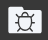

Development in Qodly relies on the use of **Qodly Studio**, an innovative platform for creating business web applications. Our primary goal with **Qodly Studio** is to provide developers with a seamless, 100% web-based development experience. This platform empowers developers to:

- Design and modify data models that align with your business logic.
- Effortlessly link data with [ORDA](../concepts/platform.md#the-orda-concept)  dataclasses.
- Visually craft webforms by simply dragging and dropping components onto a canvas.
- Instantly preview web pages.
- Execute QodlyScript code directly within web events or datasource events.
- Write and debug code directly within the browser.
- Fine-tune privileges and roles as per your requirements.

Ultimately, **Qodly Studio** allows developers to build comprehensive web-based business applications using just a web browser, significantly minimizing the need for extensive coding. Importantly, JavaScript is not a mandatory component in this process.

## Requirements

For development purposes, Qodly Studio supports the following web browsers:

- Chrome
- Edge
- FireFox

It is recommended to have a screen resolution of 1920x1080 for an optimal experience.

:::info
Deployed Qodly applications are accessible on all popular web browsers, with no specific requirements.
:::

## Accessing Qodly Studio

Access to Qodly Studio is granted to developers once they complete a series of authentication steps to enter the Qodly Console, as outlined in the [Architecture chapter](../concepts/cloud.md). From the Development or Staging [environments](../cloud/getStarted.md#environments-and-services) within the Qodly Console, you can access your application instance in Qodly Studio by either:

- Clicking on the [Studio](../cloud/application-management#open-qodly-studio) button on the Overview page.
- Clicking on the [Studio URL](../cloud/application-management#open-qodly-studio) in the General tab for the open environment.

## Qodly Studio Homepage Overview

When you first step into Qodly Studio, you'll immediately encounter a user-friendly interface. It's divided into three key sections: the `Explorer` ⓵ on the left, a `Header bar`⓶ at the top, and a `Grid container`⓷ in the center.

1. **Explorer**: is where you'll find an overview of your project's essential elements:

    -  [Webforms](./design-webforms/create-webform#overview): Serve as containers, enveloping various components within your application. 
    -  [Methods](./coding#methods): Function as distinct blocks of code that fulfill specific roles within your application. While they can be invoked from class functions or other methods, components can't directly interact with them.
    -  [Classes](./coding#classes): Serve as the cornerstone for organizing your code around objects, granting components the capability to directly interact with them.
    -  Shared: Streamline the management and integration of local images and files within your app.
    -  [Debugger](./debugging.md): Provides a suite of debugging tools that address different types of errors during the development phase.
    -  [Roles And Privileges](./roles/rolesPrivilegesOverview.md): Play a pivotal role in enforcing data access restrictions within your application, ensuring that the right users access the right data.
    -  [Model](./model/model-editor-interface.md): Defines how data is accessed and stored within structures referred to as datastore classes.
    -  [Settings](./settings.md): Offer options to configure application-specific settings.

2. **Header bar**: provides quick access to several project-related options:

    -  [Debug](./debugging#starting-a-debug-session): Initiate a debug session on the server, attaching it to your browser, and enable debugging for your app.
    -  Save All: Save all changes made across all open windows within your app.
    -  [Data](../data-explorer/data-explorer.md): Provide access to the Data Explorer, facilitating data-related operations.
    -  [Preview](./rendering#preview-the-entire-site): Allows you to assess your application's appearance and functionality with ease.
    -  [Settings](./settings.md): Present a range of options for configuring application-specific settings, tailoring the environment to your app's needs.

3. **Grid container**: houses a collection of swift shortcuts for a range of actions:

    - **Create New**: Offers convenient quick links for:
        -  [Webforms](./design-webforms/create-webform#creating-a-webform): Speedily initiate the creation of a new Webform.
        -  [Classes](./coding#creating): Generate a new Class.
        -  [Methods](./coding#creating): Generate a new Method.
        -  [Data](../data-explorer/data-explorer.md): Provide access to the [Data Explorer](../data-explorer/data-explorer.md), facilitating data-related operations.
    - **Recent Files**: Displays the most recently accessed files, allowing you to quickly revisit your recent work.
    - **What's New**: Keeps you updated with the latest news and announcements from the Qodly team.