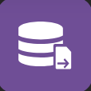

import Column from '@site/src/components/Column'

## Binding Standard Actions to Events

Standard actions are applicable to both Qodly Sources and States, with their availability and specific functionality depending on the type of qodlysource or state involved. Qodly Sources can be categorized into three types: Entity, Entity Selection, and Scalar. Additionally, actions within Page states play a crucial role in defining the page's behavior in response to user interactions, further enhancing the dynamic capabilities of the system.

### Qodly Sources

After binding a standard action to a qodlysource with an event, follow these steps:

1. **Define Action**: Proceed to the Action section to unvail the available actions, which vary depending on the type of the qodlysource:

    | Qodly Source Type | Action                | Icon                                                                                                           | Description                                                                                                                     |
    |------------------|-----------------------|----------------------------------------------------------------------------------------------------------------|---------------------------------------------------------------------------------------------------------------------------------|
    | Scalar           | Copy                  |                                                                         | Copy the content of the qodlysource to a target qodlysource                                                                      |
    |                  | Set Value             |                                                                         | Update the qodlysource with a new value, which can be a String, Number, Boolean, Date, Array, or Object (with JSON validity). Note that this will trigger any configured OnChange event for the qodlysource.                                                                     |
    |                  | Clear                 |                                                                       | Erase the content within the qodlysource                                                                                       |
    |                  | Reset                 |                                                                       | Resets the qodlysource to its initial value                                                                                       |
    | Entity Selection | Order By              |                                                                 | Specify one or more attributes to sort and select direction                                                                    |
    |                  | Query                 |                                                                     | The query is provided as a string and supports the same syntax as an [ORDA query](../../../orda/queries.md), except for formula (`eval`) and the `settings` object. Placeholders can be used with qodlysources or data as-is  |
    |                  | Reload                |                                                                   | Reload the entire entity selection from the server                                                                             |
    |                  | All                   |                                                                         | Load all entities of the same dataclass                                                                                        |
    |                  | Clear                 |                                                                     | Remove any content and create a new, empty selection of the same dataclass                                                    |
    |                  | Reset                 |                                                                       | Resets the entity selection qodlysource to its initial value (All or none)                                                                                       |
    |                  | Copy                  |                                                                       | Copy the entity selection to a target entity selection qodlysource                                                             |
    |                  | Clean                  |                                                                       | Clean the entity selection to ensure it references only existing entities, maintaining consistent length with the referenced entities Qodly Source                                                             |
    | Entity           | Create   |                                                | Generate a new entity in memory from the corresponding dataclass (see Note)                                                                         |
    |                  | Save       |                                                          | Save the entity on the server                                                                                                 |
    |                  | Reload                |                                                                   | Reload entity values from the server                                                                                          |
    |                  | Drop                  |                                                                       | Delete the entity on the server                                                                                                |
    |                  | Copy                  |                                                                       | Copy the entity to a target entity qodlysource                                                                                  |
    |                  | Clear                 |                                                                     | Put `null` in the qodlysource. If the qodlysource is the selected element of a component (Matrix, Select box, Datatable), clearing the qodlysource also unselects the selected element        |
    |                  | Reset                 |                                                                       | Resets the entity qodlysource to its initial value (First or none)                                                                                       |
    |                  | First                 |                                                      | Navigate to the first entity within the entity selection                                                                      |
    |                  | Previous              |                                                  | Move to the previous entity within the entity selection                                                                        |
    |                  | Next                  |                                                          | Advance to the next entity within the entity selection                                                                         |
    |                  | Last                  |                                                          | Navigate to the last entity within the entity selection                                                                        |
    | Entity (Standalone)| Create   |                                                | Generate a new entity in memory from the corresponding dataclass (see Note)                                                                        |
    |                  | Save       |                                                          | Save the entity on the server                                                                                                 |
    |                  | Reload                |                                                                   | Reload entity values from the server                                                                                          |
    |                  | Drop                  |                                                                       | Delete the entity on the server                                                                                                |
    |                  | Copy                  |                                                                       | Copy the entity to a target entity qodlysource                                                                                  |
    |                  | Clear                 |                                                                     | Put `null` in the qodlysource. If the qodlysource is the selected element of a component (Matrix, Select box, Datatable), clearing the qodlysource also unselects the selected element        |
    |                  | Reset                 |                                                                       | Resets the qodlysource to its initial value                                                                                       |

:::info
[Entities originating from an Entity Selection Qodly Source](../qodlySources.md#standalone-entity-vs-entity-from-es) enable iterative navigation within the selection, while [Independently Created Standalone Entities](../qodlySources.md#standalone-entity-vs-entity-from-es) are generated independently and lack any selection affiliation.
:::

 

:::note About Create entity action
Keep in mind that the **Create** action only creates a new, blank entity in memory. If you want to save this entity in the datastore, you need to execute the **Save** action. New entity attributes are filled with null values. If you want to create, initialize, and save a new entity, you might consider using a [QodlyScript function](../../../orda/data.md#creating-an-entity). 
:::

 

2. **Provide Feedback**: Enable the <code>Provide Feedback</code> checkbox to customize the handling of unexpected error messages, determining what will be displayed to end users. For more detailed information, refer to the <a href="#providing-feedback">Provide Feedback</a> section. Here, you have the ability to:

    <Column.List align="center" justifyContent="between">
        <Column.Item width="50%">
            <ul>
                <li>Provide simple UI feedback on a <code>Save</code>, <code>Reload</code>, or <code>Drop</code> standard action on an entity.</li> 
                <li>Provide simple UI feedback on a <code>Reload</code>, <code>Order by</code>, or <code>Query</code> standard action on an EntitySelection.</li>
            </ul>
        </Column.Item>
        <Column.Item width="45%">
            
        </Column.Item>
    </Column.List>

### States

Upon binding a standard action to a state, follow these steps:

1. **Define Action**: Proceed to the Action section to unvail the available actions, which vary depending on the type of the qodlysource:

- <Column.List align="center" justifyContent="between">
	<Column.Item width="55%">
    <strong>Add Action</strong>: Utilized for incorporating modifications from selected states into the base state.
	</Column.Item>
	<Column.Item width="40%">
		
	</Column.Item>
</Column.List>

- <Column.List align="center" justifyContent="between">
	<Column.Item width="55%">
    <strong>Delete Action</strong>: This action facilitates the removal of selected states, along with their changes, in relation to the base state.
	</Column.Item>
	<Column.Item width="40%">
		
	</Column.Item>
</Column.List>

:::tip
When a new state is applied or removed as a user interacts with an input field, the interaction remains uninterrupted ensuring that the focus on the input field is not lost by the state change.
:::

<Column.List align="center" justifyContent="between">
<Column.Item width="55%">
    When triggering these actions, users can select from available states, which are then tagged in the state field. 
</Column.Item>
<Column.Item width="40%">
    
</Column.Item>
</Column.List>

 

:::info
The `Base` state and `Conditional` states, however, are not included among these selectable options. Only Non-Conditional states are included.
:::

:::tip
The states are enabled in the given order of the standard action (same if [`WebForm.enableState`](../../../language/WebFormClass#enablestate) is called several times with different states).
:::

:::warning
If a state is initially "Non-Conditional" but later transitions to a "Conditional" state, any standard actions previously applied to this state will be removed.
:::

## Binding Navigation Actions to Events

<Column.List align="center" justifyContent="between">
	<Column.Item width="55%">
        Navigation actions can be configured to direct users to particular targets by associating these actions with specific events.
	</Column.Item>
	<Column.Item width="40%">
		
	</Column.Item>
</Column.List>

The navigation target can be defined in two ways using the toggle :

- <Column.List align="center" justifyContent="between">
    <Column.Item width="60%">
         <strong> Qodly Sources</strong>: When the destination Page or external link is generated through server-side business logic. In such cases, provide a qodlysource of type string.
    </Column.Item>
    <Column.Item width="40%">
        
    </Column.Item>
</Column.List>

- <Column.List align="center" justifyContent="between">
    <Column.Item width="60%">
         <strong>Hardcoded values</strong>: When selecting a Page from the Pages list or providing a direct link as a hardcoded value.
    </Column.Item>
    <Column.Item width="40%">
        
    </Column.Item>
</Column.List>

### Pages

To set up a navigation action after linking it with an event, proceed as follows:

1. <Column.List align="center" justifyContent="between">
	<Column.Item width="55%">
        <strong>Choose Target Type</strong>: Select the "Page" option.
	</Column.Item>
	<Column.Item width="40%">
		
	</Column.Item>
</Column.List>

2. Either:

    - **Specify Target Pages for "Qodly Source" type targets**: Enter the string-type qodlysource containing the name of the intended Page.

    - **Explore Target Pages for "Hardcoded Value" type targets**: Browse through the list of available Pages, each serving as a potential navigation destination.

3. **Define Transition Method**: Define the approach through which the target Page will be presented based on the following options:

    <Column.List align="center" justifyContent="between">
        <Column.Item width="55%">
            <ul>
                <li> <code>New Tab</code>: Induce the opening of a new browser tab.</li>
                <li> <code>Current Tab</code>: Replace the ongoing browser tab with the chosen Page.</li>
                <li> <code>Page Loader</code>: Access the intended Page through a dedicated <a href="../components/pageloader">Page loader</a>.</li>
                <li> <code>Page Loader (Self)</code>: Reveals content within the existing <a href="../components/pageloader">Page loader</a></li>.
            </ul>
        </Column.Item>
        <Column.Item width="40%">
            
        </Column.Item>
    </Column.List>

:::info
Shared datasources are reinitialized with each tab navigation. However, when using a Page Loader (or Page Loader Self) during navigation, shared values persist across pages, preventing reinitialization and maintaining state continuity.
:::

:::tip
The feature for providing feedback is not applicable in the context of navigation events.
:::

### External Links

In addition to navigating to Pages, Qodly Studio offers a convenient way to direct users to external links. The process follows the same steps as outlined for [associating navigation actions with events for Pages](#Pages), with a slight variation in the "Target Type" step:

1. <Column.List align="center" justifyContent="between">
	<Column.Item width="55%">
        <strong>Choose Target Type</strong>: Select the "External Link" option and input the URL of the desired external link.
	</Column.Item>
	<Column.Item width="40%">
		
	</Column.Item>
</Column.List>

2. <Column.List align="center" justifyContent="between">
    <Column.Item width="55%">
        <strong>Define Transition Method</strong>: Similar to configuring Page navigation, you can specify how the external link will open. However, for external links, you have two options:
          
        <ul>
            <li><strong>New Tab</strong>: Induce the opening of a new browser tab.</li>
             
            <li><strong>Current Tab</strong>: Replace the ongoing browser tab with the chosen external link.</li>
        </ul>
    </Column.Item>
    <Column.Item width="40%">
        
    </Column.Item>
</Column.List>

### Shared Folder

Accessing content stored in the **Shared** folder follows a process similar to [navigating to external links](#external-links). You have the option to display items from this folder, like images, in either a new tab or the current tab by specifying the image path (e.g., `/$shared/visuals/banner.png`) in the target field. Ensure that the path begins with `/$shared`.

:::tip
When the path points to a file, it doesn't open it in a new tab but instead initiates a download.
:::

## Binding Class Functions to Events

### Class Functions

<Column.List align="center" justifyContent="between">
	<Column.Item width="55%">
        Data model class functions can be linked to events, utilizing parameters from qodlysources or static values, with the option to assign the result to a qodlysource as needed. After binding a class function with an event, follow these steps:
	</Column.Item>
	<Column.Item width="40%">
		
	</Column.Item>
</Column.List>

1. **Select a Function**: Browse the available functions and select an appropriate class function (<i>A class function will only be available if it is **exposed**; otherwise, it will appear as disabled</i>). You can link events to various types of class functions, including datastore class functions, dataclass class functions, entity class functions, entity selection class functions, and singleton class functions. 

2. **Pass Parameters**: After selecting a class function, Qodly Studio automatically parses it, extracting its declared prototype. This allows you to visualize and configure its parameter(s) and return value. You can enhance the functionality of class functions by configuring parameters in two ways using the toggle  to define how the [function parameter(s)](#parameter-handling) should be filled, including the option to have [variadic parameters](#variadic-parameters).

3. **Select a qodlysource for the returned result**: In the return parameter section, choose a qodlysource to store the function's returned result.  
    <Column.List align="center" justifyContent="between">
        <Column.Item width="55%">
            <ul>
                <li>If your class function defines a specific variable for the result, its name will be displayed in the label within the return parameter section. </li>  
                <li>However, if your class function does not specify a result name, the default label <code>result</code> will be used in the return parameter section.</li>
            </ul>
        </Column.Item>
        <Column.Item width="40%">
            
               
            
        </Column.Item>
    </Column.List>

 

4. <Column.List align="center" justifyContent="between">
	<Column.Item width="55%">
		<strong>Add Parameter</strong>: If your function accepts a <a href="../../../language/basics/lang-parameters#optional-parameters">variable number of parameters</a>, you can use this button to declare and bind one or more appropriate parameter(s). They will be passed to the function in the defined order when called for the event.
	</Column.Item>
	<Column.Item width="40%">
		
	</Column.Item>
</Column.List>

5. <Column.List align="center" justifyContent="between">
	<Column.Item width="55%">
		<strong>Provide Feedback</strong>: Enable the <code>Provide Feedback</code> checkbox to display backend feedback on the user interface. For more detailed information, refer to the <a href="#providing-feedback">Provide Feedback</a> section.
	</Column.Item>
	<Column.Item width="40%">
		
	</Column.Item>
</Column.List>

:::tip
A single class function can be utilized across multiple events, allowing you to assign multiple events to a single function and observe a coordinated sequence of actions taking place.
:::

### Function Parameters & Variability

#### Parameter Handling

There are two primary methods for ensuring precise parameter handling:

- <Column.List align="center" justifyContent="between">
    <Column.Item width="50%">
         <strong>Hardcoded values</strong>: Provide various types of values directly to the class function as parameters by selecting the type through the value icon . Whether it's a string, number, boolean, or any other supported data type, simply choose the desired type from the dropdown list ensuring compatibility with the expected parameter type for precise and accurate results.
    </Column.Item>
    <Column.Item width="47%">
        
    </Column.Item>
</Column.List>

<ul>
    The following types are supported as hard-coded values:
    <table>
        <thead>
            <tr> <th>Type</th> <th>Description</th> <th>Example</th> </tr>
        </thead>
        <tbody>
            <tr> <td>String</td> <td>Any string value</td> <td>Hello World</td> </tr>
            <tr> <td>Object</td> <td>JSON syntax</td> <td>&#123;"age": 12, "name": "Smith"&#125;</td> </tr>
            <tr> <td>Array</td> <td>Collection of values</td> <td>[10, 20, 30]</td> </tr>
            <tr> <td>Number</td> <td>Any numeric value</td> <td>42</td> </tr>
            <tr> <td>Date</td> <td>A short-format date</td> <td>20/12/2024</td> </tr>
            <tr> <td>Boolean</td> <td>True or False</td> <td>False</td> </tr>
        </tbody>
    </table>
</ul>

:::info
<Column.List align="center" justifyContent="between">
    <Column.Item width="50%">
        Toggling hardcoded values and entering values that differ from the specified type will promptly trigger an error message beneath the parameter field.
    </Column.Item>
    <Column.Item width="37%">
        
    </Column.Item>
</Column.List>
:::

 

- <Column.List align="center" justifyContent="between">
    <Column.Item width="50%">
         <strong>Qodly Sources</strong>: Pass <a href="../qodlySources#page-qodly-sources">Local</a> or <a href="../qodlySources#shared-qodly-sources">Shared Qodly Sources</a> as parameters to the class function. The scope of the qodlysource is indicated by a name tag. If the tag reads <code>Page</code>, it signifies a local qodlysource visible only within the current Page. On the other hand, if there is a tag with a specific name <code>shared</code>, it implies that you have passed a shared qodlysource belonging to a namespace.  
        Make sure the qodlysource value is of the same type as expected for the parameter by the function, otherwise an error will be returned.
    </Column.Item>
    <Column.Item width="47%">
        
    </Column.Item>
</Column.List>

#### Variadic Parameters

<Column.List align="center" justifyContent="between">
    <Column.Item width="50%">
        Utilize the <code>...</code> notation in function prototypes to handle a <a href="/language/basics/lang-parameters#declaring-variadic-parameters">variable number of parameters</a>.
    </Column.Item>
    <Column.Item width="45%">
        
    </Column.Item>
</Column.List>

<Column.List align="center" justifyContent="between">
    <Column.Item width="50%">
        When creating a variadic function, such as one of type integer, without parameters, associating it with an event initially generates an empty function prototype.
    </Column.Item>
    <Column.Item width="45%">
        
    </Column.Item>
</Column.List>

<Column.List align="center" justifyContent="between">
    <Column.Item width="50%">
        However, when parameters are added to the event, they all adopt the specified type (e.g., integer) for the variadic parameters.
          
        <a href="./eventsManagement#reload-event-function-prototype">Reloading the Event Function Prototype</a> after changing one of the parameter types resets them to match the updated information.
    </Column.Item>
    <Column.Item width="45%">
        
    </Column.Item>
</Column.List>

:::info
<Column.List align="center" justifyContent="between">
    <Column.Item width="50%">
        If a variadic function incorporates mixed parameter types, like a string parameter followed by variadic parameters of type integer:
    </Column.Item>
    <Column.Item width="45%">
        
    </Column.Item>
</Column.List>
<Column.List align="center" justifyContent="between">
    <Column.Item width="50%">
        Qodly ensures the first parameter is of type string when associating it with an event. Subsequent parameters will align with their specified types, such as number for the variadic parameters.
    </Column.Item>
    <Column.Item width="45%">
        
    </Column.Item>
</Column.List>
:::

## Binding Dialog Actions to Events

<Column.List align="center" justifyContent="between">
    <Column.Item width="55%">
        Components within a Page can be configured to trigger dialog-related events. By choosing the <code>Add a dialog action</code> in a component's event configuration, you can define the following:
    </Column.Item>
    <Column.Item width="40%">
        
    </Column.Item>
</Column.List>

1. <Column.List align="center" justifyContent="between">
    <Column.Item width="55%">
        The type of action:
          
        <ul>
            <li><strong>Open</strong>: This action causes the dialog to be displayed.</li>
             
            <li><strong>Close</strong>: This action leads to the closing of the dialog.</li>
        </ul>
    </Column.Item>
    <Column.Item width="40%">
        
    </Column.Item>
</Column.List>

2. <Column.List align="center" justifyContent="between">
    <Column.Item width="55%">
        The name of the dialog to be affected by this interaction.
    </Column.Item>
    <Column.Item width="40%">
        
    </Column.Item>
</Column.List>

:::info
For further details, refer to the [Dialog](../components/dialog.md) section.
:::

## Providing feedback

To provide feedback within the user interface, enable the `Provide Feedback` checkbox. This feature allows the backend to communicate with the user by displaying relevant messages regarding the outcomes of different functions or standard actions.

:::info
Importantly, this customized feedback aligns with the application's business rules and does not disrupt the application's navigation flow.
:::

### Toast Notifications

When the `Provide Feedback` checkbox is enabled, it introduces a **hidden internal feedback element** into the web page, known as a **toast** notification. This element automatically showcases messages generated by the application code in response to events, using [dedicated Page functions](../../../language/WebFormClass.md) or by specifying them for `On Success` or `On Failure` in the Page Editor interface, for the case of standard actions.

:::info
If this feature is not enabled, feedback sent from the backend will not be displayed within the user interface.
:::

### Control of Feedback Display

The `Provide Feedback` checkbox offers manual control over the display of feedback messages when executing a specific function. This manual control is designed to determine when to provide and display feedback, ensuring that messages precisely align with the specific needs of the user and the context.

For example, in the context of a technical document, regular users may require feedback messages to stay informed about the status of their requests, such as waiting for admin approval. However, administrators using a different interface to make modifications to the same technical document, which invokes the same function, might not need to receive the same message due to their administrative roles.

### Three Tiers of Feedback

Three tiers of feedback are accessible and will be displayed as colored **toasts**:

- **Informative Messages**: Dispatches informative messages when invoked, either directly through the [`setMessage()`](../../../language/WebFormClass.md#setmessage) function or by specifying them in the `On Success` field within the event section associated with a standard action.

- **Cautionary Messages**: Sends out cautionary messages, and these messages are exclusively triggered using the [`setWarning()`](../../../language/WebFormClass.md#setwarning) function.

- **Error Messages**: Issues error messages when invoked, either directly through the [`setError()`](../../../language/WebFormClass.md#seterror) function or by specifying them in the `On Failure` field within the event section associated with a standard action.

 

:::info
Displaying multiple toasts through a single function is not supported.

Upon calling a function, it initiates an HTTP request, updating the UI simultaneously with the latest changes. This aligns with the principle that one HTTP request results in one response, leading to a single UI update.

Consequently, only the final update from the function will be visible in the UI, showcasing only the last toast.
:::

The time these **toast notifications** remain visible is typically managed by Qodly Studio's internal logic.

:::info
They will automatically disappear after a preset **5-second** period. Users can also manually dismiss them by clicking on the `x` icon.
:::