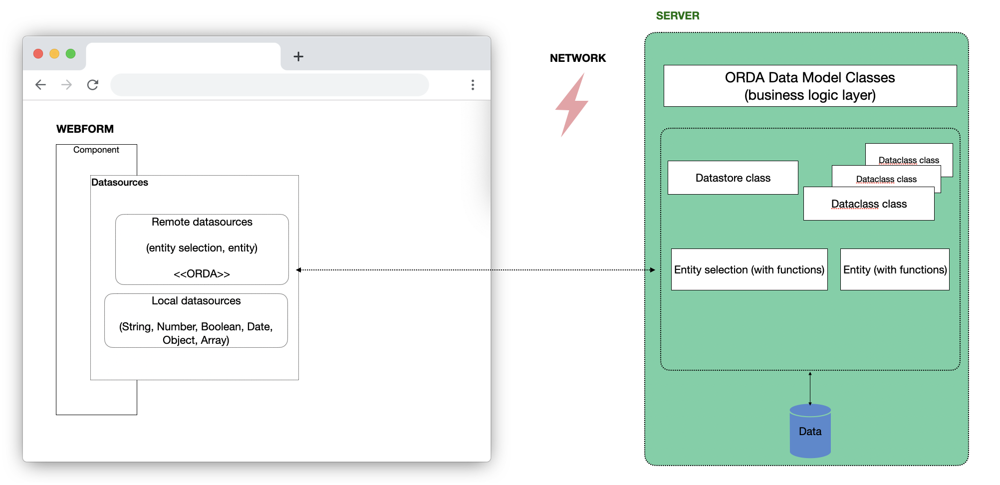
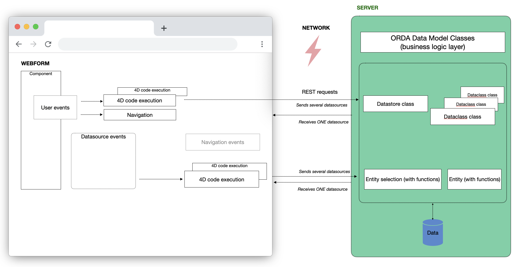

import Column from '@site/src/components/Column'

Qodly Sources are integral to Qodly's architectural design, simplifying the development of web applications. They act as **data connectors, serving as references** that automatically activate events upon data changes. These qodlysources can be **linked** to Page components, providing an intuitive way to display and manage data within your application.

## Understanding Qodly Sources

### Components and Qodly Sources

[Components](./components/componentsBasics.md) are UI elements that can be bound to qodlysources, allowing them to display attributes from these qodlysources. When a qodlysource changes, the component automatically reflects the updated data. For instance, if a function returns a qodlysource as a result, any changes to that qodlysource will be immediately reflected in the associated component.



### Events and Qodly Sources

You can also attach events to qodlysources, triggering specific actions when these qodlysources are updated in the web browser. Please refer to [Qodly Source Events](events/bindingActionToEvents.md#qodly-sources) for more details.



## Qodly Source Types

### Catalog Qodly Sources

Catalog qodlysources (also known as **ORDA qodlysources**), serve as references to entities and entity selections that originate from the server and are based on the data model.

:::info
These qodlysources optimize data exchange by selectively requesting only the attributes displayed by the component from the server and then making them available in the browser.
:::

### Scalar Qodly Sources

Scalar qodlysources, on the other hand, are confined to the browser's local environment. They can be generated directly within the browser and subsequently transmitted to the server during a function call. Scalar qodlysources are versatile and can take on various data types, including String, Number, Boolean, Date, Object, or Collection.

:::info
It's crucial to emphasize that Scalar qodlysources do not originate from the Data model and, consequently, do not possess persistence.
:::

## Qodly Source Scopes

### Page Qodly Sources

Page qodlysource are scoped to the Page where they are defined. They can only be used within that specific Page.

### Shared Qodly Sources

Shared qodlysource, on the other hand, are scoped to the entire application and can be utilized in multiple Pages within the same project.

:::info
By default, when you [**create a Qodly Source**](#creating-a-qodly-source) without specifying a namespace, you define a Page qodlysource.
:::

### Shared functions

Shared functions are also accessible when Entity and Entity Selection serve as shared qodlysources, making them available for use in multiple Pages within the same project.

### Determining the Scope of Qodly Sources

When selecting a component bound to a qodlysource, the Properties panel provides information about whether the qodlysource is shared:

- If the tag reads **Page**, it signifies a local qodlysource visible only within the current Page.

- On the other hand, if there is a tag with **a specific name**, it implies that you have passed a shared qodlysource belonging to a namespace.

:::info
When configuring a function event, the Contextual panel indicates whether the function is shared.
:::

## Built-in Shared Qodly Namespace

Shared namespaces enable you to define qodlysources accessible across multiple pages within your application. Among these shared namespaces, Qodly provides a built-in namespace named `Qodly`, specially designed to simplify common tasks related to URL handling and shared data management.

The `Qodly` namespace   is automatically included in every Qodly project. It is designed to help developers easily access and manage shared data crucial for application-wide tasks, such as URL parsing and navigation management. This namespace:

- Cannot be edited or deleted to ensure consistency and integrity across your application.

- Provides ready-to-use datasources available to all application pages.


### Qodlysource: Location

Within the **Qodly** namespace, you'll find the predefined datasource named **Location** . 

The Location qodlysource is specifically designed to facilitate handling URL-related data, making it simple to interact with different URL segments.


#### Key Attributes of Location:

- **urlQuery** *(Array)*: Stores URL segments that identify specific resources. These segments represent parts of the URL separated by slashes (`/`).
  
  **Example:**
  ```javascript
  // URL: example.com/products/item
  Location.urlQuery // Output: ["products", "item"]
  ```

- **urlPath** *(Object)*: Contains key-value pairs representing parameters that appear after the question mark (`?`) in URLs.

  **Example:**
  ```javascript
  // URL: example.com/search?category=shoes&color=blue
  Location.urlPath // Output: { category: "shoes", color: "blue" }
  ```

- **anchor** *(String)*: Stores the part of the URL following the hash symbol (`#`). This is typically used for navigation within the same page or handling client-side routing.

  **Example:**
  ```javascript
  // URL: example.com/page#section3
  Location.anchor // → "section3"
  ```

:::info Restrictions:
The **Location** datasource is shared across your entire application and **cannot be edited or deleted**. This ensures uniform behavior and prevents accidental modifications.
:::

### Qodlysource: UserLanguage

Within the **Qodly** namespace, you'll find the predefined datasource named **UserLanguage** .

The UserLanguage qodlysource is specifically designed to manage multilingual behavior within your application by storing the currently selected language and the list of available supported languages.

It provides a seamless way to bind user-selected languages at runtime without requiring manual coding or session handling.

#### Key Attributes of UserLanguage:

- **selected** *(Object)*: Stores the currently active locale chosen by the user. This object contains information about the selected language.

        **Structure:**
        ```javascript
        {
           isocode: "en",
           locale: "anglais",
           native: "English"
        }
        ```

        Each locale entry include:
        - `isocode`: Standard two-letter language code (e.g., "en" for English).
        - `locale`: Display name for the language.
        - `native`: Native name for the language (as spoken in that locale).
        
        **Example:**
        ```javascript
        UserLanguage.selected // → { isocode: "fr", locale: "français", native: "Français" }
        ```

- **supported** (Array): Lists all the available supported locales that the user has created in the **Localization page**. Each entry in the array represents one locale and must follow the same structure as the `selected` object.

        **Structure:**
        ```javascript
        [
           {
              isocode: "en",
              locale: "anglais",
              native: "English"
           },
           {
              isocode: "de",
              locale: "allemand",
              native: "Deutsch"
           }
        ]
        ```

        **Example:**
        ```javascript
        UserLanguage.supported // → [
        //    { isocode: "en", locale: "anglais", native: "English" },
        //    { isocode: "es", locale: "espagnol", native: "Español" }
        //   ]
        ```

:::info Restrictions:
The **UserLanguage** datasource is shared across your entire application and **cannot be deleted or edited manually**.  

To modify the list of supported languages (adding or removing locales), you must update the configuration from the [Localization page](../localization.md#accessing-the-localization-page).  
Changes made in the Localization page will automatically be reflected in the `UserLanguage.supported` array.
:::


## Creating a Qodly Source

Within the Page Editor, the **Qodly Sources** section conveniently organizes available qodlysources. This section includes:

<Column.List align="center" justifyContent="between">
	<Column.Item width="60%">
        <ul>
            <li>A <strong>Search</strong> area for filtering the qodlysource list.<br/></li>
            <li>The <strong>Catalog</strong>, containing:<br/></li>
            <ul>
                <li>Dataclasses from your application. Here, you can designate entities or entity selections from your Datastore, which will be handled by the server as qodlysources.<br/></li>
                <li>Functions defined at the datastore level and within each dataclass.</li>
            </ul>
            <br/>
            <li><strong>This Page</strong>: qodlysource exclusive to the current Page.<br/></li>
            <li><strong>Namespaces</strong>: Shared qodlysources organized by namespaces. You can create a namespace by clicking the <code>+</code> icon or when defining a shared qodlysource.</li>
        </ul>        
	</Column.Item>
	<Column.Item width="30%">
        
	</Column.Item>
</Column.List>


### From the Catalog

To create Page or Shared qodlysources directly from the Catalog, follow these steps:

<Column.List align="center" justifyContent="between">
	<Column.Item width="50%">
                <ul>
                        <li>In the Qodly Sources section, choose <strong>Catalog</strong> > <strong>Data Classes</strong>.</li>
                        <br/>
                        <li>Click the <code>+</code> icon next to a defined Dataclass.</li>
                        <br/>
                        <li>Enter the name of the qodlysource. </li>
                        <br/>
                        <li>Select the qodlysource type, either through <code>Entity selection</code> or <code>Entity</code>, to establish an ORDA qodlysource. Afterward, proceed to configure its settings, including initial values, page size, and depth.</li>
                        <br/>
                        <li>To create a shared qodlysource, specify a <code>Namespace</code>, for a Page (non-shared) qodlysource, leave the field empty.</li>
                </ul>        
	</Column.Item>
	<Column.Item width="45%">
                
	</Column.Item>
</Column.List>

:::info
Specifying a namespace places the qodlysource in the **Namespaces** section, while without a namespace, it is situated in the **This Page** section.
:::

### From This Page

To create Page qodlysources, follow these steps:

<Column.List align="center" justifyContent="between">
	<Column.Item width="50%">
                <ul>
                        <li>Click the <code>+</code> icon in the header of the <strong>This Page</strong> section.</li>
                        <br/>
                        <li>Enter the name of the qodlysource. </li>
                        <br/>
                        <li>Choose the qodlysource type and configure its initial value according to the selected type.</li>
                </ul>        
	</Column.Item>
	<Column.Item width="45%">
                
	</Column.Item>
</Column.List>

<br/>

:::info
For Entity Selection or Entity types, make sure to also configure additional settings such as Dataclass, page size, or depth for the ORDA qodlysource.
:::


### From a Namespace (Shared Qodly Source)

To create Shared Qodly Sources, follow these steps:

<Column.List align="center" justifyContent="between">
	<Column.Item width="50%">
                <ul>
                        <li>Click the <code>+</code> icon next to a defined <strong>Namespace</strong>. <br/><br/>
                        If you haven't created a Namespace yet or want to create an additional one, click the <code>+</code> icon in the header of the <strong>Namespaces</strong> section to establish one before proceeding to create a shared qodlysource within it.</li>
                        <br/>
                        <li>Enter the name of the qodlysource. </li>
                        <br/>
                        <li>Choose the qodlysource type and configure its initial value according to the selected type.</li>
                </ul>        
	</Column.Item>
	<Column.Item width="45%">
                
	</Column.Item>
</Column.List>

<br/>

:::info
For Entity Selection or Entity types, make sure to also configure additional settings such as Dataclass, page size, or depth for the ORDA qodlysource.
:::

### Standalone Entity vs Entity from ES

<Column.List align="center" justifyContent="between">
	<Column.Item width="55%">
        - <strong>Entities from Entity Selection Qodly Source</strong>: These entities originate from an entity selection qodlysource, particularly advantageous in situations necessitating navigation and bulk actions.
	</Column.Item>
	<Column.Item width="40%">
	        
	</Column.Item>
</Column.List>
<br/>
<Column.List align="center" justifyContent="between">
	<Column.Item width="55%">
        - <strong>Independently Created Standalone Entities</strong>: These entities have no affiliation with entity selections. They exist in isolation and are well-suited for the management of individual entities that do not require inclusion in larger selections. Standalone entities are typically managed on a one-to-one basis.
	</Column.Item>
	<Column.Item width="40%">
	        
	</Column.Item>
</Column.List>

:::info
<Column.List align="center" justifyContent="between">
	<Column.Item width="60%">
                To distinguish between the two types of entities, look for the keyword <code>entity selection qodlysource Name</code> that appears after the child entity qodlysource, such as <code>products</code>.
	</Column.Item>
	<Column.Item width="38%">
	        
	</Column.Item>
</Column.List>
:::

### Editing a Qodly Source

<Column.List align="center" justifyContent="between">
	<Column.Item width="60%">
                Once a qodlysource is created, you can edit all its properties except for its Type. To start editing, select the <code>Edit</code> icon located next to the qodlysource name:
	</Column.Item>
	<Column.Item width="35%">
	        
	</Column.Item>
</Column.List>


<Column.List align="center" justifyContent="between">
	<Column.Item width="60%">
                This action will display the Qodly Source in the <code>Contextual panel</code>. To alter an editable property, simply click on the "Edit" icon situated on the right side of the property.
	</Column.Item>
	<Column.Item width="35%">
	        
	</Column.Item>
</Column.List>


### Renaming a Qodly Source

You can easily rename a qodlysource from the contextual panel. In doing so, Qodly Studio will automatically update references to the renamed qodlysource:

- Within components bound to the qodlysource.

- In other qodlysources where the renamed qodlysource serves as the origin.

:::caution
Please note that when renaming a shared qodlysource, only opened Pages can have their references renamed.
:::

### Tracking Qodly Source Usage


<Column.List align="center" justifyContent="between">
	<Column.Item width="55%">
        The <strong>Inspect</strong> option allows you to see where your qodlysources are used within your Pages.
        <br/><br/>
        Toggle the option by clicking the icon, then hover over a qodlysource to highlight its location in your Page.
	</Column.Item>
	<Column.Item width="40%">
        
		
	</Column.Item>
</Column.List>


## Deleting Qodly Sources

### Deleting a Qodly Source

To delete a qodlysource, click the delete button  next to its name in the Qodly Sources list. If you confirm the dialog box, the qodlysource is deleted and its references in Pages are removed.


### Removing Unused Qodly Sources

An unused qodlysource refers to any local qodlysource that is defined but not utilized in any section of the Page. 

Click on the `Delete Unused Elements` button  located in the Qodly Sources's header to cleanse your Page of unnecessary local qodlysource.


### Automatic Deletion of Empty Namespace

Namespaces are automatically deleted once they become empty and all Qodly Sources within them are removed.


## Binding a Qodly Source to a Component

Binding a qodlysource to a component can be accomplished through several methods:

- Dragging and dropping it from the **Qodly Sources** section onto a component.

- Selecting a component and entering the name of the qodlysource in the **Properties panel** > **Data Access** > **Qodly Source**.

:::info Shortcuts

For efficiency, if you drag and drop an Entity Selection attribute onto a [**Select Box**](components/selectbox.md) or [**Matrix**](components/matrix.md) component, the **$This.attributeName** binding is automatically established:


For [**images**](components/image.md), the binding is automatically displayed in the Data Access panel.

<!--  -->

:::


### Iterative components

Iterative components enable you to work with data by iterating through it. These components provide the flexibility to select individual items from the data as independent qodlysources.


:::info
The following components fall into the category of iterative components: [**Datatable**](components/datatable.md), [**Matrix**](components/matrix.md), and [**Select Box**](components/selectbox.md).
:::

Iterative components can be bound to two types of qodlysources:

<Column.List align="center" justifyContent="between">
	<Column.Item width="55%">
        <ul>
            <li><strong>Qodly Source</strong>: This is the primary qodlysource used for iterating through data. Its attributes are bound to the component, allowing you to display and work with the iterative data. Typically, this qodlysource represents an entity selection or a array. <br/></li>
            <li><strong>Selected Element</strong>: This secondary qodlysource is used to retrieve the currently selected item within the iterative component. In most cases, it represents an entity or a array element.</li>
        </ul>        
	</Column.Item>
	<Column.Item width="40%">
        
	</Column.Item>
</Column.List>

### Capturing Function Results in a Qodly Source

You can capture the results of a function call and store them in a qodlysource. For example, you can configure an event that calls a function and then captures the outcome, saving it in a qodlysource.
