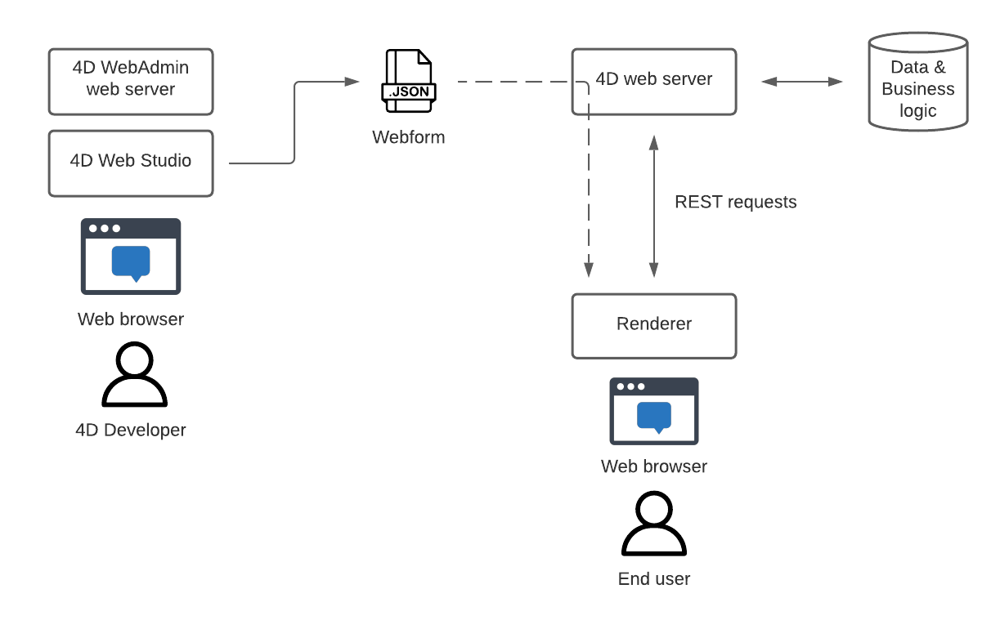
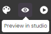
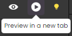

A webform describes your application's look and behavior. After or while you design a webform, you can *render* it to see its final result.

## Overview

Qodly Studio does not generate HTML code directly. When you drop components on the canvas, when you map datasources to components, or when you configure an event, Qodly Studio places your work in a JSON file. This JSON file, the webform, cannot directly be opened in a web browser. It is "rendered" either when you preview it in the Studio, or when you choose to render it in a dedicated browser tab.

At runtime, webforms are generated and interpreted by the built-in renderer engine.

Each webform has its own URL on the Qodly Web server.

The following diagram describes how data flows to and from the studio:

* The WebAdmin web server provides a secured web access to Qodly Studio and allows previewing webforms inside the studio.
* The Qodly web server is exposed as REST server and the renderer communicates with it using REST requests.
* The webforms are deployed with the application, and end-users render them in their browsers. 

## How to render a webform

Webforms can be rendered in the Qodly Studio IDE or in a browser window. Note that the database resource access control will or will not be applied to the rendered page(s) depending on the renderer.   

### In the Qodly Studio IDE

The preview button  of the webform editor allows you to render the current page directly in the webform editor window. 

In this case, the webform is rendered by the WebAdmin web server. This allows you to see all dataclasses, functions and attributes, even if they are not exposed as REST resources (they are greyed out), or even if permission actions are configured.

### In a browser window

You can render the current webform or the whole website in a browser window:

- current webform: in the webform editor, click on the Render in a new tab button ().  The webform is displayed in a browser window tab.
- whole website: in the Qodly toolbar, click on the **Preview** button ().  The home page [defined in the Settings](settings.md/#application) is then displayed in a browser window tab. 

In both cases, the webform is rendered by Qodly web renderer engine. The renderer engine **applies the REST resource restrictions and permission actions** that might have been configured defined in your Qodly project. This means that only exposed resources are rendered in the browser. 

