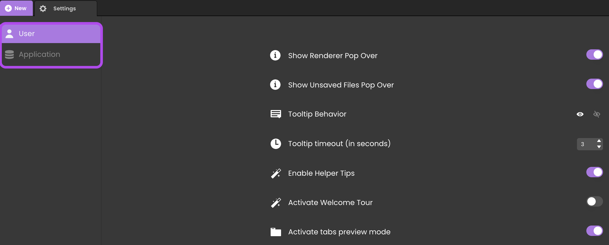
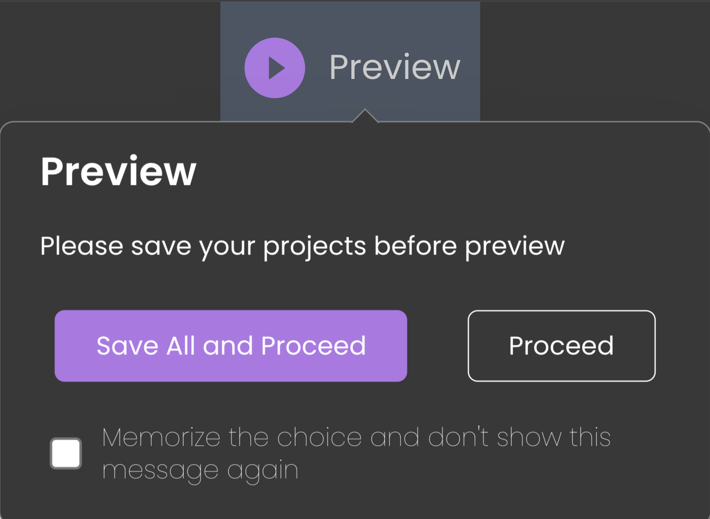
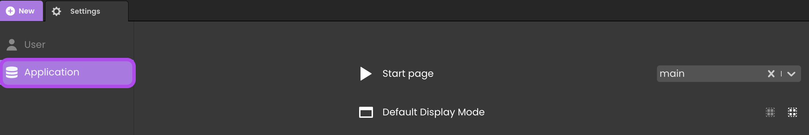

The Settings panel allows you to customize the Qodly Studio interface for the current user and the current application. 

To open the Settings panel, click on the **Settings** button from the Explorer or the toolbar:
 

The following pages are available:

- **User**: settings related to the user interface
- **Application**: settings related to the web application

You select a page by clicking its label in the top left area of the panel:

## User

This page contains settings related to the Qodly Studio user interface.

### Show Renderer Pop Over

Displays or not the pop over when the [renderer](rendering.md) and Qodly Studio use different URL schemes.

### Show Unsaved Files Pop Over

Displays or not the pop over when you click on the [**Preview** button](rendering.md#preview-the-entire-site) whereas all changes made to your forms have not been saved:

Since unsaved changes will not be rendered, it is usually useful to be warned.

### Tooltip Behavior

Defines how to display the [component tooltip](design-webforms/components/componentsBasics.md#tooltip)  when the mouse hovers a component area.

- **Show after timeout**: The tooltip is displayed after a the defined timeout (and kept onscreen until the user moves the mouse). 
- **Hide after timeout**: The tooltip is immediately displayed and hidden after a the defined timeout.

### Tooltip timeout (in seconds)

Timeout for selected tooltip behavior.

### Enable Helper Tips

Shows or hides the tips icons  in the webform editor.

### Activate Welcome Tour

Enables or disables the display of the [Welcome tour dialog boxes](../concepts/quickstart.md#step-3-navigate-qodly-studio-and-begin-the-welcome-tour) that introduce you to the main features of the Qodly Studio. 

### Activate tabs preview mode

Enables or disables the [**Tabs preview mode**](overview.md#preview-mode), which allows you to open and preview your Qodly files (webforms, model, classes, methods, or any other file) in a single tab. As a result, this option can reduce drastically the number of opened tabs in your project.

## Application

This page contains settings related to your web application.

### Start Page

Allows to select a webform to use as the start page of your application. 

The start page webform is automatically rendered when:

- you click on the **Preview** button in the webform editor - the webform is rendered in a new tab.
- you click on the **Preview URL** area in the Qodly Cloud dashboard of your application. 

### Default Display Mode

Allows to select the default mode for displaying multiple components in your webforms:

- **Neutral** (default): no specific margins are applied to components
- **Airy**: automatically incorporate default margins between components, for a better design. 

The display mode can also be selected at the webform level.