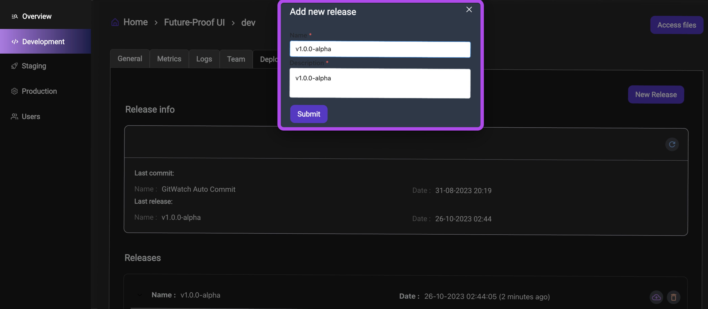

import Column from '@site/src/components/Column'

## Overview

The **Deploy** tab offers crucial tools for managing and deploying application versions in a controlled and organized way. Each step in the deployment process helps ensure your application’s integrity and functionality before it reaches end-users. This tab is typically used to manage staging and production environments, where stable and tested versions are essential.

The key difference between development and deployment environments is the availability of Qodly Studio:

## Creating a Release in Development

When creating a **release** in the **development** environment, it initially exists as an independent release that hasn’t yet been pushed to other environments. The steps to create a release include:

1. Go to the **Deploy** tab.

2. Click on the  button, then provide a title and a brief description for the release.

:::info
At this stage, you can freely delete  the release if needed.

This flexibility is useful when a release in development has issues or requires modifications before it is promoted to other environments.
:::

## Deploying a Release

To deploy a release, simply click on the deployment icon  next to the release you wish to deploy.

&nbsp; &nbsp; 

:::info
When deploying to the **staging** environment, Qodly creates a link between the releases in the **development** and **staging** environments. This connection ensures that the release in **staging** corresponds to the one in **development**. The same linkage occurs when deploying to **production**, supporting a seamless deployment process.
:::

## Restrictions on Deleting a Release

Once a release is deployed  to a subsequent environment, such as **staging**, it can no longer be deleted. This restriction is indicated by the icon  beside the release, signifying that it cannot be removed from the **development** or **staging** environments.

&nbsp; &nbsp; 

:::info
This design choice helps prevent accidental removal of releases, which could cause disruptions or inconsistencies in the deployment process.
:::