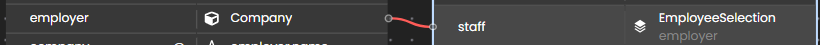

An attribute is an object that stores information or represents a value in the datastore class. Once you create a datastore class, you can add attributes to it.

## Overview

A datastore class is always created with a storage attribute of type Longint named "ID" by default, which is defined as its primary key.

You can view and modify a few of the attribute’s properties when you select or hover it in the datastore class:


- **Delete**: Deletes the attribute from the datastore class.
- **Scope**: A closed lock icon indicates that the attribute is **Not exposed as REST**, i.e. it can only be called from the server code.
- **Name**: [Attribute name](#attribute-name) that you can change by double-clicking on it to render the area enterable.
  - a name in **bold** indicates that an index is associated to the attribute.
  - a name <u>underlined</u> indicates the primary key attribute
  - a name in _italics_ indicates a not exposed attribute
- **Primary Key**: Indicates the primary key attribute for the datastore class. This attribute is mandatory, you can rename it but not delete it.
- **Type Icon**: Displays the datastore entity type as an icon.
- **Type**: Attribute type that you can change by double-clicking on it to render the area enterable. An attribute type can be [scalar](#data-types) or based upon a [relation](#create-a-relation-attribute), in which case it can be of the _classNameEntity_ or _classNameSelection_ type.

All attributes of a datastore class are also listed in the [Outline area](model-editor-interface.md#outline) of the model editor.

### Attribute name

Attribute names are case-sensitive: "firstName" and "firstNAME" are not equal. The attribute name must be unique, start with a letter, and can contain only numbers and letters. You cannot include accented and non-Roman letters. For more information, please refer to the [Identifiers](../../qodlyScript/basics/lang-identifiers.md) section. If you enter an invalid character, you will not be able to save the name.


### Attribute categories

There are several categories of attributes in Qodly:

- **Scalar/Storage**: Scalar/storage attributes allow you to store information in the datastore class.
- **Relation**: A relation attribute is relationship between two datastore classes that can be either N->1 or 1->N. From those two types, you can then create an N&#8592;>N relationship between three datastore classes.
- **Alias**: An [alias attribute](#alias-attributes) is built upon a relation attribute. Once an N -> 1 Relation Attribute is defined, any of the attributes within the "parent" datastore class can be directly referenced as attributes within the "child" datastore class. The result is what appears to be de-normalized data without the overhead of duplicating information. Alias attributes can reference any available attributes further up the relational tree. An alias attribute may reference either a scalar attribute or a relation attribute. 
 Indicates an alias attribute.
- **Calculated**: A [calculated attribute](#calculated-attributes) does not store information; instead, it determines its value based on other values from the same entity or from other entities, attributes or datastore class methods.  Indicates a calculated attribute.

The data type list contains [predefined data types](#data-types) as well as datastore classes and entity selections (in bold), and relation attributes if some have already been defined:


The type to select depend on the category of attribute to create.

:::info

You create **storage**, **relation** and **alias** attributes from the datastore class in the Model editor. **Calculated** attributes must be [created by code](#calculated-attributes). However, they are displayed in the datastore class, grouped at the bottom of the class:


:::

## Create a storage attribute

To create a storage attribute:

1. Click on the **+** button at the right side of the **Attributes** bar in the datastore class.
2. Give a [name](#attribute-name) to the attribute.
3. Select a predefined data type from the list and press **Enter**.


### Data types

The following table lists all available Qodly Database storage (*aka* scalar) data types and how they are handled in the [QodlyScript language](../../qodlyScript/basics/lang-data-types.md):

|Data Types	|Language support|Description|
|---|----|---|
|Text|`string`	|A sequence of characters up to 2 GB|
|String	|`string`	|A sequence of characters with properties|
|UUID|-|Universally Unique Identifier: a 16-bytes (128 bits) number containing 32 hexadecimal characters|
|Date|`date`	|If the **Date only** property is selected for this attribute type, the date value will include only the "MM/DD/YYYY" format (e.g., "10/05/2023"). Otherwise, the date value including the time, stored in UTC. The date is expressed in the following format: YYYY-MM-DDTHH:MM:ss.SSSZ (e.g., "2023-10-05T23:00:00.000Z" for October 5, 2023 in the Central European Timezone). SSS represents the milliseconds, which can be between 0 to 999.	|
|Duration|`time`	|A time value which is stored as a duration between two dates	|
|Bool|`boolean`|A Boolean value: either true or false.|
|Byte|-|A sequence of 8 bits.|
|Word|-|A 16-bit signed integer. Range: -32,767 to 32,768|
|Number|`real`|A numeric value, can be a Real or a Long. Range: ±1.7e±308 (real), -2^31 to (2^31)-1 (long)|
|Long|`real`|An integer number, greater than or equal to a standard number. Range: -2,147,483,648 to 2,147,483,647 |
|Object|`object`|Object containing any kind of property/value pairs, including collections. This data type can be indexed. Functions and recursive references are not supported|
|Image|`picture`	|A path to an image file or an actual image.	|
|Blob|`blob` or `object`	|Binary Large Object stored as a scalar value or a `4D.Blob` object 	|


## Create a relation attribute

### Create a N->1 relation attribute

An N->1 relation attribute relates one entity in a datastore class to one entity in another datastore class. For example, an employee has only one employer.

To create an N->1 relation attribute:

1. Click on the **+** button at the right side of the **Attributes** bar in the **1** datastore class.
2. Give a [name](#attribute-name) to the attribute.
3. Select the **N** datastore class in the data type menu. It means that the attribute will contain a reference to an entity of the N datastore class.

For example, to have a N->1 relation between Employee and Company datastore classes, create an attribute named "employer" in the Employee datastore class, and select **Company** as data type.


Once you select **Company**, a matching 1->N relation attribute is created automatically in the Company datastore class. By default, it is named "EmployeeSelection", we renamed it "employees".


:::note

You can establish the same relationship by creating a "1->N" relation from the "1" datastore class.

:::

### Create a 1->N relation attribute

An 1->N relation attribute relates one entity in a datastore class to multiple entities in another datastore class. For example, each company has multiple employees.

To create a 1->N relation attribute:

1. Click on the **+** button at the right side of the **Attributes** bar in the **N** datastore class.
2. Give a [name](#attribute-name) to the attribute.
3. Select the Entity selection of the **1** datastore class in the data type menu. It means that the attribute will contain a reference to an entity selection of the 1 datastore class.

For example, to have a 1->N relation attribute that contains all the employees in the Company datastore class, create an attribute named "staff" in the Company datastore class, and select **EmployeeSelection** as data type.


After you select **EmployeeSelection**, you need to define the **path** of the relation, i.e. the matching relation attribute to create in the N datastore class. You can enter any valid attribute name, it will be automatically created in the N datastore class.




### Create a N->N relation attribute

A N->N relation attribute allows you to have complex data structures. Here is our initial datastore model:


As it is easy to express, an invoice can contain N items, and an item can be included in N invoices. To implement a N->N relation, we added the "InvoiceItem" intermediary datastore class.

To create the N->N relation, you can proceed with the following steps

1. Create a new N->1 relation attribute in the "InvoiceItem" class, named "itemPart".
2. Define its type as "Part".
3. Create a new N->1 relation attribute in the "InvoiceItem" class, named "itemInvoice".
4. Define its type as "Invoice".

In both cases the 1->N relation attribute is automatically created in the "Part" and "Invoice" datastore classes. As a result, we have the "InvoiceItem" datastore class that has a relation attribute in the "Invoice" and "Part" datastore classes:


## Alias attributes

An **alias** attribute is built above another attribute of the data model, named **target** attribute. The target attribute can belong to a related dataclass (available through any number of relation levels) or to the same dataclass. An alias attribute stores no data, but the path to its target attribute. You can define as many alias attributes as you want in a dataclass.

Alias attributes are read-only. They can be used instead of their target attribute path in class functions.

<iframe width="560" height="315" src="https://www.youtube-nocookie.com/embed/T2Youk5UXjc?si=1nzp_nE7JdscSl_7&amp;controls=0" title="YouTube video player" frameborder="0" allow="accelerometer; autoplay; clipboard-write; encrypted-media; gyroscope; picture-in-picture; web-share" allowfullscreen></iframe>

:::tip
Alias attributes are particularly useful to handle N to N relations. They bring more readability and simplicity in the code and in queries by allowing to rely on business concepts instead of implementation details.
:::

### Create an alias attribute

To create an alias attribute:

1. Click on the **+** button at the right side of the **Attributes** bar in the datastore class.
2. Give a [name](#attribute-name) to the attribute.
3. Click in the Type area and enter the name of the related attribute in the datastore class upon which you want to create the alias, and type a dot (**.**)

  

4. Select or enter the full attribute path. It can contain one or more levels, such as "employee.company.name".

:::info
An alias can be used as a part of a path of another alias.
A [calculated attribute](#calculated-attributes) can be used in an alias path, but only as the last level of the path, otherwise, an error is returned. For example, if "fullName" is a calculated attribute, an alias with path "employee.fullName" is valid.
:::

<!-- The alias attribute is then displayed in the datastore class with the  symbol. -->

### Examples

Considering the following model:


1. In the Teacher dataclass, create a new attribute named "students" and give the path "courses.student" as type:


The **students** alias attribute returns an entity selection with all students of the courses of a teacher, i.e. all students of a teacher.

2. In the Student dataclass, create a new attribute named "teachers" and give the path "courses.teacher" as type. The **teachers** alias attribute returns an entity selection with the teacher of all courses of a student, i.e. all teachers of a student.
3. In the Course dataclass:

- create an alias attribute that returns another label for the "name" attribute
- create an alias attribute that returns the teacher name
- create an alias attribute that returns the student name

The model now looks like:


You can then execute the following queries:

```qs
// Find course named "Archaeology"
ds.Course.query("courseName == :1","Archaeology")

// Find courses given by the professor Smith
ds.Course.query("teacherName == :1","Smith")

// Find courses where Student "Martin" assists
ds.Course.query("studentName == :1","Martin")

// Find students who have M. Smith as teacher
ds.Student.query("teachers.name == :1","Smith")

// Find teachers who have M. Martin as student
ds.Teacher.query("students.name == :1","Martin")
// Note that this very simple query string processes a complex
// query including a double join, as you can see in the queryPlan:
// "Join on Table : Course  :  Teacher.ID = Course.teacherID,
//  subquery:[ Join on Table : Student  :  Course.studentID = Student.ID,
//  subquery:[ Student.name === Martin]]"
```

You can also edit the value of the _courseName_ alias:

```qs
// Rename a course using its alias attribute
arch=ds.Course.query("courseName == :1","Archaeology")
arch.courseName="Archaeology II"
arch.save() //courseName and name are "Archaeology II"
```

### Alias attribute type

Alias attribute [`kind`](../../qodlyScript/DataClassClass.md#attributename) is "alias".

An alias attribute inherits its data [`type`](../../qodlyScript/DataClassClass.md#attributename) property from the target attribute:

- if the target attribute [`kind`](../../qodlyScript/DataClassClass.md#attributename) is "storage", the alias data type is of the same type,
- if the target attribute [`kind`](../../qodlyScript/DataClassClass.md#attributename) is "relatedEntity" or "relatedEntities", the alias data type is of the `4D.Entity` or `4D.EntitySelection` type ("*classname*Entity" or "*classname*Selection").

Alias attributes based upon relations have a specific [`path`](../../qodlyScript/DataClassClass.md#attributename) property, containing the path of their target attributes.

## Calculated attributes

A calculated attribute is a dataclass attribute with a data type that masks a calculation.

At the very minimum, a calculated attribute requires a `get` function that describes how its value will be calculated. When a _getter_ function is supplied for an attribute, ORDA does not create the underlying storage space in the datastore but instead substitutes the function's code each time the attribute is accessed. If the attribute is not accessed, the code never executes.

A calculated attribute can also implement a `set` function, which executes whenever a value is assigned to the attribute. The _setter_ function describes what to do with the assigned value, usually redirecting it to one or more storage attributes or in some cases other entities.

Just like storage attributes, calculated attributes may be included in **queries**. By default, when a calculated attribute is used in a ORDA query, the attribute is calculated once per entity examined. In some cases this is sufficient. However for better performance, especially in client/server, calculated attributes can implement a `query` function that relies on actual dataclass attributes and benefits from their indexes.

Similarly, calculated attributes can be included in **sorts**. When a calculated attribute is used in a ORDA sort, the attribute is calculated once per entity examined. Just like in queries, calculated attributes can implement an `orderBy` function that substitutes other attributes during the sort, thus increasing performance.

### Create a calculated attribute

You create a calculated attribute by defining a [`get` function](../../../QodlyinCloud/qodlyScript/guides/data-model.md#function-get-attributename) in the [**entity class**](../../../QodlyinCloud/qodlyScript/guides/data-model.md#entity-class) of the dataclass. The calculated attribute will be automatically available in the dataclass attributes and in the entity attributes.

Three other calculated attribute functions ([`set`](../../../QodlyinCloud/qodlyScript/guides/data-model.md#function-set-attributename), [`query`](../../../QodlyinCloud/qodlyScript/guides/data-model.md#function-query-attributename), and [`orderBy`](../../../QodlyinCloud/qodlyScript/guides/data-model.md#function-orderby-attributename)) can also be defined in the entity class. They are optional.

Within calculated attribute functions, `this` designates the entity. Calculated attributes can be used and handled as any dataclass attribute, i.e. they will be processed by [entity class](../../qodlyScript/EntityClass.md) or [entity selection class](../../qodlyScript/EntitySelectionClass.md) functions.

## Properties

Properties help you to define your application's business rules that will be automatically applied at the server level. For example, if you define an attribute like "Unique", Qodly returns an error if the user tries to save the entity with a value that is not unique into that attribute, and the entity will not be saved, and the entity will not be saved.

Qodly manages the attribute's properties when it is published to the Web. You can overwrite certain properties, like an attributes display formats in a component on your Pages.

The Properties tab allows you to modify the attribute’s properties, which are different depending on its type. For example, the Properties tab below displays the properties for an attribute of type string:


Here is the list of all available properties:

| Property         | Description                                                                                                                                                                                                                                                                                                                                                                                                                                                                                                                                                                                                                                                                                                                                                                                 | Available with type(s) |
| ---------------- | ------------------------------------------------------------------------------------------------------------------------------------------------------------------------------------------------------------------------------------------------------------------------------------------------------------------------------------------------------------------------------------------------------------------------------------------------------------------------------------------------------------------------------------------------------------------------------------------------------------------------------------------------------------------------------------------------------------------------------------------------------------------------------------------- | ---------------------- |
| Attribute type   | Can be "Scalar" or "Calculated".                                                                                                                                                                                                                                                                                                                                                                                                                                                                                                                                                                                                                                                                                                                                                            | Calculated             |
| Autogenerate     | Automatically generates a UUID. If you do not select this option, you must generate a UUID in your code or else the attribute will not be valid.                                                                                                                                                                                                                                                                                                                                                                                                                                                                                                                                                                                                                                            | uuid                   |
| Autosequence     | A sequence number that Qodly automatically generates for each new datastore entity.                                                                                                                                                                                                                                                                                                                                                                                                                                                                                                                                                                                                                                                                                                         | long                   |
| Comments         | Notes that you can store with your attribute for private use                                                                                                                                                                                                                                                                                                                                                                                                                                                                                                                                                                                                                                                                                                                                | All                    |
| Date only        | If unchecked, the date is represented as a standard JS date with the timezone and time in "YYYY-MM-DDTHH:MM:SSZ" format. If checked, the date is represented without the timezone and time (hour, minutes, and seconds). In this case, you can send the date in the format that it is returned to you: dd!mm!yyyy (e.g., 05!10!2023) or in typical JS format in which the timezone and time (hours, minutes, and seconds) will be removed and therefore disregarded                                                                                                                                                                                                                                                                                                                         | date                   |
| Default value    | Default value for the attribute.                                                                                                                                                                                                                                                                                                                                                                                                                                                                                                                                                                                                                                                                                                                                                            | long, number           |
| Ignore HTML tags | When you select this option, queries and sorts carried out in the data stored in the attribute do not take any style tags into account.                                                                                                                                                                                                                                                                                                                                                                                                                                                                                                                                                                                                                                                     | string                 |
| Index kind       | Defines the type of index for the attribute. If you select an Index Kind, the attribute name will be displayed in bold. By default, no index is selected ("None").<li>B-tree: Standard B-Tree type index. This multipurpose index type meets most indexing requirements.</li><li>Cluster: B-Tree type index using clusters. This architecture is more efficient when the index does not contain a large number of keys, i.e., when the same values occur frequently in the data.</li><li>Automatic: Qodly automatically selects an index according to the attribute type.</li>                                                                                                                                                                                                              | All except Calculated  |
| Keyword index    | This index is intended to facilitate fast searching of individual words inside of these attributes                                                                                                                                                                                                                                                                                                                                                                                                                                                                                                                                                                                                                                                                                          | string, text, image    |
| Mandatory        | Specifies that the attribute is mandatory and cannot be saved with the `null` value                                                                                                                                                                                                                                                                                                                                                                                                                                                                                                                                                                                                                                                                                                         | All storage attributes |
| Max value        | Minimum value allowed for the attribute. If the value entered is more than this property, an error is returned.                                                                                                                                                                                                                                                                                                                                                                                                                                                                                                                                                                                                                                                                             | long, number           |
| Min value        | Minimum value allowed for the attribute. If the value entered is less than this property, an error is returned.                                                                                                                                                                                                                                                                                                                                                                                                                                                                                                                                                                                                                                                                             | long, number           |
| Reverse path     | This option must be selected for a 1->N relation attribute                                                                                                                                                                                                                                                                                                                                                                                                                                                                                                                                                                                                                                                                                                                                  | related 1->N           |
| Scope            | "Expose as REST" or "Do not expose as REST". An exposed attribute can be used from anywhere and its value can be displayed using REST requests. A not-exposed attribute can only be used by code called from inside the datastore class, including calculated attributes, functions, methods, and events, executed on the server. Select "Do not expose as REST" for attributes that should not be accessed directly, e.g. "salary". This property can be selected at the [datastore class level](datastore-classes.md#scope), and attributes inherit from this level. An attribute can override the parent dataclass level with "Do not expose as REST" if the parent was exposed; however, it the parent dataclass property is "Do not expose as REST", the attribute cannot override it. | All                    |
| Unique           | Verifies that the value entered be unique. If not, an error is returned                                                                                                                                                                                                                                                                                                                                                                                                                                                                                                                                                                                                                                                                                                                     | string                 |

## Permissions

This area allows you to define the permissions at the attribute level. Permissions can also be set at the dataclass and datastore levels.

Attribute permissions are described in [this section](../../../4DQodlyPro/roles/attributesPermissions.md).
