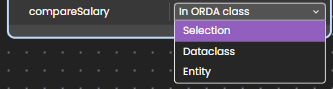

The model editor allows you to create and edit functions. Functions can be created in all ORDA object classes:

- in the datastore
- in dataclasses,
- in dataclass entity selections,
- in dataclass entities.

:::note
This section explains how to define these functions in the Model editor. For a description of the ORDA classes, please refer to the [**Data Model Objects**](../../../QodlyinCloud/qodlyScript/guides/data-model.md) section.
:::

## Datastore Functions

[Datastore functions](../../../QodlyinCloud/qodlyScript/guides/data-model.md#datastoreimplementation-class) are available through the `ds` object, from any context of the application.

To create a datastore function, click on the **+** button at the right side of the **DataStore Functions** title in the outline:

Enter the function name and press **Enter**. A code editor page is displayed with the function definition ready to be filled in the **DataStore** class (extending `DataStoreImplementation`).

**-->** [Click here for more info on datastore function definition](../../../QodlyinCloud/qodlyScript/guides/data-model.md#datastoreimplementation-class).

## Datastore Class Functions

Datastore class functions allow you to execute code that can be applied to the following class objects of a dataclass:

- the [dataclass](../../../QodlyinCloud/qodlyScript/guides/data-model.md#dataclass) itself,
- its [entity selections](../../../QodlyinCloud/qodlyScript/guides/data-model.md#entity-selection),
- its [entities](../../../QodlyinCloud/qodlyScript/guides/data-model.md#entity).

### Create A Function

You can create or edit these functions from the **Functions** area at the bottom of the dataclass:

1. Click on the **+** button on the right side of the "Functions" title bar and enter the function name.
2. Press **Tab** or **Enter** to validate the name. You need to select the object class where to create the function:

Once you have selected a class, a code editor page is displayed with the function definition ready to be filled. In the dataclass panel, the function status is _pending_ until the function is saved in the project.

### Edit A Function

To edit an existing function, click on  icon at the left side of the function name: a code editor page is displayed with the function definition ready to be edited.

**-->** [Click here for more info on dataclass function definition](../../../QodlyinCloud/qodlyScript/guides/data-model.md#dataclass).
**-->** [Click here for more info on entity selection function definition](../../../QodlyinCloud/qodlyScript/guides/data-model.md#entity-selection).
**-->** [Click here for more info on entity function definition](../../../QodlyinCloud/qodlyScript/guides/data-model.md#entity).

:::tip Additional Resources
[Learn about dataclass function definition](../../../QodlyinCloud/qodlyScript/guides/data-model.md#dataclass).
[Learn about entity selection function definition](../../../QodlyinCloud/qodlyScript/guides/data-model.md#entity-selection).
[Learn about entity function definition](../../../QodlyinCloud/qodlyScript/guides/data-model.md#entity).
:::

## Permissions

This area allows you to define the permissions for the selected function.

Function permissions are described in [this section](../../../4DQodlyPro/roles/permissionsFunctionLevel.md).
